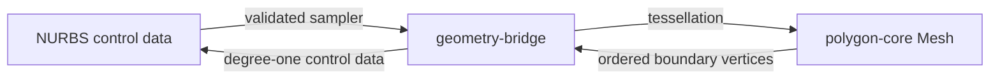

# Two Rust geometry libraries

| Library | Owns | Does not depend on |
| --- | --- | --- |
| `nurbs-core` | Rational control data, curve/surface evaluation and editing, surface constructors | polygon-core, WASM, Manifold, the application |
| `polygon-core` | Vertex/index buffers, UV polygon clipping and meshing, mesh topology, transforms, boundary loops, thickening, STL | nurbs-core, WASM, Manifold, the application |
| `gcode-core` | Completed print-plan serialization and independent preview parse | polygon-core, NURBS, WASM, Manifold, the application |

`geometry-bridge` is integration/transport code. It implements the polygon library's `ParametricSurface` trait for a validated NURBS snapshot and transfers boundary vertices into the NURBS polyline constructor. Both domain libraries can be used directly as normal native Rust dependencies; the application links both through one generated WASM module. Its compressed bytes are shared by the UI and Worker chunks and expanded synchronously with the repository-owned bounded DEFLATE decoder. The two libraries do not call each other or maintain shared mutable state.



## Interchange contract

- Mesh: owned `positions: Vec<f64>` (xyz triples), `indices: Vec<usize>` (triangle triples), optional `uv: Vec<f64>` (one pair per vertex). The current application uses millimeters. No borrowed WASM pointers cross the host API.
- Surfaces retain their rational control data. Tessellation returns an independent derived mesh; its deviation estimate is sampled and is not a certified global error bound.
- The polygon mesher accepts **any** implementation of `ParametricSurface`, including analytic surfaces with no NURBS representation. The NURBS adapter alone knows how to establish periodic seams and collapsed boundaries. Welding verifies geometric agreement before merging vertices.
- UVs locate source samples. On welded seams they do not encode all per-corner chart branches and must not be used for interpolating across a seam. An affine mesh edit preserves UV labels but does not update the source surface. Thickening drops UVs because the new wall vertices do not belong to the original surface.
- Mesh boundaries convert exactly to clamped degree-one NURBS curves (including a repeated closing point, `periodic: false`). Each loop must fit the NURBS budget of 256 controls; an oversized loop is rejected, not silently simplified. Nonmanifold or branching boundary chains are rejected.
- There is no automatic reconstruction of smooth NURBS surfaces from arbitrary polygon data. The `boolean::boolean` API implements union, intersection and difference with an iterative BSP, normalized coordinates, tolerance-based welding and T-junction stitching. It validates closed edge/vertex topology, shell orientation and triangle intersections with the selected tolerance. Empty results are valid; edge/point-only unions that produce non-manifold results are rejected. There is no native C/C++ fallback. Generic topology reports outside the boolean API check triangle/edge conditions; they do not certify vertex-manifoldness, absence of self-intersections or printability.
- Imported mesh limits are 100,000 triangles and 300,000 vertices, preserving the host export budget. Tessellation and thickening retain the tighter 20,000-triangle output cap, with 128 segments per parameter direction, 16 holes and 512 total trim vertices. Native callers should bound input allocation before constructing vectors; the WASM transport additionally limits serialized input to 32 MiB.

## Native use

```rust
use geometry_bridge::{tessellate_nurbs, boundary_curves};
use polygon_core::tessellation::Options;

// surface: nurbs_core::surface::Surface
# fn example(surface: &nurbs_core::surface::Surface) -> geometry_bridge::Result<()> {
let sampled = tessellate_nurbs(surface, &Options {
    segments_u: 8, segments_v: 8, trim: None, max_triangles: None,
})?;
let boundary = boundary_curves(&sampled.mesh)?;
let solid = sampled.mesh.thicken([0.0, 0.0, 2.0])?;
let stl = solid.mesh.export_stl()?;
# let _ = (boundary, stl);
# Ok(())
# }
```

Host APIs are `src/services/polygonKernel.ts` and `src/services/nurbsPolygonBridge.ts`. Existing NURBS entry points delegate to the same Rust implementations. Other mesh export formats stay in the host. Existing OpenSCAD CSG still uses its Manifold backend; the two new libraries do not depend on it.

```sh
cargo test --locked --manifest-path crates/Cargo.toml --workspace
cargo clippy --locked --manifest-path crates/Cargo.toml --workspace --all-targets -- -D warnings
npm run test:geometry
```

### Mesh Boolean contract

`boolean(a, b, Operation::Difference, &Options::default())` computes A minus B. Inputs must be indexed, closed, consistently oriented solids; cavity shells point into the cavity. UVs are discarded. Coordinates use a shared normalized frame; `relativeTolerance` defaults to `1e-9` of the combined bounding-box extent (range `1e-12..1e-5`). This is floating-point mesh CSG, not certified exact arithmetic. Features near tolerance can be refused. The report records absolute tolerance, work, fragments and input triangle counts; `checked_with_tolerance` is not an exact intersection certificate.

Hard limits: 10000 combined input triangles, 20000 output triangles, 100000 created fragments, 8000000 work units. Options can lower the latter three limits. Complex inputs can exhaust work before reaching the triangle limits and return a typed resource error. The host API is `booleanPolygonMeshes(a,b,'union'|'intersection'|'difference',options?)`; ModelGraph uses `{id,op:'mesh_boolean',inputs:['a','b'],operation:'difference'}`. Empty results have null graph bounds and no preview. STL export still requires a nonempty closed mesh.

### Shared B-rep topology

`brep-topology` is an independent support library using repository-owned value-codec used by **both** kernels. It checks incidence, orientation, loop and shell connectivity, vertex fans and body boundary references. `nurbs-core::brep` binds 3D curves, 2D face-local pcurves and rational surfaces; validates endpoint and sampled interior agreement; and constructs a six-face exact box. `polygon-core::brep` binds triangle patches to the same topology. Explicit per-triangle face groups preserve a face containing many triangles and hole loops. Without groups, each triangle becomes a face (256-face limit). Multiple disconnected shells are not automatically classified as cavities.

`geometry-bridge::brep` tessellates both kinds, returns one face ID per triangle and converts sampled NURBS B-rep into polygon B-rep with the same face groups. Faces are sampled individually and seams welded within tolerance; incompatible sampling returns an error if a closed model produces open/non-manifold edges. This is not general certified sewing. Models preserve topology and geometry definitions; tessellation is derived. B-rep geometric booleans, containment certification, arbitrary periodic seam construction and smooth mesh-to-NURBS reconstruction remain outside this implementation.

Host API: `src/services/brepKernel.ts`. The compact form `brep_box([0,0,0],[20mm,30mm,10mm]) |> brep_tessellate(4)` also runs through ModelGraph/MCP. Viewer-authored face IDs are authoritative. Legacy meshes use connected smooth-patch inference with a 30-degree edge threshold; this heuristic does not reconstruct CAD geometry. Mesh CSG currently drops authored face identities, so its results use that fallback.

## Subdivision and implicit fields

`subdivision-core` owns Catmull–Clark cages/refinement; `sdf-core` owns implicit field trees and extraction. Both use only repository-owned crates for values and mesh exchange. geometry-bridge exposes native/WASM operations; the compact language examples are in examples/modelgraph-text/subdivision.scad and sdf.scad. See each crate README for numerical and feature limits.
