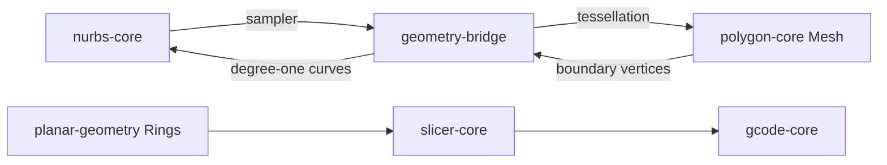

# Native geometry crates

Workspace kernels for CAD, print planning, languages, and photogrammetry. Coordinates are millimeters; algorithms use binary64. Domains do not share mutable state.

| Crate | Owns |
| --- | --- |
| `math-core` (`osv-math` on crates.io) | `V2`/`V3`, vector helpers, shared `Error` / `ensure` |
| `value-codec` | JSON/binary value transport |
| `gpu-compute` | Optional WGSL compute host |
| `geometry-ops` | Deformations, `Triangles`, sweep frames |
| `planar-geometry` | 2D paths, rings, Pathfinder (**crates.io**) |
| `brep-topology` | Indexed B-rep incidence only |
| `nurbs-core` | Rational curves/surfaces |
| `brep-core` | CAD B-rep over NURBS |
| `polygon-core` | Triangle meshes, UV meshing, mesh CSG |
| `subdivision-core` | Catmull–Clark cages |
| `sdf-core` | Implicit fields and extraction |
| `sketch-core` | 2D constraints |
| `slicer-core` | Walls/infill from already-cut contours |
| `gcode-core` | G-code encode/preview and G-code 3MF package |
| `gcode-optimize` | Toolpath order/seam/simplify/comb + emit |
| `printer-core` | Multi-vendor LAN job transport (Bambu / Moonraker / OctoPrint / Prusa / Creality / Snapmaker) |
| `mechanics-core` | Section properties / beam estimates |
| `openscad-core` | OpenSCAD frontend |
| `modelgraph-text` | ModelGraph Text frontend |
| `modelgraph-runtime` | ModelGraph validation / emit (`Error` has path+details) |
| `photogrammetry-core` | Photo reconstruction |
| `photogrammetry-ffi` / `photogrammetry-wasm` | Photo host ABI |
| `geometry-bridge` | Kernel adapters + WASM/JSON transport (`Error` = `math_core::Error`) |
| `geometry-wasm` | Browser WASM shell |



## Interchange

- Mesh: owned `positions` (xyz), `indices` (triangles), optional `uv`. No borrowed WASM pointers on the host API.
- Surfaces keep rational control data; tessellation is derived. Polygon mesher accepts any `ParametricSurface`.
- Mesh boundaries convert to clamped degree-one NURBS loops (budget 256 controls). No automatic smooth surface reconstruction from arbitrary meshes.
- Mesh boolean is floating-point BSP CSG with typed resource limits; empty results are valid.
- Import budgets: 100k triangles / 300k vertices. Tessellation/thickening keep the 20k-triangle output cap.

## Native use

```rust
use geometry_bridge::{tessellate_nurbs, boundary_curves};
use polygon_core::solid::tessellation::Options;

# fn example(surface: &nurbs_core::surface::Surface) -> geometry_bridge::Result<()> {
let sampled = tessellate_nurbs(surface, &Options {
    segments_u: 8, segments_v: 8, trim: None, max_triangles: None,
})?;
let boundary = boundary_curves(&sampled.mesh)?;
let solid = sampled.mesh.thicken([0.0, 0.0, 2.0])?;
let stl = solid.mesh.export_stl()?;
# let _ = (boundary, stl);
# Ok(())
# }
```

Host TypeScript lives under `src/services/geometry/` (`kernel.ts`, `polygon.ts`, `polygonBridge.ts`, `nurbs.ts`, `brep.ts`, …). OpenSCAD CSG can still use its Manifold backend; these crates do not depend on Manifold.

```sh
cargo test --locked --manifest-path crates/Cargo.toml --workspace
cargo clippy --locked --manifest-path crates/Cargo.toml --workspace --all-targets -- -D warnings
npm run test:geometry
```

### Mesh Boolean

`boolean(a, b, Operation::Difference, &Options::default())` is A minus B. Inputs must be closed, consistently oriented solids. Host: `booleanPolygonMeshes`; ModelGraph: `mesh_boolean`.

Separated, nested, identical or empty operands take exact fast paths that are not subject to the 10,000-triangle BSP admission cap (`BSP_INPUT_TRIANGLES`); above the cap their result is bounded by the inputs and reported as `self_intersection_status: "not_checked"`. N-ary operations go through `union_many` (bound-connected groups are folded, separated groups are joined without CSG) and `difference_many` (cutters subtracted in batches of mutually separated bodies). The bridge tries `prism_boolean` first: for a difference it now also accepts a vertical cutter that spans the base, the usual drilled-hole idiom. Scaling measurements and the remaining limits (BSP on curved bodies, multi-hole cap triangulation) are in `docs/design/csg-scaling-2026-09-19.md`; `cargo run --release -p polygon-core --example bench_boolean` reproduces them natively.

### B-rep

`brep-topology` is shared incidence. `brep-core` binds NURBS geometry; `polygon-core::solid::brep` binds triangle patches. Bridge tessellates both and preserves face IDs. Host: `src/services/geometry/brep.ts`.

### Subdivision and SDF

`subdivision-core` and `sdf-core` exchange meshes through `geometry-ops::Triangles` / bridge ops. See each crate for limits.

### Print / strength (not yet in the Worker UI)

`polygon_core::solid::section::MeshSectionIndex` cuts layers. `slicer-core` builds walls/infill; `gcode-core` encodes; `mechanics-core` ranks weak layers. Wired in geometry-bridge JSON ops `mesh_section`, `mesh_toolpaths`, `mesh_gcode` (Worker/UI panel still a product stage).
