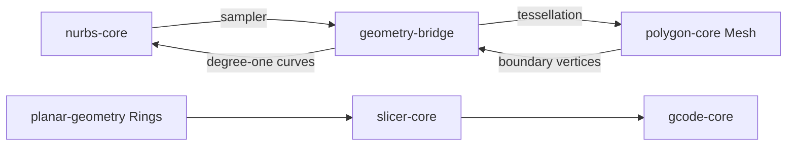
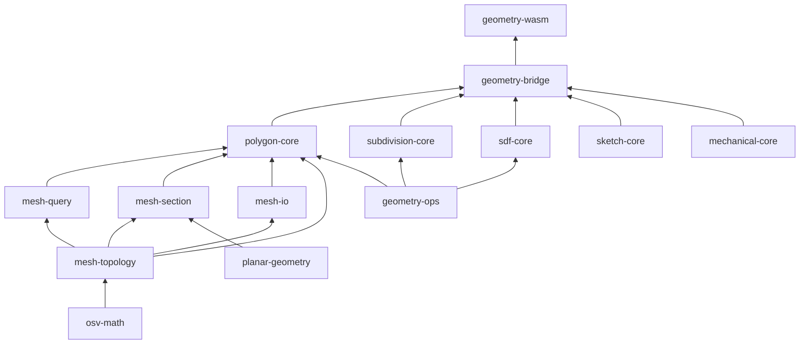

# Native geometry crates

Workspace kernels for CAD, print planning, languages, and photogrammetry. Coordinates are millimeters. Authored geometry uses binary64; display kernels retain their float32 buffer contracts. Domains do not share mutable state.

| Crate | Owns |
| --- | --- |
| `math-core` (`osv-math` on crates.io) | `V2`/`V3`, vector helpers, affine matrices (composition, rigid poses/inverses, Euler rotation, reflection, translation, scaling), shared `Error` / `ensure` |
| `value-codec` | JSON/binary value transport |
| `gpu-compute` | Optional WGSL compute host |
| `geometry-ops` | Deformations, `Triangles`, sweep frames |
| `planar-geometry` | 2D paths, primitive contours, rings, Pathfinder (**crates.io**) |
| `brep-topology` | Indexed B-rep incidence only |
| `nurbs-core` | Rational curves/surfaces |
| `brep-core` | CAD B-rep over NURBS |
| `mesh-topology` | Borrowed mesh view, indexed incidence, inspection, incremental affine area, boundary loops, display edges |
| `mesh-query` | Triangle/scene BVHs, picking, closest points and sampled distances |
| `mesh-section` | Reusable horizontal section index, contours and planar projection |
| `mesh-io` | Mesh codecs, 3MF OPC packaging and transactional scene export |
| `manifold-core` | Full vertex-link manifoldness and conservative repair |
| `polygon-core` | Owned triangle meshes, UV meshing, mesh CSG and compatibility adapters |
| `subdivision-core` | Catmull–Clark cages |
| `sdf-core` | Implicit fields and extraction |
| `sketch-core` | 2D constraints |
| `slicer-core` | Walls/infill from already-cut contours |
| `gcode-core` | G-code encode/preview and G-code 3MF package |
| `gcode-optimize` | Toolpath order/seam/simplify/comb + emit |
| `printer-core` | Multi-vendor LAN job transport (Bambu / Moonraker / OctoPrint / Prusa / Creality / Snapmaker) |
| `mechanical-core` | Typed gear profiles, planetary assemblies and thread meshes; optional SCAD adapter |
| `mechanics-core` | Section properties / beam estimates |
| `openscad-core` | OpenSCAD frontend |
| `rush-frontend` | Rush frontend |
| `rush-runtime` | RushGraph validation / emit (`Error` has path+details) |
| `photogrammetry-core` | Photo reconstruction |
| `photogrammetry-ffi` / `photogrammetry-wasm` | Photo host ABI |
| `geometry-bridge` | Kernel adapters + WASM/JSON transport (`Error` = `math_core::Error`) |
| `geometry-wasm` | Browser WASM shell |


```mermaid
flowchart LR
    N[nurbs-core] -->|sampler| A[geometry-bridge]
    A -->|tessellation| P[polygon-core Mesh]
    P -->|boundary vertices| A
    A -->|degree-one curves| N
    S[planar-geometry Rings] --> SL[slicer-core]
    SL --> G[gcode-core]
```

## Interchange

- Mesh: owned `positions` (xyz), `indices` (triangles), optional `uv`. No borrowed WASM pointers on the host API.
- Surfaces keep rational control data; tessellation is derived. Polygon mesher accepts any `ParametricSurface`.
- Mesh boundaries convert to clamped degree-one NURBS loops (budget 256 controls). No automatic smooth surface reconstruction from arbitrary meshes.
- Mesh boolean is floating-point BSP CSG with typed resource limits; empty results are valid.
- Import budgets: 100k triangles / 300k vertices. Tessellation/thickening keep the 20k-triangle output cap.

## Native use

```rust
use geometry_bridge::{tessellate_nurbs, boundary_curves};
use polygon_core::solid::tessellation::Options;

# fn example(surface: &nurbs_core::surface::Surface) -> geometry_bridge::Result<()> {
let sampled = tessellate_nurbs(surface, &Options {
    segments_u: 8, segments_v: 8, trim: None, max_triangles: None,
})?;
let boundary = boundary_curves(&sampled.mesh)?;
let solid = sampled.mesh.thicken([0.0, 0.0, 2.0])?;
let stl = solid.mesh.export_stl()?;
# let _ = (boundary, stl);
# Ok(())
# }
```

Host TypeScript lives under `src/services/geometry/` (`kernel.ts`, `polygon.ts`, `polygonBridge.ts`, `nurbs.ts`, `brep.ts`, …). OpenSCAD CSG can still use its Manifold backend; these crates do not depend on Manifold.

```sh
cargo test --locked --manifest-path crates/Cargo.toml --workspace
cargo clippy --locked --manifest-path crates/Cargo.toml --workspace --all-targets -- -D warnings
npm run test:geometry
```

### Mesh Boolean

`boolean(a, b, Operation::Difference, &Options::default())` is A minus B. Inputs must be closed, consistently oriented solids. Host: `booleanPolygonMeshes`; RushGraph: `mesh_boolean`.

Separated, nested, identical or empty operands take exact fast paths that are not subject to the 10,000-triangle BSP admission cap (`BSP_INPUT_TRIANGLES`); above the cap their result is bounded by the inputs and reported as `self_intersection_status: "not_checked"`. N-ary operations go through `union_many` (bound-connected groups are folded, separated groups are joined without CSG) and `difference_many` (cutters subtracted in batches of mutually separated bodies). The bridge tries `prism_boolean` first: for a difference it now also accepts a vertical cutter that spans the base, the usual drilled-hole idiom. Scaling measurements and the remaining limits (BSP on curved bodies, multi-hole cap triangulation) are in `docs/design/csg-scaling-2026-09-19.md`; `cargo run --release -p polygon-core --example bench_boolean` reproduces them natively.

### B-rep

`brep-topology` is shared incidence. `brep-core` binds NURBS geometry; `polygon-core::solid::brep` binds triangle patches. Bridge tessellates both and preserves face IDs. Host: `src/services/geometry/brep.ts`.

### Subdivision and SDF

`subdivision-core` and `sdf-core` exchange meshes through `geometry-ops::Triangles` / bridge ops. See each crate for limits.

### Print / strength (not yet in the Worker UI)

`polygon_core::solid::section::MeshSectionIndex` cuts layers. `slicer-core` builds walls/infill; `gcode-core` encodes; `mechanics-core` ranks weak layers. Wired in geometry-bridge JSON ops `mesh_section`, `mesh_toolpaths`, `mesh_gcode` (Worker/UI panel still a product stage).

### Standalone mesh kernels

`polygon_core::Mesh::view()` borrows the `mesh-topology::MeshView` buffers without
copying. Mesh query, section and export kernels consume that view and have no
reverse dependency on `polygon-core`, `geometry-bridge` or the viewer. Existing
`polygon-core` module paths forward to these kernels and retain product reports
and error codes. Read each crate's README for buffer layouts and numeric limits.

`mesh-topology` owns reusable incidence and display topology; `manifold-core`
owns full vertex-link checks and repair. Edge closure in `MeshView::inspect()`
is intentionally the existing polygon inspection contract, not full solid proof.

### Standalone modeling kernels

`sketch-core`, `subdivision-core`, `sdf-core`, `mechanical-core` and their shared
`geometry-ops` types support `default-features = false` for native use without
`value-codec`. The default `codec` feature preserves existing transport APIs.
Mechanical profiles and thread meshes are available directly as typed geometry.
SDF GPU support is optional and independent of the codec.

`nurbs-core` exposes native curve and surface APIs with its JSON dispatcher behind
the default `transport` feature. Disabling it removes the dispatcher; advanced
evidence reports still depend on `value-codec`.

## Dependency layers


```mermaid
flowchart BT
    M[osv-math] --> T[mesh-topology]
    T --> Q[mesh-query]
    T --> S[mesh-section]
    T --> I[mesh-io]
    P[planar-geometry] --> S
    Q --> O[polygon-core]
    S --> O
    I --> O
    T --> O
    G[geometry-ops] --> O
    G --> D[subdivision-core]
    G --> F[sdf-core]
    O --> B[geometry-bridge]
    D --> B
    F --> B
    K[sketch-core] --> B
    C[mechanical-core] --> B
    B --> W[geometry-wasm]
```

Arrows point from dependency to consumer. Mesh libraries never depend on
`polygon-core` or the bridge. `polygon-core` owns meshes and modeling operations;
its compatibility modules forward queries, sections and exports to mesh kernels.
`mesh-topology` separates buffer validation (`view`), mesh inspection,
boundary walks, indexed incidence and display edges internally. Public types and
methods remain accessible at the crate root.

### Workspace dependency policy

Internal dependency paths and versions live in `[workspace.dependencies]`.
Crate manifests use `workspace = true` and state only their own optional flags
and feature requirements. Geometry operations, sketch, subdivision, SDF and
mechanical workspace dependencies disable default features. Consumers that
serialize their types explicitly request `features = ["codec"]`; native kernels
keep the codec disabled. Direct consumers outside this workspace retain the
existing default codec feature for API compatibility.

`polygon-core` uses native `geometry-ops` without enabling its codec. Transport
and product reports stay in the bridge and compatibility adapters. GPU backends
remain optional; this structure change does not alter their selection policy.

## Native editing and import

`polygon-core::mesh_editor` owns numeric editing: UV spheres, centroid transforms,
vertex motion, proportional falloff, face delete/flip/subdivision/extrusion/inset,
merge, knife cuts, separation, join and symmetry. Its frozen 22-case corpus was
captured from the previous TypeScript implementation before replacing it.

`mesh-io::import` owns bounded OBJ, PLY, STL and OFF decoding plus shared welding.
Import limits remain 250,000 triangles and 750,000 source vertices. OFF polygon
triangulation retains winding and admits concave faces. Binary PLY supports both
byte orders and extra scalar/list properties. Strict scene STL import retains
its binary-only error contract. AMF/3MF ZIP/XML parsing remains in the OpenSCAD
file adapter; shared welding runs in Rust for those formats too.

`mesh-topology::soup` owns display normal reconstruction and degenerate-triangle
removal; `mesh-query::display` owns world bounds and triangle measurements.
`planar-geometry::sampled_corner` owns sampled fillet/DogEar geometry and contour
admission. Force marker meshes live in `geometry-ops::force_markers`.

The bridge owns request decoding, sampled shell/blend orchestration and sketch
placement for revolve. File bytes and large triangle soups cross dedicated raw
WASM buffers. Result handles keep typed vectors alive until the host copies them,
then release them in `finally`. They avoid expanding bytes or display buffers
through the numeric value codec. Invalid float32 display records use a bitwise
transport so inspection can continue skipping them without weakening the codec.

TypeScript owns object identity, history, files/ZIP/XML, names/colors, SVG strings,
and typed-buffer marshalling. Geometry edits call the native kernel. Sparse
surface-group requests pack referenced records to fit the transfer budget;
coordinate welding, normals, adjacency and union-find remain native.

### Typed profile tools

`polygon-core::profile_tools` owns profile rotation (`Axis`, `RevolveOptions`) and authored sketch placement (`SketchPlane`). Basis scale and the cross-product depth direction are retained. The bridge only decodes parameters and encodes meshes; placement no longer requires a round trip through `Value`. Native tests cover both axes and profile sides, translated placement, crossing-axis rejection, and scaled bases.

`mesh-topology::planar` owns typed coplanar display grouping and face workplanes.
Shell selection reads triangle membership directly. `polygon-core::local_blend`
owns sampled local fillet/chamfer construction and boolean application; its
bridge adapter only decodes the request and encodes the result.

The binary64 distance BVH and its GPU/CUDA buffer layout belong to
`mesh-query::distance_bvh`. Sampled shell and lattice share triangle preparation
and queries instead of keeping acceleration structures in the transport bridge.

### Sampled solids and sketch operations

`polygon-core::mesh_shell` owns sampled shell/lattice construction, adaptive
extraction, and the shared lattice field shader. Optional `gpu`/`cuda` features
provide native samplers; the bridge forwards these features and retains its old
public paths as compatibility exports. CUDA regeneration follows the kernels in
`polygon-core`.

`polygon-core::lattice_tools` owns spatial graphs, component counting,
decimation, lightening cells and complete mesh lightening. Document metadata
and print-setting records remain in adapters. `planar-geometry::sketch_shapes`
and `sketch_offset` own sampled curves, slots, contour validation and offsets;
`geometry-ops::point_transform` owns mixed 2D/3D transforms.

`planar-geometry::sketch_transform` transforms point contours and retained analytic
curves, with explicit-pivot / analytic-center / centroid precedence.
`planar-geometry::sketch_trim` trims and extends bounded local-coordinate
polylines against supplied boundaries, returning points without document edits.
`geometry-ops::path_sampling` samples mixed-length 2D/3D polyline segments by
arclength; it is available with the codec disabled. Trim adapters own record IDs
and remove obsolete analytic/dimension fields. Planar body edits borrow native
mesh topology directly instead of serializing it between adapters.

## Library structure requirements

Run `npm run verify:libraries` to inspect the Cargo graph and application imports. The check requires:

- One workspace declaration for each internal dependency.
- No cycles through normal or build dependencies.
- Native kernels built without default features must not depend on `value-codec`.
- Native kernels must not depend on application bridges or host ABI packages.
- Production TypeScript and Vue scripts must not import benchmark or test oracles, including type imports, CommonJS aliases, and literal dynamic imports.

Serialization remains available through the optional `codec` feature of
`polygon-core`, `brep-topology`, `cad-predicates`, `nurbs-core`, and `brep-core`. Their default features
preserve the existing serialized API; workspace consumers opt in explicitly.

All 16 native kernels have normal dependency graphs without
`value-codec` when default features are disabled. NURBS and BRep native
computations and typed reports remain available in that configuration; wire
APIs require their codec features.
A passing graph
check alone does not establish algorithm equivalence or eliminate duplicated
computation; native tests and host compatibility checks remain necessary.

## Primitive and language rules

`planar-geometry::primitives::rectangle_corners` owns rectangle coordinates.
The sampled mesh constructor drops collapsed contours; the exact graph adapter
retains their authored corners and delegates validity checks to the BRep builder.

| Native rule | Language ABI | Host responsibility |
| --- | --- | --- |
| `openscad-core::extrude_slices`: automatic twist and nonuniform subdivision, including spiral length | 12 | Resolve authored arguments, report warnings and apply the slice limit |
| `geometry-ops::resize`: aggregate bounds, explicit and automatic axis scales, first invalid extent axis | 13 | Attach original arguments to warnings; decode infinite ratios from the explicit transport token |

The frozen extrusion comparison oracle lives under `benchmarks/rush`.

## Bridge ownership

`geometry-bridge` calls domain libraries directly:

| Domain library | Bridge operations |
| --- | --- |
| `mesh-query` | Triangle/scene BVHs, picking, closest triangles, source admission and reconstruction deviation samples |
| `mesh-topology` | Exact-coordinate welding and display edge extraction, including cooperative analysis |
| `mesh-section` | Scene sections, G-code sections, profile projection and slicing |
| `mesh-io` | Scene export sessions and raw export preparation |

The bridge owns report serialization and its shared legacy mesh-error mapper.
Existing application wire errors remain `POLYGON_INVALID_INPUT`; native library
callers retain domain-specific errors. Public compatibility adapters in
`polygon-core` remain available to existing native callers.

Reconstruction source preparation calls `mesh-query::proximity::valid_source`,
which uses `mesh-topology::weld::exact`. The bridge converts its owned plain
buffers to the application's mesh type; neither kernel depends on polygon-core.
