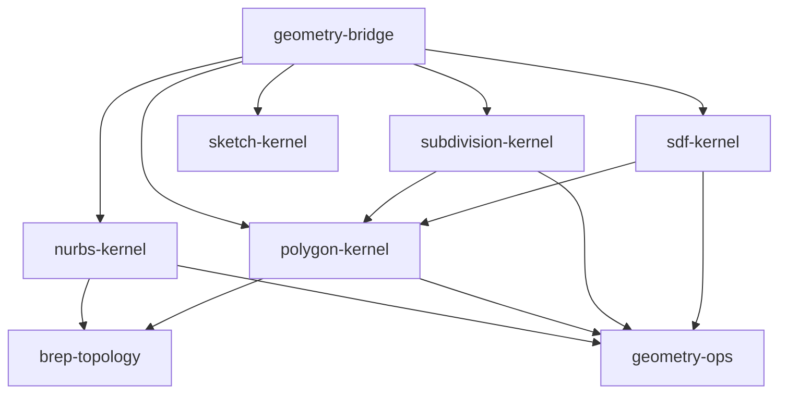

# Аудит геометрических библиотек и готовности к нарезке

Дата: 2026-09-08. Статус: проверка текущего исходного кода; архитектурные предложения отдельно от реализованных возможностей. Проверяемая рабочая копия содержит незакоммиченные изменения. Этот документ не подтверждает запуск тестов, квалификацию ядра или готовность печатать модель.

## Главный вывод

Разделение на собственные Rust-ядра уже существует и сохраняет исходные представления в вычислительных API. Но общего контракта между **авторитетной моделью, производными данными, геометрической достоверностью и изготовлением** ещё нет. Следующий архитектурный этап должен установить этот контракт до добавления общего `slice()` или универсальных булевых операций.

Полигоны пригодны для отображения и самостоятельного моделирования. Они не должны становиться обязательным промежуточным форматом NURBS, SDF или subdivision при нарезке. B-rep — организация границы тела, а не ещё один вид поверхности: NURBS- и полигональная геометрия уже могут быть адаптерами одной топологии.

## 1. Что обнаружено в коде

| Компонент | Реализовано | Существенная граница |
| --- | --- | --- |
| `brep-topology` | Индексированные вершины, рёбра, coedge, контуры, грани, оболочки, тела; проверка ссылок, владения, связности и ориентации | Включает координаты `f64` и `tolerance_mm`; независим от представления поверхности, но не от числового контракта. Замкнутая топология не доказывает геометрически корректный solid |
| `nurbs-kernel` | Рациональные кривые/поверхности, производные, узловое редактирование, extrude/revolve поверхности, translation sweep, согласование сечений loft; B-rep кубоид | Общих пересечений поверхностей, bool над B-rep, capped extrude произвольного профиля и геометрической сертификации solid нет |
| `polygon-kernel` | Сетка, UV-тесселяция, BSP union/intersection/difference, extrude/revolve/sweep/loft, деформации, кисть, выдавливание выбранных треугольников, полигональный B-rep | Bool численный с допуском и бюджетом. Проверки конструкции/редактирования слабее проверок bool: самопересечения не проверяются общим `inspect()` |
| `subdivision-kernel` | Catmull–Clark с конечным числом равномерных шагов, происхождение от исходной грани, каркасные конструкторы, деформации/кисть | Нет limit evaluator, адаптивного критерия ошибки, crease weights и собственного контракта нарезки. Fan-триангуляция рассчитана на выпуклые грани; общая проверка каркаса не доказывает их выпуклость |
| `sdf-kernel` | Примитивы, CSG, профили extrusion/revolution, twist обратным преобразованием, сферическая кисть, mesh distance, marching tetrahedra | Тип `Field` смешивает настоящие расстояния и общие скалярные поля. Нарезка нулевого множества на плоскости отсутствует; сеточная выборка может пропускать мелкие компоненты |
| `sketch-kernel` | Ограниченный численный решатель 2D точек, окружностей, размеров и касаний | Возвращает статус/невязки/степени свободы. Не является доказательством единственности или глобальной сходимости; отдельное подключение к документу/GUI ещё требуется |
| `geometry-bridge` | Rust/WASM JSON dispatch, адаптер параметрической поверхности, B-rep-тесселяция и явные реконструкции | Модуль содержит сами алгоритмы конверсии/сшивки, а не только транспорт. Единой таблицы возможностей и типизированных контрактов результата нет |

Источники: [workspace](../../crates/Cargo.toml), [topology](../../crates/brep-topology/src/lib.rs), [NURBS B-rep](../../crates/nurbs-kernel/src/brep.rs), [NURBS surface](../../crates/nurbs-kernel/src/surface.rs), [polygon modeling](../../crates/polygon-kernel/src/modeling.rs), [polygon editing](../../crates/polygon-kernel/src/edit.rs), [polygon Boolean](../../crates/polygon-kernel/src/boolean.rs), [subdivision](../../crates/subdivision-kernel/src/lib.rs), [SDF](../../crates/sdf-kernel/src/lib.rs), [sketch](../../crates/sketch-kernel/src/lib.rs), [bridge](../../crates/geometry-bridge/src/lib.rs).

Поиск в исходниках Rust-крейтов не обнаружил реализации сечений слоя, областей слоя, периметров/infill, траекторий или генератора G-code. Существующие методы `extrude` относятся к построению геометрии, а не к дозированию материала принтером.

## 2. Фактические зависимости и их цена

**Наблюдение:** `subdivision-kernel` и `sdf-kernel` импортируют `polygon_kernel::{Error, Mesh, Result}`. Поэтому ошибка SDF или каркаса часто получает код `POLYGON_INVALID_INPUT`. Mesh distance и реконструкция каркаса используют polygon proximity; это обоснованные алгоритмические зависимости, но они затрагивают весь core API соответствующего крейта. `Cage::sweep` также вызывает `polygon_kernel::modeling::sweep_sections`: он создаёт собственные quad-грани без промежуточной триангуляции, однако общая математика переноса рамки находится внутри полигонального ядра.

**Предложение:** перенести перенос рамок в `geometry-ops`, а нейтральные ошибки/контексты/обменные буферы выделять только по реальным общим контрактам. Mesh distance и реконструкции вынести в явно подключаемые адаптеры (`interop` или feature), чтобы обычные SDF-примитивы и Catmull–Clark не требовали всего polygon-kernel. Тип mesh payload не должен тянуть BSP или B-rep. Не переносить в общий слой все операции лишь из-за одинаковых имён: topology-edit остаётся в ядре владельца геометрии.

**Наблюдение:** B-rep-адаптер NURBS повторяет часть лимитов и проверок `brep-topology`. Это уже две точки изменения одного контракта. `geometry-ops::Region2`, polygon `Profile` и UV `Trim` частично перекрываются, но UV и миллиметровые координаты имеют разную размерность.

**Предложение:** разделить один нейтральный контейнер контуров и алгоритмы над ним от политики единиц и допуска. Не сделать UV миллиметрами ради унификации типов. Оставить одну реализацию проверки инцидентности, дополняемую геометрическими проверками адаптера.

## 3. Авторитет модели сейчас не доходит до сцены

**Наблюдение:** `buildOwnNurbs()` хранит вычисленные curve/surface/brep/field/cage/patch definitions в отчёте. `buildTextNurbsScene()` требует root mesh, публикует только треугольники, использует постоянный `entity:nurbs-root`, записывает `source:null` в provenance и не передаёт definitions в `GeometryEvaluationResult`. Документ при этом может оставаться в редакторе: потеря касается контракта сцены, а не утверждения, что исходник удаляется.

Есть дополнительная непоследовательность: узел `subdivision(vertices,faces,levels)` сразу возвращает `kind:'mesh'`, тогда как `mesh_to_subdivision` возвращает `kind:'subdivision'` и требует отдельного `subdivision_tessellate`. Одинаковая семантическая сущность имеет разную авторитетность в зависимости от пути создания.

Источники: [graph execution](../../src/services/modelGraphNurbsKernel.ts), [scene publication](../../src/services/modelGraphTextScene.ts), [mesh contract](../../src/core/mesh.ts).

**Предложение:** результат моделирования должен содержать `GeometryArtifact { definition, revision, nativeRepresentation, validation, provenance }`, а производный `RenderMesh` — ссылку на этот artifact и параметры тесселяции. `show` запрашивает preview через сервис отображения; пользователь не обязан менять авторитетный root на mesh ради просмотра. Нарезка получает native artifact, а не текущие Float32-буферы GPU. `geometryAssetId` остаётся идентичностью точных буферов и не заменяет идентичность модели.

## 4. Выбор грани и происхождение результата

**Наблюдение:** B-rep face IDs — индексы `Vec`, а не стабильные ключи после редактирования. `brep::Tessellation` и refinement SubD передают соответствия triangle→face. Polygon `Mesh` и `BuiltMesh` не содержат атрибутов происхождения; bool, thicken и selected-triangle extrusion не возвращают отображение старых граней в новые. UV у этих результатов может исчезать. Во viewer `faceIdsAuthoritative` сохраняет авторские группы, а старые сетки группируются по связанности и углу нормалей 30°.

Имеющийся флаг полезен для подсветки, но не сообщает, от какой ревизии взят ID, является ли это B-rep гранью или гранью исходного cage, какому body он принадлежит и как обновить выбранный элемент после операции.

Источники: [B-rep tessellation](../../crates/geometry-bridge/src/brep.rs), [polygon data](../../crates/polygon-kernel/src/lib.rs), [selection grouping](../../src/services/meshSurfaceGroups.ts), [mesh contract](../../src/core/mesh.ts).

**Предложение:** ввести типизированный `EntityRef { artifact, revision, kind, localId }` и возвращать из topology-changing операций `HistoryMap` со связями generated/modified/deleted/split/merged. Постоянный ID сам по себе не решает неоднозначность topological naming: ссылки на старую ревизию нельзя молча привязывать к другому элементу. Для поверхности хранить patch/face и UV; для mesh — face/triangle и barycentric; для SubD — cage face и patch coordinates. Не выдавать эвристическую группу гладкости за нативную CAD-грань.

## 5. B-rep/NURBS Boolean: недостающий вертикальный путь

**Наблюдение:** NURBS B-rep валидирует соответствие pcurve→surface и 3D edge на девяти параметрах. UV-связность проверяется фиксированным `1e-9`; мировой допуск хранится в `tolerance_mm`. Контуры для тесселяции отдельно семплируются на каждой грани. Bridge затем сваривает близкие вершины всех патчей по координатам и проверяет manifold seams. Проверки возвращают `geometry_agreement: sampled_with_tolerance` и `solid_geometry_status: not_certified`.

Это полезная база инцидентности, но не система точного пересечения, классификации и сшивки. Пространственная близость не доказывает, что две точки принадлежат одному топологическому ребру. Универсальные булевы нельзя получить, просто вызвав существующий polygon Boolean и заново упаковав треугольники в NURBS.

**Предложенный порядок реализации:**

1. Контракт геометрического допуска, периодических seam/pole, coedge orientation и согласованного параметрического соответствия.
2. Консервативные bounds/BVH для кривых и патчей; predicate-слой с явным `indeterminate` для неоднозначных случаев.
3. Intersection result: 3D-кривая и обе pcurve, диапазоны, ориентация, residual/error evidence, отдельные isolated/tangent/coincident события. Начать с аналитических и ограниченных регулярных случаев, расширять поддерживаемый класс явно.
4. Trim arrangements в UV; shared-edge cache и единый набор параметров тесселяции ребра для всех coedge. Нельзя лечить несогласованные разбиения глобальным weld.
5. Классификация относительно объёма: inside/outside/on/indeterminate; пересборка оболочек с inner shells; проверка orientation, containment и самопересечений согласно достигнутому уровню доказательности.
6. Native union/intersection/difference возвращают B-rep плюс историю элементов и отчёт проверки. Неподдержанный контакт/совпадение возвращает структурированную ошибку, а доступная явная mesh-конверсия остаётся отдельным решением пользователя/политики документа.

B-rep нужен как отдельный общий слой топологии и для полигонов, но численные операции пересечения/построения поверхности принадлежат соответствующему адаптеру. Не нужен второй самостоятельный набор NURBS-данных внутри B-rep.

## 6. Числовой контракт важнее названия представления

**Наблюдение:** ядра используют `f64`, frontend mesh — `Float32Array`; точность исходной геометрии и preview различается. Допуски задаются по-разному: B-rep абсолютный в миллиметрах; polygon Boolean нормализует общий габарит и использует relative tolerance; Region2 имеет фиксированные epsilon для площадей и пересечений. `sampledDeviation` правильно помечен несертифицированным, но единого типа evidence между ядрами нет.

**Наблюдение:** `Field` не хранит signedness/distance/Lipschitz-контракт. `mesh_distance(signed:true)` проверяет `mesh.inspect().closed`, а `inspect()` сообщает `self_intersection_status: not_checked` и не выполняет полный анализ вложенности оболочек. Поэтому такое поле нельзя считать независимо валидированным описанием физического solid. `offset` произвольного CSG/twisted field не обещает постоянную физическую толщину.

**Предложение:** общий `GeometryContext` содержит единицы, масштаб, tolerances по длине/углу/UV, лимиты ресурсов и детерминированную политику неоднозначности. Результат отдельно сообщает topology validity, embedding validity, sampled residual, certified bound и предполагаемые условия. Полям нужен `FieldSemantics`: signed distance / distance bound / general implicit; при наличии — консервативная оценка Lipschitz или интервала. Отсутствие такой оценки разрешает preview и эвристическую нарезку с явным статусом, но не обещание отсутствия пропущенных компонентов.

## 7. Бюджеты: защита есть, общего планирования нет

| Текущий ограничитель | Где задан |
| --- | --- |
| B-rep: 4096 сущностей, 256 граней, 8192 coedge | topology и повторно NURBS B-rep |
| Mesh buffers: 100000 треугольников, 300000 вершин | polygon `Mesh::validate` |
| Большинство polygon constructions/B-rep tessellation: 20000 треугольников | соответствующие операции |
| Polygon bool: 10000 входных, 20000 выходных, 100000 фрагментов, 8 млн work units | boolean options/budget |
| Граф: 128 узлов, глубина 32, 30000 значений; суммарно 60000 mesh triangles | TS schema/compiler/executor |
| SubD: 0–5 uniform levels, 25000 граней и 100000 углов каркаса | subdivision |
| SDF: 256 узлов, глубина 32, sample work ≤4096; extraction ≤8 млн sample work, grid 1–64 по оси | SDF |
| WASM JSON request: 32 MiB | bridge `execute` |

Это разные виды бюджетов, а не противоречивые значения одной настройки. Например, SDF API может создать mesh до 100000 треугольников, который не пройдёт лимит графа 60000 или bool-input 10000. Сегодня вызывающий код узнаёт это последовательно во время исполнения. Host API сериализует и копирует определения и большие буферы JSON при каждом вызове; синхронный WASM-вызов не предлагает токен отмены внутри вычисления.

**Предложение:** дать операциям preflight/capabilities, общему job context — work/memory/output quotas и cancellation checkpoints, а каждой стадии — расход и причину остановки. Межъядерные native Rust вызовы должны оставаться типизированными; JSON — внешний протокол. Позже typed arrays/handles могут убрать копии, но с явным владением, освобождением, ревизией и generation ID. Не увеличивать лимиты вслепую ради большой модели.

## 8. Что требуется от архитектуры нарезки

Схема пользователя корректна как направление: разные представления сходятся в общем пространстве **областей слоя**, затем используются общие планирование и постпроцессор. Уточнение: пересечение ещё не является готовой замкнутой областью, а zero contour не доказывает, что все компоненты найдены.

**Предложенные общие контракты:**

- `SectionRequest`: плоскость с ортонормированным локальным базисом, допуск, artifact revision, budget и политика случая «поверхность совпала с плоскостью».
- `SectionResult`: направленные кривые/сегменты с provenance, topology events, signed-side/occupancy information и evidence об ошибке/полноте. Открытая NURBS sheet даёт open section, а не выдуманный solid.
- `LayerRegion`: нормализованные внешние контуры, отверстия и material/body ownership после 2D arrangement/union. Случай вложенных тел и несколько материалов требует политики приоритета и интерфейса материалов; простой union уничтожает эту информацию.
- `PlanarRegionOps`: устойчивые пересечения, nesting/winding, union/difference/offset и явная quantization/error policy. Это общий слой для всех представлений, не метод каждого 3D-ядра.
- `DepositionPath`: геометрическая траектория плюс ширина/высота валика, скорость, материал/инструмент и объём. Только машинный постпроцессор переводит это в режим E, ретракт и конкретный dialect G-code.

**Адаптеры:** NURBS/B-rep пересекает ограниченные поверхности с плоскостью с учётом trim и тела; polygon пересекает треугольники с согласованным правилом на общей вершине/ребре; SDF извлекает 2D zero set прямо на плоскости и отдельно доказывает/оценивает полноту; SubD использует limit evaluation или адаптивную аппроксимацию с контролем ошибки, а не фиксированное число шагов под названием «адаптивно».

Нарезка всех представлений возможна поэтапно: первый поставляемый путь polygon→section→regions→deposition на аналитически проверяемых случаях, затем прямой field→section и NURBS/B-rep→section. Каждый новый адаптер проходит одну общую батарею layer-contract tests. Это не требует сначала закончить все булевы NURBS, но curved trimmed solids нельзя заявить поддержанными до соответствующей геометрической проверки.

## 9. Проверки, которые должны сопровождать внедрение

Предлагаемые критерии, ещё не выполненная квалификация:

- Один solid в разных представлениях даёт совместимые области слоя с учётом заявленного допуска; mesh resolution не влияет на native NURBS/SDF сечение.
- Тесты слоя точно через вершину, ребро, касание, coplanar face, seam/pole; повторный запуск детерминирован.
- Небольшие отверстия, тонкие стенки, несколько disconnected components, inner shells, touching solids и несколько материалов не исчезают молча.
- Смена preview quality сохраняет ссылки выбора и native geometry revision; топологическое split/merge выдаёт историю, stale selection отклоняется.
- Ошибка или отмена каждой стадии не публикует частично собранное тело/слой/G-code.
- Translation/rotation/uniform-scale metamorphic tests проверяют согласование допусков, направлений и объёма. Проверки near-degenerate inputs отдельно от обычных golden cases.
- Суммарный планируемый объём экструзии сверяется с площадью путей и профилем валика; travel не изменяет материальный объём. Это проверка планировщика, а не гарантия результата реального принтера.

## 10. Долг документации

В [старом описании own NURBS](modelgraph-nurbs-own-kernel.md) вступление про «две библиотеки», отсутствие включённой topology и отсутствие общего sweep уже не отражает текущий набор крейтов; поздние разделы того же файла описывают B-rep и реконструкции. Статус этих утверждений нужно согласовать с [native-modeling-operations.md](native-modeling-operations.md), сохранив точные ограничения: translation sweep не является любым sweep, а существование topology не означает готовый Boolean.

Рекомендуется хранить одну машинно читаемую таблицу capability → native owner → input/output kinds → constraints → evidence/tests и генерировать из неё справку MCP/языка и статус архитектуры. Документ не должен объявлять метод готовым только потому, что совпало его имя. Для RAG этот аудит — `observed-source` snapshot с датой; предложения в разделах выше должны индексироваться как `proposed`, а не как возможности продукта.
