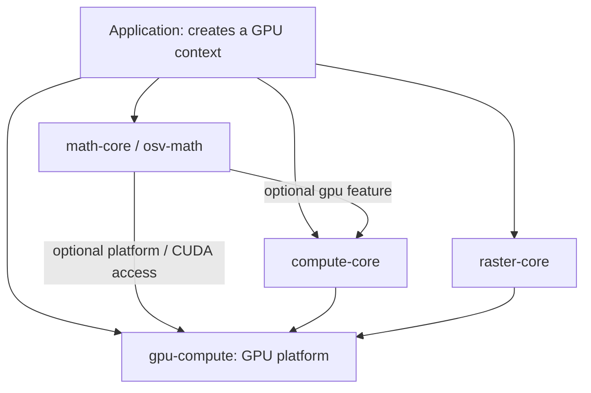

# GPU libraries: responsibility boundaries and migration

Date: 2026-09-26. Scope: `gpu-compute`, `compute-core`, `raster-core`, and
`math-core` (Cargo package `osv-math`).

## Decision

Keep four crates. Their reasons to change differ: GPU platform support,
computation execution, rendering, and mathematical behavior. Share device and
queue ownership, command recording, and byte-level infrastructure. Keep
numerical contracts, buffer layouts, render state, and placement decisions with
the domain that defines them.

Production dependencies, with arrows meaning “depends on”:



`raster-core` and `compute-core` are peers. Neither needs to depend on the other
to record into a shared wgpu encoder. CPU-only `math-core` must build without
wgpu, CUDA or either GPU runtime. Direct optional platform access in math is
legitimate: CUDA and backend reports are not generic compute operations.

The package name `gpu-compute` is narrower than its actual platform role. Keep
it during this migration to preserve imports and consumers in SDF, geometry and
photogrammetry. Renaming it alone would not improve responsibility boundaries.

## Ownership

| Crate | Owns | Excludes |
| --- | --- | --- |
| `gpu-compute` | Device/queue creation, backend capabilities, byte packing and transport, optional CUDA driver access | Mathematical placement thresholds, geometry, materials, generic array operations |
| `compute-core` | WGSL kernel compilation, binding contracts, recording/batching, typed arrays, array operations, reduction scheduling | Point-cloud semantics, CPU reference geometry, rendering policy |
| `math-core` | CPU f64 reference math, validation, numerical tolerances, domain WGSL/PTX, acceleration policy, domain GPU adapters | General pipeline plumbing, application device selection, material/shader variants |
| `raster-core` | Render WGSL, uniform ABI, variants and browser code generation, render pipelines, frame recording, texture row layout | Generic numerical operations, point-cloud algorithms, independent device selection inside render calls |

`GpuContext::new` is a convenience factory. Application code should create one
context and pass it to sessions. `GpuContext::clone` clones handles to the same
device and queue; it does not request another adapter. Handles are exposed through
immutable dereferencing, so existing `context.device` reads remain valid. Context
struct literals and replacing its device/queue fields are intentionally unsupported.
`same_device` compares shared context identity, because raw wgpu handle equality
can collide across independently created instances.

```rust,ignore
let context = GpuContext::new().expect("GPU adapter");
let compute = ComputeRuntime::new(&context)?;
let math = MathGpuSession::new(&context);
let raster = Rasterizer::new(context.clone(), format);
```

Device sharing does not imply interchangeable layouts or buffers. Math's point
buffers pack triples, raster vertices have their own stride, and typed compute
arrays remain associated with one `ComputeRuntime`. Cross-domain buffer views
need explicit usage, format, offset, length and owner validation.

## Module structure implemented

```text
gpu-compute/src/
  context.rs     device construction and shared handles
  backend.rs     backend/capability reports and workgroup heuristic
  buffer.rs      byte packing and compatibility helpers
  memory.rs      owned buffers and device-validated borrowed views
  readback.rs    fallible byte transport, mapping and cancellation
  executor.rs    native blocking initialization helper
  cuda.rs        optional CUDA driver adapter
  lib.rs         public facade

compute-core/src/
  kernel.rs      WGSL compilation and binding/dispatch contract
  batch.rs       reusable ordered dispatches
  reduction.rs   prepared multipass sum
  array.rs       typed storage identity and views
  buffer.rs      compatibility buffer upload/read helpers
  readback.rs    typed nonblocking readback ticket
  runtime.rs     device ownership, pipeline catalog, allocation and uploads
  scratch.rs     budgeted retained capacity and allocation generations
  program.rs     operation validation, composition and submission
  ops.rs         built-in operation vocabulary
  error.rs       typed runtime errors
  shaders.rs     embedded generic WGSL sources
  lib.rs         public facade

math-core/src/
  <algorithm>.rs CPU reference, mathematical contracts and dispatch policy
  acceleration.rs placement policy
  gpu/
    session.rs   explicit context, fallible execution and lazy caches
    plans.rs     recorded transform, point distances and reduction
    error.rs     execution errors and backend/arithmetic reports
    neighbors.rs nearest-neighbor families and Chamfer
    distance.rs  pair distances and transformed error reductions
    bounds.rs    ordinary and transformed bounds
    moments.rs   moments and combined cloud statistics
    support.rs   private domain wire helpers and binding layouts
    mod.rs       compatibility functions and default session
  cuda/          neighbors, distance, bounds and moments adapters; mod facade

raster-core/src/
  shaders.rs, variants.rs, codegen.rs  shader source and export contracts
  uniform.rs                         uniform ABI
  pipeline.rs                        render state and pipeline construction
  rasterizer.rs                      frame recording and convenience facade
  resources.rs                       mesh, instance and overlay storage/uploads
  readback.rs                        RGBA row layout over shared byte transport
```

The existing root exports stay available after module moves. The generic
compute API and the low-level `Kernel` API are both deliberate: geometry kernels
need custom layouts and must not be forced through the scalar-array API.

## SOLID applied to these boundaries

- **Single responsibility:** device creation belongs to the platform; a program
  describes work; a kernel validates and records a dispatch; a math executor
  owns one algorithm's packing/cache rules. Files follow these responsibilities.
- **Open/closed:** domain kernels extend execution through `Kernel` and WGSL.
  Adding a new geometry algorithm does not modify the platform or rasterizer.
  Built-in array enums remain a finite vocabulary; they are not a universal
  registry for every domain operation.
- **Substitution:** CPU f64 and GPU/CUDA f32 have different precision and failure
  behavior. Keep explicit acceleration policy and operation-specific tolerances.
  Do not promise bitwise equivalence or silently treat a failed GPU read as a
  successful zero result.
- **Interface segregation:** callers can use `Kernel`, a typed program, a math
  session or a rasterizer independently. Avoid a single backend trait containing
  render, array, geometry and CUDA methods.
- **Dependency inversion:** the application supplies the context to sessions.
  Platform code has no domain dependencies. Add a narrow domain executor trait
  only when a consumer needs runtime substitution of concrete implementations;
  wgpu already provides native backend dispatch.

## DRY: share knowledge, retain domain differences

Implemented:

1. wgpu/naga versions are declared once in workspace dependencies. Native Metal,
   Vulkan and Windows DX12 features are selected by `gpu-compute`; the two
   higher-level runtimes inherit that backend configuration.
2. All 11 math GPU executors use `Kernel::create_bind_group`; the duplicate
   bind-group constructor was removed.
3. Math uniform word packing uses `gpu_compute::pack_u32`; the identical local
   packer was removed.
4. A `MathGpuSession` owns one supplied context and creates each executor lazily.
   Legacy functions share one default session per thread instead of requesting
   a separate device for each kernel family.
5. Compute and raster both support caller-owned command encoders. `render` keeps
   its convenience behavior by delegating to `record` then submitting.

Keep specialized shader variants, material layouts and mathematical reductions
local. Similar-looking wgpu pipeline descriptors may encode different depth,
blend or visibility rules. Likewise, neighbor buffers and moment buffers have
different capacities and output layouts; a universal buffer-pool abstraction
would obscure those constraints before a common lifetime model is established.

## Lifetime, submission and compatibility contracts

- Explicit math sessions are caller-owned and use lazy, thread-local-style
  caches (`OnceCell` / `RefCell`), not global mutable caches. Use a session per
  worker, sharing a context where needed.
- Existing free math functions preserve their `Option` results and CPU fallback
  behavior. Their default session intentionally retains the existing
  process-lifetime allocation policy, avoiding GPU destruction inside TLS
  destructors. Explicit sessions can be dropped normally outside TLS teardown.
- `Kernel::record_dispatch`, `ComputeBatch::record`, and `Rasterizer::record`
  append commands without submitting. The caller owns ordering and submission.
  A shared device alone does not make math's current synchronous functions
  recordable: those still upload, dispatch and read back inside the adapter.
- Queue writes happen before the next submission, not between two recorded
  steps. Per-step parameters require separate buffers or encoded copies.
- Reusing a storage allocation is safe only when earlier GPU uses are ordered
  before its overwrite. Bind groups retain old buffer handles after a grow or
  replacement. `ScratchPool` reports allocation generations; consumers rebuild
  bindings when the generation changes. Its budget covers retained pool capacity,
  excluding old allocations retained by plans or in-flight commands.
- Preserve browser WGSL export paths, shader names, uniform offsets, draw order,
  CPU f64 implementations and `Acceleration::Auto` thresholds during this work.

## Migration implemented

| Area | API and behavior | Local evidence |
| --- | --- | --- |
| Byte transport | `ByteReadback` owns map/unmap and cancellation; typed compute and RGBA decoding delegate to it | Empty/consumed/cancelled states, deterministic stalled-callback timeout and mapping error, staging reuse, padded rows |
| Domain errors | All 11 WGSL executors initialize fallibly; `MathGpuSession::try_*` returns `MathExecution<T>` with backend and f32 arithmetic, preserving errors | CPU parity and explicit invalid-input/report tests |
| Recorded domain work | `MathGpuProgram` records transform, squared point distances and sum; `PointCloudView` requires packed xyz | Transform → distance → sum → generic affine → final readback in one submission, repeated three times |
| Device ownership | `GpuBuffer` is created from a context; borrowed views check identity, range, usage and binding alignment | Independent instances are rejected; cloned contexts are accepted |
| Capabilities | `features` describes the adapter; `enabled_features()` describes the device | Default device reports no enabled subgroup support |
| Scratch | Caller/session-owned `ScratchPool` retains named allocations within a capacity budget; growth increments generation | Reuse, rejected over-budget growth, alias rejection, old plans and readbacks survive replacement |
| Raster | Resource upload and RGBA readback moved out of frame recording; `render_rgba_async` submits once | Existing pixel, morph, instancing and shader-export contracts pass |
| CUDA | Domain executors split into neighbors, distance, bounds and moments | Feature builds and tests on this host; NVIDIA execution remains unverified |

The recordable math API currently covers transform, point distances and sum.
Nearest-neighbor, bounds, moments and statistics convenience methods still own
synchronous uploads/readbacks and their specialized caches. `ScratchPool` is an
opt-in primitive for new sessions; it does not impose a global GPU-memory cap or
replace those existing caches automatically.

Compatibility math functions retain `Option` and CPU fallback. Legacy compute
`read_f32`/`read_u32` now fail loudly on transport errors; recoverable callers use
`try_read_f32`/`try_read_u32`. The platform `read_buffer` shim retains its old
empty-on-error contract for external SDF/photogrammetry consumers; migrated
compute, math and raster adapters use fallible transport directly. Moving those
external consumers is separate scope.

Native blocking readers return an explicit unsupported error on wasm; browser
callers must use nonblocking tickets and yield to their event loop. This migration
does not establish browser runtime support. Raw `Kernel`, `Reduction`, encoder
and buffer APIs retain wgpu's caller-owned device and usage contracts. Typed
arrays and domain views validate ownership before using those raw APIs.

Automatic graph scheduling, shader fusion and extra crates are not prerequisites
for these boundaries. Introduce them only after measuring a workload where they
remove a demonstrated bottleneck. The existing full-readback array example is
slower than its CPU reference; structural refactoring is not a speedup claim.

## Verification

```sh
python3 scripts/check-gpu-architecture.py
cargo test --offline --manifest-path crates/Cargo.toml -p osv-math --no-default-features
COMPUTE_REQUIRE_GPU=1 cargo test --offline --manifest-path crates/Cargo.toml \
  -p gpu-compute -p compute-core -p raster-core -p osv-math --features osv-math/gpu
cargo check --offline --manifest-path crates/Cargo.toml -p osv-math --features cuda
```

The dependency check rejects production edges that invert the diagram and
verifies that CPU-only math has no GPU runtime/driver dependency. It is a local
command; wiring it into CI is separate work. GPU tests cover explicit context
sharing, reused math caches, compute/raster command recording and existing
numerical/pixel contracts. Metal execution does not validate CUDA, Vulkan or
DX12 runtime behavior. Browser export tests check source parity; they do not
prove a native Rust runtime works in a browser.

Validation after migration: 137 tests in the four-crate Metal suite, 68 CPU-only
math tests, 109 tests with the CUDA feature on a host without an NVIDIA driver,
and the dependency check. CUDA-specific availability tests exercise fallback
here, not NVIDIA arithmetic. SDF, geometry-bridge and photogrammetry compile with
all features after the context change.
The readback timeout test controls callback completion rather than depending on
GPU timing. `gpu-compute` and `compute-core` pass Clippy and rustdoc with warnings
denied. Cargo retains the existing `wgsl_export` binary-name warning; combined
example builds also report the existing shared `bench` output name.
