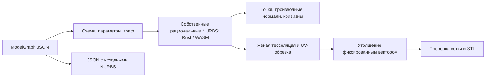

# Собственное NURBS-ядро ModelGraph

`modelgraph/nurbs-1` явно выбирает собственные численные алгоритмы на Rust (`crates/nurbs-kernel`). NURBS-вычисления не используют стороннюю геометрическую библиотеку, Open CASCADE, CadQuery или Manifold. Zod проверяет входной JSON, а `tsx` запускает TypeScript; эти зависимости не вычисляют NURBS. Кривые, поверхности, производные, редактирование и конструкторы вычисляет Rust через WASM. Вторая независимая Rust-библиотека `polygon-kernel` выполняет полигональную UV-тесселяцию, анализ/утолщение сетки и STL-экспорт. `geometry-bridge` связывает их через интерфейс параметрической поверхности и буферы сетки. TypeScript содержит адаптеры, обработку графа и остальные экспортные форматы. Прежние `modelgraph/1` и OpenSCAD сохраняют свои маршруты. Зарезервированное Rust B-rep-ядро этим изменением не включается.

Это работающий слой рациональных кривых и поверхностей с редактированием, запросами и получением производной сетки. Полное B-rep-ядро с топологией граней, сертифицированными пересечениями и булевыми операциями ещё не реализовано.

## Данные и выполнение

Контрольные точки, положительные веса, степени и развёрнутые узловые векторы остаются авторитетным представлением. Все вычисления используют `binary64`. Слово «рациональный» описывает математическое представление; оно не означает точную арифметику над действительными числами или интервальный сертификат.

У кривой с `N` контрольными точками и степенью `p` имеется `N+p+1` узлов. Её естественный диапазон — `[knots[p], knots[N]]`. Поверхность задаёт два таких направления; внешний индекс контрольной сетки — U, внутренний — V. Периодическое хранение требует явно повторённых контрольных точек, весов и внешних узлов. Одинаковые концы сами по себе не объявляют кривую периодической.

`compile` проверяет документ, разрешает ссылки на параметры и возвращает хеш нормализованного документа. Численные проверки сплайнов выполняются при построении или запросе. Узлы вычисляются по зависимостям и кэшируются в пределах одного запроса. Операции редактирования возвращают новые определения и не изменяют исходный узел.

MCP использует отдельный процесс с пределом 30 секунд, отменой и максимум двумя одновременно выполняемыми заданиями на процесс сервера. Вход ограничен 256 КиБ, ответ — 12 МиБ. Ошибка завершает этот запрос; автоматического переключения на другое ядро нет.

## Реализованные операции

| Область | Реализация и существенные условия |
| --- | --- |
| Кривые | Собственные базисные рекуррентные формулы Cox–de Boor; 2D/3D рациональные кривые; точки и аналитические производные первого и второго порядка. |
| Поверхности | Рациональное тензорное произведение; `Su`, `Sv`, `Suu`, `Suv`, `Svv`; нормаль `Su × Sv`; гауссова и знаковая средняя кривизна. |
| Редактирование | Вставка узлов в однородных координатах, повышение степени через рациональные Bézier-сегменты, ограничение диапазона, разбиение кривой на две обрезанные ссылки, разворот направления. Для поверхности — по каждой оси и по прямоугольнику параметров. |
| Изолинии | Точная в рамках рационального представления кривая при фиксированном U или V; это не аппроксимация набором точек. |
| Границы | Консервативная коробка контрольной оболочки при положительных весах. Она может быть шире фактической поверхности и не имеет сертификата округления наружу. |
| Построение поверхностей | Линейчатые участки между совместимыми кривыми, выдавливание кривой вектором, вращение вокруг оси с рациональными квадратичными дугами не более 90° на участок. Полный оборот допускается. |
| Преобразования | Аффинная матрица 4×4 применяется к трёхмерным контрольным точкам; перспективные матрицы отклоняются. Вырожденное преобразование может дать поверхность без нормали. |
| Производная сетка | Явное число сегментов U/V, полигональная UV-граница и отверстия, триангуляция обрезанной области, измеренное отклонение в дополнительных выборочных точках. |
| Утолщение | Копия сетки со смещением фиксированным вектором и соединение её границ стенками. Проверяются рёбра, ориентация, вырожденные треугольники и знаковый объём. |

В узлах с недостаточной гладкостью недоступные двусторонние производные равны `null`. Концы непериодического диапазона имеют односторонние производные. Вырожденная параметризация не получает выдуманную нормаль или кривизну. Знак средней кривизны соответствует ориентации `Su × Sv` и меняется при развороте одной оси.

Повышение степени сохраняет геометрию с точностью численной арифметики, но текущая сборка Bézier-сегментов может увеличивать кратности внутренних узлов. Поэтому представление может сообщать более низкую гарантированную гладкость, чем фактическая кривая. Редактирование периодической кривой вставкой, обрезкой или повышением степени ограничивает один период и снимает флаг периодичности; представленный диапазон сохраняется.

Линейчатое построение требует совпадающих степеней, узлов, размерности и количества контрольных точек исходных кривых. Оно не интерполирует автоматически произвольные несовместимые сечения. Выдавливание и вращение создают поверхности, а не автоматически замкнутые тела с крышками.

## Ограничения и экспорт

- Документ: до 128 узлов, глубина графа 32, до 64 параметров, 30 000 значений и 250 000 символов. Все узлы должны быть достижимы из корня.
- Математика: степени 1–25, до 256 контрольных точек кривой, поверхность до 32×32 точек, включая результаты редактирования. Веса находятся в `[1e-12, 1e12]`, отношение максимального к минимальному не превышает `1e12`.
- Документ принимает числовые скаляры в пределах ±`1e6` или ссылки `{param:"id"}`. Это отдельный контракт без функциональных выражений и типизированных величин `modelgraph/1`. Координаты означают миллиметры, углы вращения — градусы, узлы и UV — безразмерные параметры.
- Сетка: до 20 000 треугольников на результат и до 60 000 суммарно при выполнении графа. `sampledDeviationMm` — измерение на выборке, а `errorBoundCertified` всегда `false`. Оно не гарантирует максимальную ошибку между выборочными точками.
- Утолщение не является нормальным смещением NURBS-поверхности. Самопересечения, минимальная толщина стенки и пригодность для конкретного принтера не проверяются. Замкнутая ориентированная сетка не доказывает отсутствие геометрических самопересечений.

JSON сохраняет исходный параметрический NURBS-документ. STL содержит только производные треугольники и доступен для замкнутой, согласованно ориентированной сетки с положительным объёмом. Ограничение STL-артефакта — 4 МиБ. STEP/IGES и экспорт точного B-rep отсутствуют.

В этой реализации также отсутствуют общие пересечения поверхность–поверхность, рациональные криволинейные trim-петли, B-rep Boolean, сшивка произвольных патчей в топологическое тело, скругления, оболочки, общий sweep, подгонка по облаку точек, удаление узлов и понижение степени с контролем ошибки. Полигональная UV-обрезка применяется к производной сетке и не подменяет эти операции.

## Проверяемые свидетельства

| Проверка | Что она подтверждает |
| --- | --- |
| `tests/nurbsCurve.test.ts` | Рациональная четверть окружности, аналитические производные, незащемлённые диапазоны, периодическое хранение, вставка, обрезка, разворот и повышение степени. |
| `tests/nurbsSurface.test.ts` | Независимые значения взвешенного биквадратичного патча, нормали и кривизна рационального цилиндра, разные масштабы параметров, гладкость узлов, сингулярности, аффинная инвариантность, изолинии и редактирование поверхностей. |
| `tests/nurbsTessellation.test.ts` | Вогнутые UV-границы, отверстия меньше ячейки сетки, согласованная топология, уменьшение выборочного отклонения, утолщение, объём и запись STL. |
| `tests/modelGraphNurbs.test.ts` | Документ и параметры, построение в отдельном процессе, численные запросы, JSON/STL, отказ для неверной геометрии и отмена запроса. |

Основные модули: `src/services/nurbsCurve.ts`, `nurbsSurface.ts`, `nurbsConstructors.ts`, `nurbsTessellation.ts`; граф исполняет `modelGraphNurbsKernel.ts`, а MCP подключает `src/mcp/modelGraphNurbsTools.ts`. Эти тесты — регрессионные свидетельства для перечисленного поведения, а не квалификация общего CAD-ядра или доказательство корректности любого входа.

## Сборка Rust-ядра

Нужны Rust/Cargo nightly-2026-09-10 (rustc 1.100, `rust-toolchain.toml`) и target `wasm32-unknown-unknown`. WASM — прямой `cdylib` без `wasm-bindgen`. `npm run build:geometry` собирает обе библиотеки через `geometry-bridge` и генерирует синхронный WASM-модуль в `src/generated/geometry-kernels/`. Стандартные `npm run dev`, `npm run build`, `npm test`, `npm run typecheck` и `npm run mcp` вызывают сборку автоматически. При прямом запуске `tsx`/`vitest` сначала выполните `npm run build:geometry`.

`npm run test:geometry` запускает нативные Rust-тесты и интеграционные проверки через WASM, включая MCP-подпроцесс. `report.kernel` равен `own-rust-nurbs`. Автоматического перехода на TypeScript-математику нет. Тесселяция целиком выполняется внутри Rust над неизменяемым снимком поверхности; память освобождается по RAII и при успехе, и при ошибке.

## Обмен с полигональной библиотекой

`nurbsToPolygonMesh(surface, options)` создаёт производную сетку, не изменяя исходное определение. `polygonBoundaryNurbsCurves(mesh)` получает упорядоченные границы сетки и строит точные кусочно-линейные NURBS-кривые первой степени. Их можно снова использовать в NURBS-конструкторах. Это не восстановление гладких поверхностей по треугольникам. Полигональная библиотека работает отдельно с `positions`, `indices` и необязательными `uv`; она не импортирует NURBS. В `polygon-core` реализованы численные BSP-операции `union`, `intersection`, `difference` над замкнутыми ориентированными сетками. Они доступны через `booleanPolygonMeshes` и узел `mesh_boolean` с `inputs:[a,b]`; вычитание означает A минус B. Проверяются топология рёбер и вершин, ориентация оболочек и пересечения треугольников с заданным допуском. UV результата не сохраняются. Это операции над производной сеткой, не точные B-rep-операции над NURBS. Пределы: 10000 входных треугольников суммарно, 20000 выходных, 100000 фрагментов и 8000000 единиц работы. Допуск по умолчанию — 1e-9 от общего габарита; неоднозначная геометрия и превышение бюджета возвращают ошибку без перехода на Manifold. Пустой результат допустим и имеет bounds:null.

## B-rep и выбор поверхностей

`brep_extrude_curves` строит замкнутое тело непосредственно из сохранённых 2D-кривых. В JSON узел имеет вид `{id:"body", op:"brep_extrude_curves", loops:[["outer"],["hole"]], z_min:-2, z_max:3}`. Ссылки могут вести к исходной кривой или к результату существующего узла редактирования; они участвуют в обычных проверках достижимости, циклов и глубины графа. Текстовая форма — `brep_extrude_curves([[outer],[hole]], -2mm, 3mm).brep_tessellate(8)`, где элементы списков являются значениями `nurbs_curve`, а не строками.

Контрольные точки таких профилей имеют ровно две координаты. Кривые с тремя координатами не принимаются даже при `z=0`: автоматической проекции нет. Сохранённые окружности допускают вставку узлов, аффинную смену диапазона параметра и общий положительный множитель весов; повышение степени за пределы поддержанных квадратичных дуг не расширяет допустимый набор.

Готовый пример [корпуса с глухим карманом](../../examples/brep/stepped-enclosure.mg) доступен также в галерее приложения как «B-rep: корпус с карманом». Он использует круговое основание, приподнятый боковой выступ и карман с дном 2 мм. Проверенный нативный объём — около 7619,809938 мм³; показанные в сцене метрики считаются по производной сетке и зависят от детализации.

Контуры должны быть связными и замкнутыми, с материалом слева: внешние обходятся против часовой стрелки, отверстия — по часовой. Допустимы несколько внешних компонент и окружность, представленная одной многопролётной рациональной кривой. Поддерживаются рациональные прямые первой степени и круговые дуги второй степени; произвольные некруговые NURBS явно отклоняются. Исходные кривые, рациональные рёбра, линейчатые боковые поверхности и кривые обрезки крышек сохраняются; выборка точек не строит контур тела.

Пределы этой операции: 64 контура, 254 ссылки на кривые и 254 активных узловых пролёта суммарно, 8192 контрольные точки и 256 итоговых граней. Непустой контур содержит хотя бы одну кривую; `loops:[]` создаёт пустое B-rep без фиктивной сетки. Пределы Z задаются в миллиметрах в пределах ±1000000, высота — не менее 0,00001 мм. Вычисления выполняются в binary64 и не получают сертификат точной арифметики. Свидетельства: `tests/brepCurveExtrusionModelGraph.test.ts` и нативные проверки компиляторов ModelGraph.

Общая библиотека `brep-topology` не зависит от NURBS или полигонов. Оба ядра используют её вершины, рёбра, ориентированные использования рёбер, контуры, грани, оболочки и тела. Геометрия хранится в типизированных полях адаптера. Проверяются ссылки, владение, замкнутость контуров, связность оболочек, ориентация общих рёбер и веера граней у вершин. Геометрическая корректность тела, вложенность полостей и отсутствие самопересечений этим не доказываются.

`brep_box` строит NURBS-тело с 6 гранями, 12 рёбрами и 8 вершинами; `brep_tessellate` сохраняет связь каждого треугольника с гранью. Полигональный адаптер принимает индексированную сетку и явные группы граней, включая грани с отверстиями. Идентификаторы — индексы в модели, не глобальные стабильные ключи после произвольного редактирования.

В просмотрщике авторские `faceIds` сохраняются. Для старых сеток без авторской топологии соседние треугольники объединяются при угле между нормалями не более 30 градусов. Границы, острые и неманифолдные рёбра разделяют выбор; близкие несвязанные поверхности не склеиваются. Это эвристика, не восстановление B-rep. Ограничение подсветки остаётся 20000 треугольников.

## Обратные преобразования

Теперь доступны явные meshToSdf, meshToSubdivision, meshToNurbs и meshToNurbsBrep. Методы, ограничения точности и команды языка описаны в [mesh-reconstruction.md](mesh-reconstruction.md).
