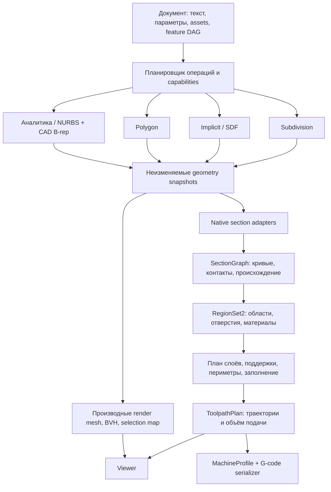

# Архитектура собственной геометрии и нарезки

Дата: 2026-09-08. Статус: **предлагаемая целевая архитектура по текущему коду и требованиям пользователя**. Это проектирование, не заявление о готовом CAD-ядре или слайсере. Проверка реализации: [аудит](geometry-architecture-audit-2026-09-08.md); первичные источники: [нарезка](slicing-evidence-2026-09-08.md); независимая проверка: [разбор решений](geometry-architecture-review-2026-09-08.md). История поиска и подготовка RAG: [пакет знаний](../architecture/geometry-2026-09-08/README.md).

## 1. Решение

Нужны **четыре семейства собственной геометрии на Rust**, общая топология и общий двухмерный геометрический слой. Каждое семейство выполняет поддерживаемые операции над своим представлением. Общими становятся контракты, численная инфраструктура, документ, результаты сечений и планирование печати. Произвольное приведение всех входов к треугольникам не является интеграцией библиотек.

- Аналитика и NURBS/Bézier описывают кривые и поверхности. Bézier — частный случай/форма вычисления; отдельная пользовательская библиотека не нужна.
- B-rep описывает **связи и границу**. Он применим к аналитическим/NURBS граням и фасетным телам. Сам по себе граф смежности не доказывает корректность тела.
- Полигональное ядро владеет сеткой и её операциями.
- Subdivision владеет управляющим каркасом, правилами границ/складок и определением предельной поверхности.
- Неявное ядро владеет полем и семантикой знака. Не каждое такое поле является точной signed distance function.
- Слайсер получает исходное представление и возвращает сечение, затем общий конвейер получает плоские области. Создавать полную трёхмерную сетку для этого необязательно.

Растеризатор по-прежнему может получать треугольники. Опция «не переводить NURBS в полигоны» означает сохранить NURBS источником геометрии для операций, измерений и нарезки; отдельная сетка отображения этому не противоречит.

## 2. Что меняется относительно прежних планов

[Спецификация июля](rust-brep-nurbs-kernel.md) и [план августа](brep-nurbs-14-stage-master-plan.md) проектировали два постоянных класса движка, Manifold и будущий Rust B-rep. Позднейшие требования пользователя добавили собственные polygon, SDF, subdivision, обратные преобразования и операции в каждом подходящем ядре.

Сохраняем из прежнего плана: source provenance, независимость геометрии и топологии, явные преобразования, отсутствие скрытого fallback, атомарную публикацию, численные ограничения, отдельную проверку заявленной точности. Предлагаем заменить **для нового собственного контракта** выбор одного представления на всю сцену типизированным графом операций над несколькими представлениями. Выбор провайдера совместимости и тип геометрии — разные вещи.

Legacy `.scad`, существующие manifest/qualification snapshots и зарезервированный `brep-1` остаются в своих действующих контрактах. Новый дизайн не означает их прохождение, изменение или автоматическую маршрутизацию. Текущий `modelgraph/nurbs-1` уже обслуживает несколько представлений; следующий контракт предлагается назвать `modelgraph/geometry-2`. Старое имя поддерживается адаптером. Номер/имя нового формата здесь предложены, ещё не зарегистрированы.

Старые документы сохраняются как историческое evidence. При индексации статус «runtime отсутствует» из старого плана нельзя распространять на уже существующие математические crates; и наоборот, существование crates не делает готовым квалифицированный solid B-rep provider.

## 3. Архитектурные решения

| ADR | Решение | Почему |
| --- | --- | --- |
| A01 | Один редактируемый документ, несколько типов геометрии | Сцена может содержать CAD-корпус, скан и SDF-вставку одновременно |
| A02 | Форма хранения и геометрический смысл — отдельные признаки | NURBS patch — поверхность; mesh может быть листом, телом или некорректной оболочкой |
| A03 | Операции принадлежат ядру; диспетчер только выбирает разрешённую реализацию | `extrude` кривой и профиля дают разные типы результата |
| A04 | B-rep topology отдельно; CAD-операции над геометрией и топологией вместе | Перемещение одной грани требует обновления кривых, pcurves, смежных граней и валидации |
| A05 | Native geometry, render geometry и manufacturing geometry разделены | LOD камеры не меняет размер детали и траекторию печати |
| A06 | Общая граница нарезки — SectionGraph → RegionSet2 | Контакты и открытые ветви нельзя без проверки считать замкнутыми областями |
| A07 | Предикаты, построения, метрические допуски и полнота результата различаются | Точный знак orient2d не делает округлённую точку пересечения точной |
| A08 | Конверсия — явный узел с отчётом об изменении геометрии и identity | Обратное восстановление сетки не восстанавливает неизвестный CAD-замысел |
| A09 | Состояние геометрии неизменяемое, изменения транзакционные | Ошибка или отмена не оставляет половину Boolean/скульпта |
| A10 | RAG — внешний инструмент знаний, не зависимость геометрического runtime | Модель должна собираться и печатные артефакты воспроизводиться офлайн |

## 4. Система и направление зависимостей



Логические модули ниже — направление зависимостей, **не требование немедленно создать все crates**. Выделять crate при появлении второго потребителя, независимого API или бюджета сборки. Пометка «существует» означает наличие crate, а не готовность всей целевой ответственности: frames, limit/crease evaluation, intervals и общие intersections ещё требуют реализации; фактические возможности см. в аудите.

| Модуль | Целевая ответственность | Не должен зависеть от |
| --- | --- | --- |
| `geometry-core` (предлагается) | Point/Vector/Transform, единицы, численные policies, budget/cancel, structured errors, evidence | Представлений, UI, serde JSON на горячем пути |
| `geometry-ops` (существует) | Общая математика деформаций, frames, brush falloff | Polygon/NURBS/SubD/SDF |
| `planar-geometry` (предлагается) | Paths/regions, 2D arrangements, классификация, offsets, triangulation с lineage | 3D mesh, принтера, документа |
| `brep-topology` (существует) | Vertices/edges/coedges/wires/faces/shells/bodies и incidence | Реализаций поверхностей |
| `nurbs-kernel` (существует) | Rational curve/surface, jets, knots, analytic specializations, intersection primitives | Mesh и слайсера |
| `brep-kernel` (предлагается из нынешнего nurbs::brep) | Geometry + topology validation, solid features, trims, sewing, Boolean | Viewer, G-code, implicit fallback |
| `polygon-kernel` (существует) | Mesh storage/topology, native modeling, mesh intersections/Boolean | NURBS, SDF, SubD |
| `subdivision-kernel` (существует) | Cage, creases, refinement, limit evaluation, native cage edits | Polygon algorithms для внутренних операций |
| `sdf-kernel` (существует) | Field DAG, sign/distance evidence, bounds, interval queries, samples | Polygon-specific errors и mesh storage |
| `sketch-kernel` (существует) | Constraint graph, solve status, rank/residual diagnostics | Выходных solid representations |
| `geometry-bridge` (существует) | Явные cross-representation conversions и mapping reports | UI и machine profiles |
| `modeling-runtime` (предлагается) | Feature evaluation, snapshots, capability routing, cache | Vue/WebGPU, знаний RAG |
| `slicing` (предлагается) | Layer schedule, section orchestration, материализация областей | GPU и файла G-code |
| `toolpath` / `machine-output` (предлагаются) | Print features / сериализация под конкретный станок | Конкретной реализации NURBS или mesh |
| Host ABI / MCP adapters | Версии wire format, admission, handles, progress, transport | Геометрических алгоритмов внутри dispatch |

Первые исправления зависимостей: вынести `sweep_sections` из polygon в общую frames-математику; вынести Error/Result из polygon; SDF mesh-distance сделать адаптером `geometry-bridge` с owned bounded distance sampler/BVH, а не зависимостью всего SDF от polygon. SubD tessellation должен выдавать нейтральный `TriangleBuffer`/sink; mesh operations над ним начинаются только в polygon-адаптере. Нейтральный triangle buffer — транспорт, не новая авторитетная mesh-модель.

`Region2` из geometry-ops — пока простые кольца для sampling. Его нельзя объявлять готовым arrangement/offset kernel. UV pcurves могут использовать общую математику 2D, но UV безразмерен; допуск в миллиметрах переводится через геометрию поверхности и локальную обусловленность, не копируется как UV epsilon.

## 5. Типы и source of truth

У документа одна редактируемая ревизия: source text + именованные параметры + ссылки на immutable geometry assets. Типизированный feature DAG — результат компиляции этой ревизии. Изменения в viewport создают изменение параметра/новый feature node/asset revision и затем обновляют source. Не допускаются две независимо изменяемые копии текста и графа. Для сохранения комментариев нужен lossless CST и адресуемые диапазоны; до него сложный direct edit добавляет явный узел, а не переписывает произвольную функцию.

Пример предлагаемого значения:

```text
GeometryValue {
  geometry_id, revision, representation,
  semantic_kind: Curve | Region | Sheet | Solid | SolidSet,
  payload_ref, units, bounds_evidence,
  validation_evidence, provenance_ref
}
Representation = AnalyticNurbs | Faceted | Subdivision | Implicit
```

Внутри валидаторов состояния явные: imported/unvalidated → validated sheet → validated solid. `Solid` нельзя получить установкой флага `closed=true`. Нужны применимые проверки ориентации, смежности, самопересечений, containment оболочек и допусков. Там, где проверки неполны, API возвращает candidates + evidence, не validated solid.

Контрольные точки NURBS, вершины B-rep, вершины mesh и cage controls — разные selectable entities. Сетка отображения хранит `triangle → geometry revision → source face/patch/cage face`; edges и points имеют отдельные отображения. Snapshot-local индексы остаются компактными, но сериализуемые IDs независимы от порядка массивов. Lineage описывает `preserved/split/merged/generated/deleted/ambiguous`. При неоднозначности идентичность не угадывается по близкому центру.

## 6. Capabilities и операции в каждой библиотеке

Нужен список реализуемых возможностей с точными входами, выходами и ограничениями, а не один флаг `supportsExtrude`.

```text
Capability {
  id, algorithm_version, accepted_types, result_type,
  parameter_domain, degeneracy_policy,
  accuracy_class, completeness_class, limits
}
```

Примеры разных возможностей: `nurbs.curve.extrude_surface`, `brep.region.extrude_solid`, `polygon.region.extrude_solid`, `subdivision.profile.extrude_cage`, `implicit.region.extrude_field`. Одно короткое слово языка допустимо, когда тип входа и явно выбранный режим однозначно определяют результат. Capability mismatch сообщает причину, не запускает другое ядро.

| Операция | NURBS / CAD B-rep | Polygon | Subdivision | Implicit / SDF |
| --- | --- | --- | --- | --- |
| Extrude/Revolve | Surface от curve; solid от замкнутого region + caps | Вершины/грани + topology | Построение cage; limit shape отдельно | Поле от signed planar region |
| Sweep/Loft | Alignment, frame/orientation policy, continuity; caps в B-rep | Корреспонденция колец, frames, triangles | Cage topology/creases | Свои field constructions, с указанием bound/sign semantics |
| Boolean | Пересечения поверхностей → trim → classify → sew | Intersections → conforming mesh → classify | Только явно поддержанная trimmed/remeshed модель; обычный cage не замкнут относительно Boolean | Операции над знаковыми полями; smooth изменяет форму |
| Direct edit | Features и согласованная B-rep транзакция | Selected vertices/edges/faces и проверка сетки | Controls/creases | Field nodes и spatial edits |
| Sculpt | Control-space brush либо явная fitted/deformed surface | Brushes + локальные mesh policies | Cage/limit-aware brushes | Добавление/удаление/сглаживание поля |
| Section | Native curves/pcurves и контакты | Segment graph | Limit evaluation/adaptive bound | Zero set в плоскости |

Это **целевая матрица**, не отчёт реализации. Текущие bounded API перечислены в [native-modeling-operations.md](native-modeling-operations.md). Особенно нельзя смешивать fixed-orientation rational sweep и rotation-minimizing polygon sweep: одинаковые аргументы не означают одинаковую геометрию.

## 7. Численный контракт

`f64` — базовое хранение геометрии; `f32` только производный render output в локальном origin. Координатные пределы и предельный диапазон после преобразования проверяются до аллокаций. Размеры модели/печати — mm, углы — явно rad/deg; нельзя смешивать UI пиксели и геометрический tolerance.

1. **Предикаты** возвращают sign/classification с доказуемыми условиями. Adaptive arithmetic решает сложные случаи, не увеличивая произвольно epsilon. Основание: [Shewchuk](https://www.cs.cmu.edu/~quake/robust.html).
2. **Построения** сохраняют определяющие входы/параметры или интервалы неопределённости пересечения. Точные предикаты поверх уже округлённых промежуточных точек не исправляют ошибку построения. Основание: [CGAL robustness](https://doc.cgal.org/latest/Manual/devman_robustness.html).
3. **Метрические допуски** отдельно: classification, intersection residual, permitted join, curve approximation, manufacturing deviation. Глобального `EPS` для всей системы нет.
4. **Полнота** отдельно от остатка: малый residual найденной ветви не доказывает, что найдены все ветви.

```text
OperationResult<T> = Completed { value, evidence, lineage, resource_usage }
                  | Indeterminate { reason, unresolved_domains }
                  | Rejected { code, details }
                  | Cancelled
Evidence {
  authority, geometric_error: ProvenBound | Estimated | Unknown,
  completeness: Proven | RestrictedDomain | Unresolved,
  topology_checks, numeric_policy_version, conversions
}
```

`Empty` — допустимый завершённый результат, только когда пустота установлена в разрешённом домене. Нельзя возвращать его при timeout/ошибке solver. Частичную геометрию можно показать как diagnostics, но нельзя выдать за экспортируемое тело.

Для этапов с доказанными ошибками и конечными Lipschitz bounds в выбранной метрике на всём разрешённом домене ограничение суммарной геометрической ошибки составляется с учётом преобразований: `e_total <= sum(L_downstream_i * e_i)`. Просто сложить числа допустимо только при известной нерасширяющей последующей обработке. Boolean, контакт и смена topology областей могут не иметь нужной устойчивости; их классификация проверяется отдельно. Near-tangent slicing может быть плохо обусловлен: малая 3D-ошибка не даёт малой XY-ошибки контура. Пример бюджета 0.05 mm может распределяться на section/linearization/quantization, но не включает физическую усадку и механику принтера; это не универсальный default. Estimated error никогда не повышается до proven суммированием.

Проверки topology, geometric deviation, completeness и технологической пригодности независимы. Тестовый корпус не подменяет математический сертификат; ограниченный подтверждённый домен полезнее неподтверждённой общей гарантии.

## 8. B-rep, пересечения и Boolean

`brep-topology` хранит incidence. `brep-kernel` связывает грани с аналитическими/NURBS поверхностями, edge с 3D curve, coedge с UV pcurve; одна edge может иметь разные параметризации на соседних гранях. Seam, периодичность, полюса и вырожденные edge представлены явно. Point/edge tolerances не могут самопроизвольно расти для успешного sewing.

Общая основа Boolean и slicing — intersection service, но результат секции не обязан быть замкнутым solid. Последовательность CAD Boolean: broadphase → intersections/contact/overlap → UV arrangements → classification → boundary selection → согласованное sewing → validation → atomic publish. Политики union/intersection/difference задаются над областями, отдельно от нахождения пересечений. Для mesh полезна та же декомпозиция; направление подтверждает [Lévy, mesh CSG](https://arxiv.org/abs/2405.12949).

NURBS SS пересечение в общем случае не является точно представимой NURBS-кривой конечной степени. Хранить `IntersectionCurve` с родительскими поверхностями, parameter traces, coverage/evidence; fitted curve — отдельное приближение. Независимо аппроксимированные 3D curve и две pcurves могут разойтись. Согласованность проверяется относительно одного источника пересечения.

Начальный домен — planes и ограниченный набор аналитических пар, затем transverse patches, после этого tangencies/coincidences. Уже transverse пересечение может иметь замкнутую петлю полностью внутри обоих parameter domains: поиск только от границ неполон. Transverse capability включает coverage и обнаружение таких петель либо доказанное ограничение входного домена, исключающее их. Для каждой пары surface types — явная capability. Новая pair capability не включает все degeneracies автоматически.

Tessellation идёт от shared edge samples к face interiors. Швы сшиваются по topology correspondence; случайная proximity weld не заменяет связь ребра и способна уничтожить малый зазор.

## 9. Нарезка: уточнённая схема пользователя

### 9.1 Вход и общая граница

`SliceRequest` содержит geometry revision/placement, plane frame, интересующую область, tolerance policy, material/part identity и work budget. Plane frame ортонормирован; мировые точки преобразуются в mm-координаты плоскости. Bounds консервативны либо отмечены как estimates; estimates нельзя использовать для гарантированного отбрасывания деталей.

```text
SectionGraph {
  plane, vertices, directed_curve_spans,
  isolated_contacts, coincident_regions, open_branches,
  source_refs, orientation, numerical_evidence
}
RegionSet2 {
  disjoint_regions: outer + holes + material/part ownership,
  validated_winding, intersection_free_boundaries,
  boundary_lineage, approximation_evidence
}
```

Секция surface/sheet может быть открытой; для неё это корректный результат. Для solid slice остаются отдельные статусы `closed/empty/ambiguous/invalid`. В нулевой мере касание может дать точку/линию и не давать заполненную область. Совпадение plane с гранью или вершиной разрешает единая политика слоёв с корректной классификацией, а не произвольный случайный сдвиг Z.

### 9.2 Адаптеры представлений

- **B-rep:** пересечение поверхностей с плоскостью, clip по UV trims, согласование endpoints по edge identity, классификация областей тела. Аналитические линии/дуги можно сохранять; NURBS-пересечения могут требовать bounded approximation. Не тесселировать всё тело для native section.
- **Mesh:** BVH/interval index для candidate triangles, consistent half-open/coplanar policy, topology-aware vertex/edge ownership, oriented segment assembly. Никакого заполнения дыр простым соединением ближайших endpoints.
- **SDF:** ограничить 3D field на plane и извлекать двумерный zero set. Same-sign samples по углам ячейки не исключают внутренний замкнутый контур. Для completeness нужны interval/Lipschitz bounds и subdivide/refine policy. Без bound результат только sampled; unbounded/unknown field требует явной ROI и отчёта clipping.
- **Subdivision:** задавать предельную поверхность, включая crease/boundary rules. Native patch evaluation или адаптивные patches с проверенной ошибкой. `N` refinement steps не являются сертификатом расстояния до limit surface. Для extraordinary vertices отдельный домен/статус.

Только адаптеры зависят от представления. Общие 2D операции получают кривые/сегменты и происхождение. Первая production версия planar kernel может обрабатывать сегменты на определённой integer lattice с overflow checks и explicit quantization bound; это точность **относительно квантизированных входов**, не исходных NURBS. Сохраняем исходные spans рядом, не утверждая, что все downstream offsets остаются рациональными кривыми.

### 9.3 Сборка печатных областей

`SectionGraph → arrangement → classified RegionSet2 → part/material composition`.

Assembly не равна union. Детали спиннера должны оставаться отдельными parts; перекрытия материалов требуют явного приоритета/диагностики. Для одного материала union может убирать внутренние границы по заданной политике. Modifier volumes, support blockers и infill modifiers имеют роли и не становятся печатаемыми solids автоматически.

Равенство «сечение Boolean = planar Boolean сечений» полезно для обычных множеств при фиксированной плоскости. Для regularized solid semantics и вырожденных контактов нужны отдельные правила; не заменять 3D Boolean lazy slicing без проверки этой семантики. Планарный план печати не создаёт отредактированное 3D CAD-тело.

### 9.4 От областей до подачи пластика

Layer schedule отделён от section evaluation. Адаптивная высота использует геометрию и machine/process limits; `sample_z`, высота материала слоя и команда Z принтера — разные поля. Соседние/дальние слои нужны для skin, bridges, support connectivity и support interfaces. Поддержки нельзя вычислить только из одного текущего контура.

Далее: print regions → периметры/variable width/thin features → top/bottom/infill/support paths → ordering/travel/retraction → volume flow → machine output. Все эти стадии общие для четырёх представлений.

`ToolpathPlan` хранит semantic moves, polyline/arc geometry, part/material/tool, bead width/height, deposition volume, target speed и причины ограничений. Сериализатор не вычисляет NURBS и не угадывает ширину дорожки.

Для обычного режима подачи длиной филамента: `ΔE = deposited_volume / (pi*d_filament^2/4)`, с явной flow calibration. Это приращение подачи для deposition move; absolute E накапливается отдельно с учётом retract/reset state. Объём дорожки зависит от принятой модели её сечения; `width*height*length` — приближение, не универсальный закон. Feedrate/volumetric flow/acceleration/retraction согласуются с machine profile; pressure advance не применяется одновременно скрыто в slicer и firmware. G-code dialect, units, absolute/relative XYZ/E и firmware capabilities явно фиксируются. Генерация файла не отправляет его на принтер.

## 10. Исполнение, сохранение, преобразования

- Целевой native Rust API работает над типами и immutable handles. Текущий JSON/WASM dispatch — совместимый вход; большие buffers постепенно переводятся на versioned binary/typed buffers после измерения overhead.
- Первоначально один dedicated Worker владеет всеми native handles. Четыре библиотеки не требуют четырёх WASM memories и копирования модели между ними. Синхронный execute не обрабатывает cancel messages во время вычисления. Hard cancel завершает Worker и инвалидирует handles всей его generation; для кооперативной отмены нужны шаговый executor/checkpoints с реально доступным сигналом отмены. Budget counters должны проверяться внутри длинных циклов.
- Cache key включает geometry-relevant hash узла и его входов (не весь текст с цветом/комментариями), placement, fingerprint ядра, representation/algorithm version, numeric policy и параметры. Source hash отдельно подтверждает ревизию документа при публикации. Render cache дополнительно включает tessellation policy; slice cache — plane/schedule/composition; toolpath cache — process/material и machine/kinematic profiles, поскольку план уже содержит скорости и ограничения. Смена цвета не пересчитывает Boolean, смена сопла не пересчитывает исходную геометрию.
- Entity refs включают revision. Результат для старой ревизии не публикуется даже после успешной геометрии. Cache не хранит partially computed/indeterminate значение как completed.
- Snapshot serialization хранит schema version, units, geometry payload, topology, lineage и evidence; process handles не являются долговечными IDs. Текстовый CAD и импортированные assets входят в source package. Undo использует транзакции/snapshots, не обратные Boolean.
- Конверсии mesh→NURBS faceting, PN/fitted patches, mesh→SubD fitting и signed mesh-distance должны возвращать fit domain, source hash, error method, correspondence и потерянные свойства. Отдельный статус для восстановленного CAD-замысла — он сейчас отсутствует. Это целевой полный отчёт; текущие отчёты уже содержат часть проверок, но не весь контракт (см. аудит). Конверсия никогда не заменяет исходный asset без явной операции.

## 11. Поэтапная реализация и критерии завершения

Не начинать с монолитного general NURBS Boolean. Последовательность ниже приносит используемые результаты и одновременно строит общую основу.

| Этап | Проверяемый результат | Условие завершения |
| --- | --- | --- |
| P0 Контракты и source linkage | Native geometry живёт в scene рядом с render mesh; корректный выбор patch/face | Изменение LOD не меняет selection; rebuild отслеживает split/merge; устаревший ref отвергается; legacy fixtures прежние |
| P1 Общая математика/2D | Убран import polygon из базовых SDF/SubD; planar arrangements и offset subset | Сквозной профиль с holes → mesh/SubD/SDF; касания/вложенность/коллапс/квантизация и budget failures |
| P2 Mesh sections + общий print pipeline | Собственный mesh → слои → простые walls/infill → preview + G-code artifact | Box/cylinder/annulus/spinner, planes через vertex/edge/face, holes preserved, volume-flow checks; без запуска принтера |
| P3 CAD B-rep foundation | Capped extrusion/revolution, native analytic section, topology-owned tessellation | Seam/apex/cavity cases; один face selection на всех LOD; native slice сравнен с аналитическими ожидаемыми контурами |
| P4 SDF и SubD sections | Тот же RegionSet2/print pipeline из field и limit surface | Изолированная петля внутри ячейки, thin features, extraordinary/crease fixtures; явный отказ при недостаточном bound |
| P5 CAD intersections и Boolean | Поочерёдно admitted analytic пары, затем NURBS domain | Tangent/coplanar/contained/disjoint/identical/closed-loop matrix; независимая проверка результата и atomic failure |
| P6 Полные инструменты моделирования | Sketch/direct/sculpt, все подходящие native operations в языке/UI | Каждая операция меняет source/asset revision; load/save/undo/recompute; тип результата и ошибки доступны пользователю |
| P7 Производственное качество печати | Variable widths, supports/interfaces, multi-material, process profiles | Несколько слоёв, overlap policies, thin walls, deposition verification; отдельно реальные калибровочные печати |

P5 не блокирует P2 и P4: интерфейс intersection/section фиксируется раньше. P0/P1 выполняются прежде массового расширения кнопок. Для каждого этапа нужны native Rust tests, WASM parity, source→viewer/MCP integration и adversarial geometry. Производительность сравнивать на одних входах: пиковая память, build/section latency, объём transfer, cancel latency; численные цели выбирать по измеренному baseline, не переносить тестовые caps в обещания для большого скана.

## 12. Отвергнутые упрощения и нерешённые исследования

- Один `Geometry.boolean()` на все значения скрывает разные семантики и отсутствующие реализации.
- Полная polygon conversion перед любым слайсингом теряет преимущество native представлений.
- Общий UI-level epsilon ломает thin gaps; global proximity weld стирает детали.
- Изменение B-rep face только смещением control points не обновляет trims и соседние границы.
- SubD Boolean с возвращением произвольного coarse cage без явного remesh не является точной операцией над limit surface.
- SDF offset `f-d` имеет смысл геометрического смещения на d только при достаточном distance contract.
- RAG-статья со словом «implemented» не заменяет проверку кода и test evidence соответствующей ревизии.

Исследования с реальным риском: полные NURBS SS tangencies/overlaps; certified adaptive SubD sections; feature-preserving conversion; topology-safe field contouring; сохранение persistent naming после радикальной смены topology. Их результаты могут сужать admitted domain, а не давать ложный универсальный API. Это причина точных capability contracts, а не причина лишать каждое ядро собственных операций.
