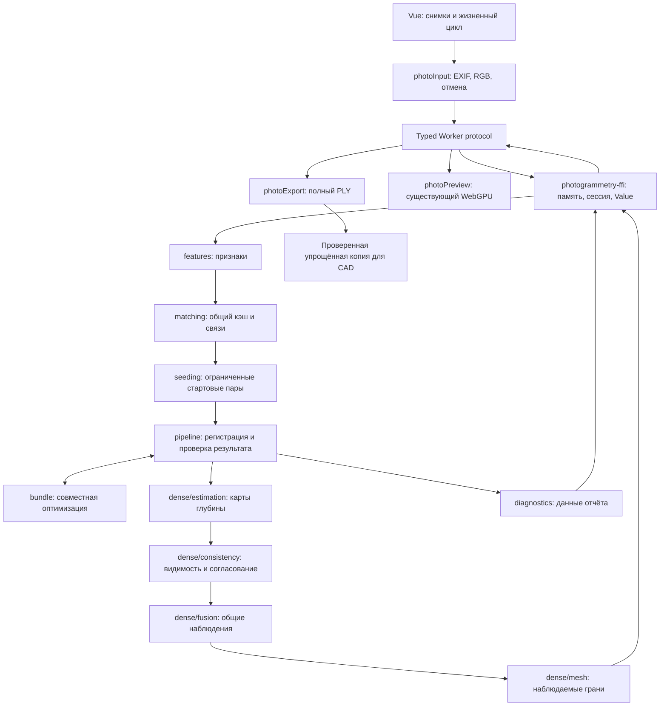

# Архитектура восстановления 3D по фото

Решение для `open-scad-viewer`, 9 сентября 2026 года. Собственная классическая фотограмметрия на Rust; браузер отвечает за чтение снимков, интерфейс и WebGPU. Новых сторонних зависимостей не добавлено: вычислительное ядро использует только `std`, WASM-адаптер — ядро и существующий локальный `value-codec`.

## Основание выбора

Предшествующий обзор охватывает 100 проектов полного процесса, отдельных алгоритмов и вспомогательных библиотек. Это архитектурное исследование, а не сравнительный запуск всех проектов. Полный каталог сохранён в соседнем рабочем проекте `scan/research/photogrammetry-100/REPORT.md` и `catalogue.json`. Из него приняты следующие решения; внешний код этих библиотек в приложение не подключается.

| Ориентир | Решение здесь | Граница реализации |
| --- | --- | --- |
| [COLMAP](https://github.com/colmap/colmap), [openMVG](https://github.com/openMVG/openMVG) | Раздельные признаки, соответствия, камеры, наблюдения и диагностика; повторные старты используют общий кэш | Нет базы долговременных проектов и полного track merging |
| [Ceres](https://github.com/ceres-solver/ceres-solver), [sba](https://users.ics.forth.gr/~lourakis/sba/) | Huber + Levenberg–Marquardt, исключение блоков точек по Шуру, фиксированная поза и масштаб | Intrinsics пока фиксированы, это не универсальный нелинейный решатель |
| [ACMM](https://github.com/GhiXu/ACMM), [OpenMVS](https://github.com/cdcseacave/openMVS) | Выбор видов по общим наблюдениям и базису, обратная проверка глубины и нормалей | Собственный перебор обратной глубины, без CUDA и PatchMatch-плоскостей |
| [Open3D](https://github.com/isl-org/Open3D), [OpenChisel](https://github.com/personalrobotics/OpenChisel) | Отдельная стадия объединения согласованных измерений и явный бюджет памяти | Сейчас слияние наблюдаемых элементов поверхности; TSDF и глобальная перестройка сетки не реализованы |
| [libigl](https://github.com/libigl/libigl) | Проверка топологии перед передачей в твердотельный CAD | Используется уже имеющееся polygon-ядро; отсутствующие поверхности автоматически не достраиваются |
| [PoseLib](https://github.com/PoseLib/PoseLib), [VLFeat](https://www.vlfeat.org/) | Следующие независимые кандидаты для улучшения poses/features | Полные SIFT, P3P и минимальный 5-point solver пока не реализованы |

## Поток и границы

Численный слой не знает Vue, Worker, DOM, файлов, часов или сериализации. Передача данных и хранение принадлежат WASM-сессии. Отчёт численного ядра содержит результаты проверок; время измеряет вызывающая сторона. Один вызов Worker владеет одной сессией, а панель — Worker, отменой декодирования и URL миниатюр.

## Разреженная реконструкция

`Image`, `Camera`, `Point` и `Reconstruction` — предметные данные. Наблюдение точки задаётся парой индексов изображения и признака; у принятой точки не бывает двух наблюдений одной камеры. Незарегистрированные камеры сохраняют свои исходные индексы как `None`.

`features` вычисляет Harris-признаки трёх масштабов и ориентированный 128-компонентный дескриптор. Это не SIFT. Подавление соседних максимумов использует пиксельный bitmap с прежними прямоугольными порогами. `MatchGraph` хранит каждую неупорядоченную пару один раз; обратный запрос меняет направление индексов без копирования массива. `AssociationVotes` отвергает связи одного признака с разными точками и разрешает конкуренцию нескольких признаков за одну точку детерминированно.

Для проектов до 24 кадров проверяются все пары; для более крупных нативных наборов стартовые предложения ограничены окном порядка съёмки. Часть бюджета геометрических проверок оставлена ранним парам, остальное ранжируется по совпадениям и пространственному покрытию. Относительная поза всё ещё использует нормализованный восьмиточечный RANSAC и проверку глубины.

По умолчанию оцениваются до 12 пар и выполняются до 4 попыток роста реконструкции. После остановки одной компоненты следующий старт предпочитает ещё не зарегистрированные виды. Признаки и сопоставления общие, геометрия каждой попытки независима. Выбирается результат с большим числом **подтверждённых** камер, затем точек; при полном охвате поиск прекращается. Это эвристика полноты регистрации, не оценка истинности формы. Независимые компоненты автоматически не совмещаются.

Регистрация PnP требует не менее 8 принятых наблюдений. После оптимизации удаляются геометрически несогласованные точки. Финализация повторно исключает камеры с менее чем 8 оставшимися наблюдениями и точки с менее чем двумя видами до устойчивого результата. Поэтому число зарегистрированных кадров не включает камеры, потерявшие поддержку при фильтрации.

`ReconstructionOptions` управляет бюджетом признаков, пар и попыток, а `bundle: Option<BundleOptions>` задаёт совместную оптимизацию. `None` — явное отключение. Нативный ввод ограничен 200 изображениями, при включённой BA — настроенным пределом до 64; превышение возвращает ошибку до расчёта. Браузер ограничен 24 снимками. Настройки не игнорируются молча.

## Совместная оптимизация

`bundle::optimize` получает камеры, координаты, неизменяемые наблюдения, опорную пару и настройки. Минимизируется робастная ошибка проекции в пикселях. Параметры камер — шесть степеней свободы; focal и principal point фиксированы. Опорная поза неподвижна, а после принятого шага точное преобразование подобия вокруг её центра сохраняет исходную длину базиса. Это сохраняет относительный масштаб; миллиметры из фото не появляются.

Исключаются независимые блоки точек размером 3×3, решается уменьшенная система камер. Не создаётся плотная матрица по всем точкам. Память для связей и временных блоков переиспользуется. Проверяются валидность индексов, конечность данных, положительная глубина, отсутствие повторов, наблюдаемость глубины и связность с опорой.

Вызов транзакционный: ошибочная задача и отмена, в том числе после принятых промежуточных шагов, не изменяют входные массивы. Обычная численная невозможность улучшения возвращает отчёт с нулём принятых шагов; отказ BA в pipeline сохраняет предшествующую геометрию и явно попадает в предупреждения. Нулевая стоимость, количество итераций и reprojection RMSE не заменяют проверку геометрии по эталону.

## Глубина и общая поверхность

`dense` оставляет прежний совместимый API `densify` и добавляет `densify_with_options`, возвращающий поверхность с диагностикой. Отдельные модули отвечают за оценку карт, согласование, слияние и грани.

На каждый снимок один раз вычисляется grayscale; проекции и лучи патчей подготавливаются вне перебора глубин. Во внутреннем цикле нет heap-выделения на каждую гипотезу. Источники выбираются по общим 3D-наблюдениям и полезному углу триангуляции, а не только по расстоянию между камерами. Проверка использует относительную глубину, обратную проекцию и согласованность нормалей; отклонение и отсутствие данных различаются в отчёте.

Fusion объединяет близкие, совместимые по ориентации и положению наблюдения **разных** видов, накапливает цвет и удаляет одинаковые грани. Противоположные стороны тонкой детали и разделённые параллельные слои не должны слипаться. Грани строятся из наблюдаемых участков карт. Это ещё не TSDF и не глобальное построение замкнутой поверхности: отверстия и частичные перекрытия разных триангуляций допустимы. Отсутствующие измерения не становятся доказанной поверхностью.

Перед выделением крупных массивов оценивается рабочий набор; оценки свыше 512 MiB отклоняются. RGB вызывающей стороны в этот бюджет не входит. Это консервативный планировщик, не ограничитель аллокатора; временные копии сериализации и памяти браузера имеют отдельные лимиты.

## Браузер, экспорт и ошибки

`photoInput` атомарно публикует импортированный набор и владеет URL. Ошибка в середине набора освобождает новые URL, сохраняя прежние фото. Отмена во время декодирования закрывает bitmap и предотвращает запуск устаревшего Worker. Панель отбрасывает сообщения старого запуска по generation ID.

Общий `PhotoWorkerEvent` — discriminated union. Разреженный результат публикуется до плотного; отказ плотного этапа не стирает его. Упрощение для CAD — отдельная необязательная операция: его отказ не скрывает полную поверхность. Ошибка очистки не заменяет исходный итог задачи. Rust-конверт ответа забирает владение уже построенным `Value`, не клонируя всё дерево повторно.

`photoPreview` хранит преобразование и подготовленные meshes на время одного результата. Цветные пакеты не проходят ненужное построение BVH всего облака. Нормализация применяется только к показу. `photoExport` сохраняет полный PLY и отдельно проверяет твердотельную пригодность, размер и бюджет текста упрощённой копии. Величина заданной ширины относится ко всей реконструкции по X, включая попавший фон.

`photoReport` выгружает метаданные ввода, настройки, причины отказа кадров, стартовые попытки, статистику BA и глубины, время. Пикселей в отчёте нет. Ошибка ввода, отмена, нехватка признаков и геометрический отказ не подменяют друг друга. Фотографии не отправляются на сервер и не сохраняются автоматически после перезагрузки.

## SOLID и DRY

Разделение ответственности выражено модулями и данными, без trait на каждую функцию. Численный API не зависит от представления отчёта, UI не решает геометрию, экспорт не владеет состоянием Worker. Заменить детектор или плотный алгоритм можно внутри соответствующей стадии, сохранив контракт её результата. До появления второго реального backend дополнительные интерфейсы не дают практической пользы.

Единственные общие политики — модель проекции, валидация настроек, типы сообщений, владение ресурсами, преобразование просмотра и экспортный масштаб. Их повторные определения удаляются. Независимые ревью и исправленные дефекты зафиксированы в [проверке архитектуры](../qualification/photogrammetry-architecture.md), измерения — отдельно от утверждений о качестве.

## Следующие границы качества

Для следующего этапа нужны сравнение устойчивых признаков и минимальных pose solvers, группы камер и оценка дисторсии, маски объекта/фона, более детальные карты, глобальная сетка и текстурирование. Смешанный реальный набор Canon R8 + iPhone, измеренный физический эталон и переворот предмета ещё не проверены. Текущая реализация — работающий экспериментальный сканер наблюдаемой геометрии, не доказанный метрологический инструмент.
