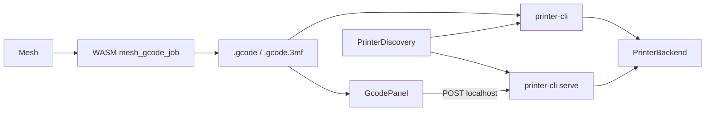

# Printer LAN transport

Library contract for sending a ready print artifact to a LAN host. Not a slicer
and not G-code generation. Implementation: [`crates/printer-core`](../../crates/printer-core).
Native CLI / Vue companion: [`crates/printer-cli`](../../crates/printer-cli).

**Status (2026-09-15, `origin/main` @ `e4fb4c5`):** multi-vendor LAN submit,
Bambu/Snapmaker discovery, `printer-cli`, Worker job export, and GcodePanel
Send-via-companion are **shipped**. Hardware soak and the queue below are open.

## Shipped

| Area | Where |
| --- | --- |
| Backends (Bambu / Moonraker / OctoPrint / Prusa / Creality / Snapmaker) | `printer-core` + `network` |
| Discovery (Bambu SSDP, Snapmaker UDP) | `PrinterDiscovery` / live scanners |
| Native CLI (`discover` / `send` / control / `serve`) | `printer-cli` |
| Job dialect + `.gcode.3mf` in Worker | `kind: 'job'` → `mesh_gcode_job` |
| GcodePanel download + Discover/Send | localhost companion only |
| rbench suites | `bench_print_export`, `bench_printer_lan` |

## Next (priority order)

1. **Hardware soak** — run `printer-cli serve` + UI Send against real Moonraker /
   Bambu / Snapmaker firmware; fix wire mismatches.
2. **mDNS for HTTP hosts** — auto-find Moonraker / OctoPrint / Prusa / Creality
   (today: manual URL only).
3. **Persist printer form** — vendor / host / credentials across sessions.
4. **Status / pause / resume / stop in GcodePanel** — `/control` exists; UI is
   Send-only.
5. **Tauri / desktop shell** — embed companion; drop the separate `serve`
   process for end users.

## Backends

| Vendor | Artifact | Observed wire |
| --- | --- | --- |
| Bambu Lab | `.gcode.3mf` | Implicit FTPS `:990` + MQTT/TLS `:8883`, user `bblp`, password = access code |
| Moonraker | `.gcode` | `POST /server/files/upload` then `POST /printer/print/start` |
| OctoPrint | `.gcode` | `POST /api/files/local` (`select`+`print`) ; job control via `/api/job` |
| PrusaLink | `.gcode` | `PUT /api/v1/files/{storage}/{path}` with `Print-After-Upload` / `Overwrite`; job via `/api/v1/job/{id}` |
| Creality | `.gcode` | Same as Moonraker (rooted Klipper Creality / Helper Script, often `:7125`) |
| Snapmaker | `.gcode` | `POST /api/v1/connect`, multipart `POST /api/v1/upload`, `POST /api/v1/start_print` (token query, port `8080`) |

These are **observed** integrations, not vendor-guaranteed API contracts.

## Discovery

| Vendor | Mechanism | Status |
| --- | --- | --- |
| Bambu | SSDP multicast (`BambuSsdpDiscovery`) | Shipped |
| Snapmaker | UDP broadcast probe (`SnapmakerUdpDiscovery`) | Shipped |
| Moonraker / OctoPrint / Prusa / Creality | Manual URL | Open → mDNS (Next #2) |

Discovery returns host/serial/model hints; callers fill config and call
`connect_*`. It does not auto-submit jobs.

## CLI + UI send path

- Artifact generation stays in the Worker / WASM (`kind: 'job'`).
- Browser **must not** open FTPS/MQTT/raw printer sockets.
- Submit runs native: `printer-cli send` or `printer-cli serve` on `127.0.0.1`
  (`GET /health`, `GET /discover`, `POST /send`, `POST /control`).

## Bambu notes

- Control writes need LAN Mode **and** Developer Mode.
- Prefer FTPS **root** upload (not `cache/`) with `url = ftp:///<file>`.
- `project_file.param` = `Metadata/plate_N.gcode`.
- `md5` = uppercase hex of uploaded bytes (empty skips check on some firmware).
- Full status snapshots use `push_status` with `msg == 0`; deltas also use
  `push_status` with `msg == 1`.
- TLS cert is self-signed X.509 v1 (CN = serial); clients skip verification.

## PrusaLink notes

- Auth in this crate: `X-Api-Key` only (HTTP Digest not implemented).
- Preferred upload is PUT octet-stream with RFC8941 booleans `?0` / `?1`.
- Pause/resume/stop need a job id from `/api/v1/job` or status telemetry.

## Creality notes

- Supported path: Moonraker HTTP API (stock rooted / Helper Script K1 family).
- Unsupported: stock Creality web UI `POST /upload` + websocket `opGcodeFile`.

## Snapmaker notes

- Token from Luban `machine.json` (or a previously approved pairing).
- Always `connect` before upload/status/control; HTTP 204 means waiting for
  on-controller confirmation.
- Upload is multipart `file=`; start is a separate `start_print` call.
- First-time on-controller pairing UI remains out of scope.

## Shared surface

`PrinterBackend`: `submit_job` → `SubmitOutcome`, plus `pause` / `resume` /
`stop` / `status` (`JobState` + vendor string). Feature `network` enables live
sockets and live discovery; default builds use mocks.

## Non-goals

Cloud accounts, AMS mapping UI, camera streams, in-browser FTPS/MQTT,
Prusa Digest auth, stock Creality websocket start, Snapmaker on-screen pairing
flow, claiming slicer or firmware parity. (mDNS and Tauri remain **deferred
next**, not permanent non-goals.)
