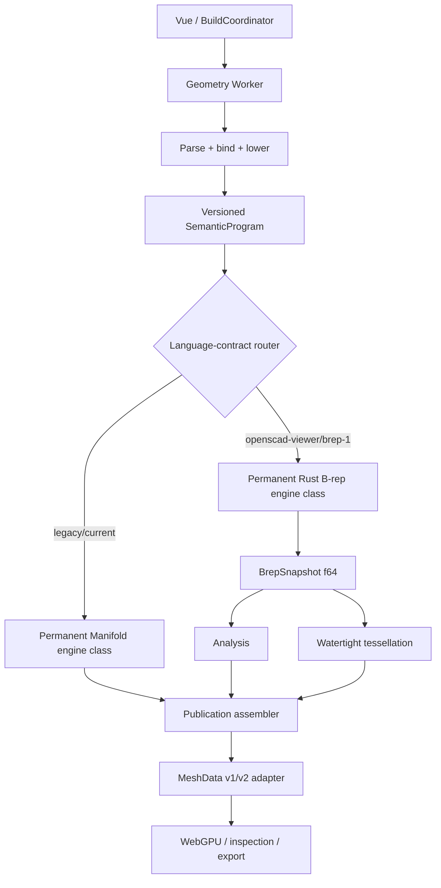

# Собственное Rust-ядро B-rep/NURBS

Статус: **Proposed design**

Дата: 2026-07-31

Область: отдельная Rust-библиотека точной геометрии с предлагаемой permissive лицензией и её интеграция как постоянного peer backend рядом с `manifold-3d` в `open-scad-viewer`.

> Этот документ описывает целевую архитектуру и проверяемые этапы. Он не утверждает, что general NURBS Boolean уже реализован или что новый backend совместим со всем OpenSCAD.

> Итог red-team review: **разрешен только G0 — contract/baseline package**. Параллельный старт G1–G3 запрещен до принятия blocking ADR, исполнимого `SemanticProgram` IDL и topology/numeric proof obligations. Это ограничение порядка работ, а не отказ от собственного ядра.
>
> Исполнимая раскладка пользовательских 14 пунктов, каждый из которых прошёл
> десять независимых ревью, зафиксирована в
> [`brep-nurbs-14-stage-master-plan.md`](./brep-nurbs-14-stage-master-plan.md).

## 1. Решение

Проект получает собственное native-first Rust-ядро, в котором:

- авторитетная геометрия хранится как аналитические кривые/поверхности и NURBS;
- авторитетное твердое тело хранится как валидированный B-rep snapshot;
- render mesh, BVH, semantic edges и STL/OBJ являются производными артефактами;
- вся мутация выполняется транзакционно и публикуется только после полной валидации;
- браузер подключает ядро через тонкий versioned WASM ABI внутри dedicated Worker;
- `ManifoldPlanBackend` и Rust `BrepBackend` — два **постоянных peer-класса движка**; rollout B-rep не имеет целью удалить или депрекировать Manifold;
- класс backend выбирается языковым контрактом source для всего build job, а не UI или MCP-вызовом; автоматического межклассового fallback ни до, ни после ошибки нет;
- каждый класс имеет собственные immutable capability manifests, fingerprint, qualification, лимиты, SBOM и rollback policy;
- смешанная B-rep/mesh операция требует явного lossy conversion и никогда не происходит скрыто.

Первый полезный вертикальный срез — не general Boolean. Это цепочка:

```text
Rust analytic/NURBS geometry
        ↓
canonical B-rep primitives + validator
        ↓
shared-edge watertight tessellation
        ↓
protocol adapter → current GeometryScene/MeshData → WebGPU
```

General NURBS surface/surface intersections и solid Boolean допускаются в production только после отдельных completeness, degeneracy и rollback gates.

## 2. Цели и не-цели

### Цели

1. Окружности, коники, квадрики и NURBS сохраняют аналитическое/рациональное представление до явной тесселяции; слово `exact` не подменяет численный сертификат.
2. Грани, ребра, контуры, оболочки и тела имеют явную топологию и проверяемые инварианты.
3. `extrude` и `revolve`, а после отдельных capability gates — `loft`/`sweep`, строят B-rep, а не triangle soup.
4. Пересечения и Boolean либо возвращают сертифицированный полный результат, либо типизированный отказ без частичной модели.
5. Preview/full различаются политикой тесселяции, когда topology уже точная; preview не меняет B-rep.
6. Stable source provenance и честная topology lineage поддерживают selection, inspection и future direct editing.
7. Библиотека работает native и в WASM, не зависит от Vue, WebGPU или OpenSCAD parser.
8. Собственный код планируется выпускать permissively только после rights inventory и утверждения inbound/outbound terms, с документированной provenance независимой повторной реализации и проверяемой supply chain. Термин `clean-room` применяется только к модулям, прошедшим отдельный утвержденный protocol разделения ролей.

### Не-цели первой production-версии

- полная совместимость с Parasolid, ACIS, OCCT, Fusion, Rhino или Plasticity;
- автоматическое преобразование произвольной mesh в NURBS/B-rep;
- скрытое healing, tolerance growth или mesh fallback;
- general signed-weight NURBS;
- non-manifold solid modeling;
- general NURBS offset, variable-radius/G2 fillet и многоветвевые corner blends;
- STEP/IGES codec до стабилизации внутренней topology и Boolean;
- изменение семантики legacy `.scad` файлов без language/version opt-in.

## 3. Неподвижные инварианты

Эти правила считаются архитектурными, а не деталями реализации:

1. **Source is authoritative.** SCAD-текст остается источником истины; B-rep snapshot — вычисленный артефакт.
2. **B-rep before mesh.** Mesh не используется для принятия topology решений B-rep.
3. **Geometry is separate from topology.** `Surface` не содержит trim loops, а `Face` не копирует математику поверхности.
4. **No global epsilon.** Каждый запрос получает явный tolerance/error context и budget.
5. **Indeterminate is a result.** Неопределенность не превращается в `false`, `empty` или исключение.
6. **Atomic mutation.** Ошибка, отмена, stale revision или budget exhaustion оставляют базовый snapshot неизменным.
7. **No cross-engine fallback.** Capability mismatch, unavailable engine и unsupported degeneracy дают стабильную диагностику; запуск другого класса запрещен.
8. **Deterministic commit.** Успешный topology result не зависит от порядка `HashMap`, гонки потоков или wall-clock deadline.
9. **Stable identity is evidence-based.** Split/merge/delete отражаются явно; ambiguous persistent naming не угадывается по centroid.
10. **Validation is mandatory.** Ни одна публичная topology-changing операция не возвращает непроверенный solid.

## 4. Системная архитектура



### 4.1 Language frontend

Lexer, parser, binding, module/loop evaluation, source spans и resource admission остаются compiler-owned. Их нормативный результат разделен на четыре независимых слоя:

```text
SemanticProgram       — смысл модели и programHash
ExecutionLimits       — пределы конкретного запуска
TessellationPolicy    — preview/full/export discretization
PublicationPolicy     — latest-only, stale и export rules
```

Immutable `SemanticProgram` DAG содержит version/language contract, `SourceOperationId`, occurrence-aware `SceneEntityId`, units, capability requirements, source provenance и typed nodes. Его versioned discriminated IDL обязан определить до G1:

- canonical node/child ordering и правила aliasing общего DAG-подвыражения;
- evaluation и stable diagnostic ordering со source spans;
- module/loop occurrence identity, placements и transform composition;
- типы `Curve | Wire | Region | Sheet | Solid | SolidSet`, явные representation/evidence поля и разрешенные 2D/3D coercions;
- семантику каждого primitive/feature/Boolean node и required capabilities;
- executable binary/JSON encode-decode round-trip fixtures.

В `brep-1` `$fn/$fa/$fs` lowering превращает в `TessellationIntent` и не меняет `programHash` B-rep snapshot. В legacy path quality-dependent polygonal values материализуются внутри semantic nodes и потому входят в его hash. Budget, deadline и publication freshness никогда не входят в смысл модели.

Manifold сначала оборачивается в `ManifoldPlanBackend`. Пока этот adapter не воспроизводит существующие conformance tests, MCP path и publication contract, Rust backend не подключается к UI.

### 4.2 Backend boundary

Текущий `GeometryKernel<TModule>` описывает только lifecycle. Целевой backend contract должен быть capability-oriented:

```ts
interface GeometryBackend {
  readonly implementationKey: string
  warm(): Promise<BackendCapabilities>
  build(program: SemanticProgram, request: BuildRequest, control: BuildControl):
    Promise<BackendBuildResult>
  dispose(): void
}
```

`build` остается внешней атомарной командой для текущего Coordinator. Внутри Worker Rust adapter может использовать reusable snapshot tokens и пошаговый executor; эти handles не становятся частью App API.

Выше провайдеров нужен общий registry/router, а не вторая реализация текущего `GeometryKernel<TModule>`: этот lifecycle-интерфейс по-прежнему передает Manifold module и не является semantic backend seam. Нормативный routing contract:

```ts
interface EngineRoutingContract {
  readonly languageContract: 'legacy/current' | 'openscad-viewer/brep-1'
  readonly engineClass: 'manifold' | 'brep'
  readonly requiredCapabilities: readonly string[]
  readonly fallback: 'never'
}
```

Registry всегда содержит оба постоянных класса, но отделяет **описание класса** от **доступного provider**. Пока Rust-ядро не подключено и не квалифицировано, `brep` публикует manifest с `status: unavailable` и стабильную причину, но fake provider не регистрируется. Запрос `brep-1` в таком состоянии завершается typed `ENGINE_UNAVAILABLE`, а не Manifold-результатом.

Поле `engine`, если оно когда-либо появится в UI/MCP request, может быть только assertion уже вычисленного класса. Оно не переопределяет source contract и не разрешает cross-engine execution.

### 4.3 Rust workspace и направление зависимостей

Целевая логическая раскладка (окончательные crate names требуют ADR):

```text
crates/
├── cad-core         units, IDs, tolerances, budgets, diagnostics
├── cad-predicates   filters, intervals, exact signs
├── cad-nurbs        basis, curves, surfaces, refinement
├── cad-geometry     analytic geometry, Curve2/3, domains, UvChart/lift/map carriers
├── cad-topology     arenas, snapshots, B-rep schema, validator
├── cad-intersect    CC/CS/SS reports and certificates
├── cad-trim         lifted-UV/DCEL arrangement algorithms
├── cad-operations   primitives, features, classify, Boolean, healing
├── cad-tessellate   shell-aware watertight meshing
├── cad-analysis     bounds, area, volume, diagnostics
├── cad-io           canonical snapshots and future neutral exchange
├── cad-kernel       public facade and job executor
└── cad-wasm         narrow ABI only
```

Это конечные ownership boundaries, а не команда сразу создать 13 crates. Первые walking slices используют 3–4 private crates либо один facade с внутренними modules; split разрешен только после появления доказанной ацикличной зависимости. Нижние слои не знают о browser API, TypeScript, OpenSCAD AST или renderer. `cad-wasm` не содержит CAD-алгоритмов. Каждый crate владеет внутренними error types, а `cad-kernel` отображает их в стабильные публичные codes.

Нормативное направление риска: lower carrier types `Curve2Handle`, parameter domains/maps, `UvChart`, lifted traces и correspondence evidence принадлежат `cad-geometry`. `cad-intersect` зависит только от core/predicates/NURBS/geometry и возвращает geometry-only parameter traces; он не знает `Face`, DCEL или trim topology. `cad-trim` потребляет эти reports и содержит только arrangement algorithms. Topology adapters и `GlobalSolidAudit` принадлежат `cad-operations`, который зависит от topology/intersect/trim. `cad-topology` ссылается на geometry carriers, содержит только local validator и никогда не зависит обратно от этих верхних слоев.

## 5. Численная модель

### 5.1 Базовые правила

- Вся авторитетная геометрия вычисляется в `f64`; `f32` используется только в render packet после range/deviation validation.
- `fast-math`, неявное FMA и недетерминированные floating reductions запрещены в release kernel.
- Все координаты, веса, knots, transforms и параметры проверяются на конечность до allocation и вычислений.
- Units канонизируются на входе операции; масштабирование является частью build identity.
- Wall-clock deadline может отменить работу, но не выбирать одну из нескольких успешных topology ветвей.

### 5.2 ToleranceContext

Один immutable context входит в operation input и cache key:

```rust
pub struct ToleranceContext {
    pub linear_abs: f64,
    pub linear_rel: f64,
    pub on_tol: f64,
    pub clear_tol: f64,
    pub angular: f64,
    pub param_floor: f64,
    pub ulp_guard: u32,
    pub max_entity_error: f64,
    pub policy: ApproximationPolicy,
}
```

Локальная линейная граница выводится из абсолютной, относительной и ULP-составляющих с учетом масштаба конкретных операндов. Она не выводится из минимального ребра и не накапливается неограниченно по цепочке операций. Parametric tolerance выводится из domain, скорости кривой или singular values Jacobian; около stationary/singular point алгоритм обязан subdivision/refinement, а не раздувание параметрического epsilon.

Один scalar `error_radius` недостаточен. Geometry records несут typed `EvidenceLedger`: позиционный enclosure/residual, directional или two-sided Hausdorff bound, parameter correspondence, derivative/normal bound и отдельно topology-preservation evidence. Неприменимые поля не заполняются фиктивным числом. Bounds композиционно не убывают; merge разрешен только при совместимых evidence и доказанном сохранении topology invariants.

`ToleranceContext` различает как минимум `on_tol` и больший `clear_tol`. Значение ниже первого может быть доказанно `On/Coincident`, выше второго — доказанно `Separate`; серый диапазон возвращает `Indeterminate`, а не `WithinTolerance` success. Numeric error budget отделен от пользовательской acceptance tolerance.
Context validation требует `0 < on_tol < clear_tol` и согласованности derived local bounds с `max_entity_error`; невалидный профиль отвергается до geometry work.

### 5.3 Три уровня решения

1. **Predicate:** знак явно алгебраического выражения над `ExactInputLeaf` — исходными binary64 bit patterns или каноническими рациональными константами. Pipeline: быстрый `f64` filter → outward interval → exact expansion arithmetic. Division, normalization, trig/libm и Newton output не становятся новыми exact leaves.
2. **Construction:** `CertifiedConstruction { enclosure, recipe, residual, uniqueness, provenance }`. Следующий predicate обязан вычисляться по recipe/enclosure либо вернуть `Indeterminate`; округленный center запрещено повторно интерпретировать как точный вход. Для NURBS root результатом служит сертифицированный parameter box, не псевдоточная `Point3`.
3. **Model classifier:** `Coincident | Separate | Indeterminate` с учетом tolerance и error bounds.

`Zero` predicate не означает «достаточно близко», а `Indeterminate` не означает `false`. UI snapping не имеет права мутировать kernel topology.

### 5.4 Status и failure taxonomy

Нужно различать как минимум:

- `InvalidInput` / `InvalidReference` / `SnapshotUnavailable`;
- `UnsupportedCapability` / `UnsupportedDegeneracy`;
- `PrecisionExhausted` / `NoConvergence`;
- `ResourceLimit` / `Cancelled` / `DeadlineExceeded` / `StaleRevision`;
- `InvalidTopology` / `NonManifoldResult`;
- `KernelFault`.

Один общий `EPSILON`, silent clamp, silent weld, округление control points, «majority vote» классификации и автоматическое повышение entity tolerance запрещены.

## 6. NURBS и аналитическая геометрия

### 6.1 Representation

Основной профиль использует const-generic размерность и homogeneous control points:

```rust
pub struct HPoint<const D: usize> {
    weighted: [f64; D],
    weight: f64,
}

pub struct NurbsCurve<const D: usize> {
    degree: u16,
    knots: KnotVector,
    control: Box<[HPoint<D>]>,
    form: CurveForm,
}

pub struct NurbsSurface<const D: usize> {
    degree_u: u16,
    degree_v: u16,
    knots_u: KnotVector,
    knots_v: KnotVector,
    size_u: u32,
    size_v: u32,
    control_uv: Box<[HPoint<D>]>,
    form_u: ParamForm,
    form_v: ParamForm,
}
```

MVP принимает только конечные строго положительные веса и clamped NURBS степени `p >= 1`. Homogeneous control net имеет каноническое общее масштабирование; дополнительно проверяются weight-ratio conditioning и положительная нижняя граница знаменателя на каждом рабочем span. Signed/zero weights и general periodic storage не входят в основной профиль.

Инварианты для степени `p`, числа control points `N` и knots `M`:

- `N >= p + 1`;
- `M = N + p + 1`;
- knots конечны и не убывают;
- активный domain `[U[p], U[N]]` имеет положительную длину;
- endpoint multiplicity равна `p + 1`; interior multiplicity не выше `p` для непрерывной edge geometry;
- каждый ненулевой knot span имеет положительную длину; interior multiplicity `p + 1` означает discontinuity и должна быть представлена split-сущностями;
- control net dimensions согласованы с обеими осями поверхности.

Повтор knots — структурное равенство уже канонизированного представления. Геометрический tolerance не склеивает knots. При interior multiplicity `m` двусторонняя производная порядка `r` допустима только когда гарантировано `C^(p-m)` и `r <= p-m`; иначе требуется `Left | Right`. На концах domain производная всегда односторонняя.

### 6.2 Обязательные NURBS-операции

Foundation:

- iterative Cox–de Boor basis на локальной опоре;
- curve/surface evaluation в homogeneous coordinates;
- производные кривой и surface jet как минимум до второго порядка;
- rational quotient recurrence;
- knot insertion/refinement;
- split;
- representation-preserving rational Bézier decomposition с учетом roundoff evidence;
- reverse и bounded trim views;
- iso-curves;
- conservative bounds.

Позднее:

- degree elevation;
- interpolation/approximation;
- knot removal и degree reduction только с certified error bound;
- periodic editing;
- general fitting.

Нулевой знаменатель, почти нулевая скорость, вырожденный `Su × Sv` или плохо обусловленная fundamental form возвращают статус/ошибку, а не NaN или придуманную normal.

### 6.3 Аналитические типы

Аналитика сохраняется как самостоятельная authoritative geometry:

```rust
pub enum Curve3 {
    Line(Line3),
    Circle(Circle3),
    Ellipse(Ellipse3),
    Nurbs(NurbsCurve<3>),
    AffineImage(AffineCurve),
}

pub enum Surface3 {
    Plane(Plane3),
    Cylinder(Cylinder3),
    Cone(Cone3),
    Sphere(Sphere3),
    Torus(RingTorus3),
    Nurbs(NurbsSurface<3>),
    AffineImage(AffineSurface),
}
```

Frames конечны, правые и ортонормальные; радиусы положительны. В MVP допускается только regular ring torus. Общий обратимый affine transform хранится без потери формы. Для линейной части `A` используется полная формула `(A Su) × (A Sv) = det(A) A^{-T}(Su × Sv)`; знак `det(A)` меняет orientation ровно один раз, а conditioning `A^{-T}` входит в normal/error evidence. Rank loss отклоняется либо выполняется отдельной явно dimension-changing операцией.

Аналитические окружности, цилиндры и сферы не нормализуются в NURBS без необходимости. Преобразование analytic → rational NURBS возвращает piecewise parameter map и `ConversionCertificate`, явно указывающий claim: совпадение image set, ориентации и параметрической correspondence относительно исходной binary64 construction recipe, включая roundoff enclosures. Если такой equivalence proof не построен, результат маркируется `CertifiedApproximation`, а не `RepresentationPreserving`.

### 6.4 Domains, periodicity и singularities

Domain не является голой парой `f64`. Он знает открытые/закрытые границы, unbounded interval, period, canonical seam и singular loci. Нельзя безвозвратно делать `u % period`: pcurve, пересекающая seam, хранится в lifted UV и может иметь несколько оборотов. Surface поддерживает несущую параметрическую геометрию; конечный `UvBox` и trim region принадлежат запросу/Face.

## 7. B-rep data model

### 7.1 Геометрия и topology

```rust
pub struct ArenaKey<T> {
    slot: u32,
    generation: u32,
    record_token: u64,
    marker: PhantomData<T>,
}

pub struct SnapshotRef<T> {
    pub snapshot_id: TopologySnapshotId,
    pub key: ArenaKey<T>,
}

pub struct Vertex {
    pub point: Point3,
    pub evidence: PositionEvidence,
    pub topo_id: TopoId,
}

pub enum EdgeGeom {
    Regular { curve: CurveHandle, interval: ParamInterval },
    Degenerate { vertex: VertexHandle, cause: DegenerateEdgeKind },
}

pub struct Edge {
    pub vertices: [VertexHandle; 2],
    pub geometry: EdgeGeom,
    pub class: EdgeClass,
    pub evidence: EdgeEvidence,
    pub topo_id: TopoId,
}

pub struct CoedgeTrim {
    pub traversal: ParamInterval,        // общий s
    pub edge_parameter: MonotoneMap1,   // t(s)
    pub lifted_pcurve: Curve2Handle,     // q(s) в lifted UV
    pub uv_parameter: MonotoneMap1,
    pub wrap: [i32; 2],
    pub evidence: CorrespondenceEvidence,
}

pub struct Coedge {
    pub edge: EdgeHandle,
    pub sense: Sense,
    pub trim: CoedgeTrim,
    pub next: CoedgeHandle,
    pub prev: CoedgeHandle,
    pub topo_id: TopoId,
}

pub struct Loop {
    pub first: CoedgeHandle,
    pub kind: LoopKind,
    pub topo_id: TopoId,
}

pub struct Face {
    pub surface: SurfaceHandle,
    pub surface_sense: Sense,
    pub chart: UvChart,
    pub loops: Box<[LoopHandle]>,
    pub evidence: FaceEvidence,
    pub topo_id: TopoId,
}

pub struct FaceUse { pub face: FaceHandle, pub sense: Sense }
pub struct Shell {
    pub mode: ShellMode,
    pub face_uses: Box<[FaceUse]>,
    pub topo_id: TopoId,
}
pub enum SolidShellRole { Outer, Cavity }
pub struct SolidShellUse {
    pub shell: ShellHandle,
    pub role: SolidShellRole,
}
pub struct Solid {
    pub shell_uses: Box<[SolidShellUse]>,
    pub topo_id: TopoId,
}
pub struct Compound { /* occurrences + placements; не topology identity */ }
```

Authoritative ownership идет только `Solid → SolidShellUse → Shell → FaceUse → Face → Loop → Coedge`. Роль outer/cavity принадлежит use внутри конкретного `Solid`; сам `Shell` canonical role не хранит. Reverse `coedge_owner_loop`, `loop_owner_face`, `face_shell_uses` и `edge_uses` строятся snapshot-owned immutable CSR indexes и никогда не редактируются как вторая истина. Так seam, import diagnostics и generalized incidence не требуют mutable radial ring. Начало/конец coedge выводятся из `Edge + sense`, а не хранятся второй раз.

3D curve и face-local pcurve не обязаны иметь одинаковую параметризацию. `CoedgeTrim` задает общий traversal `s`, явные spans `t(s)`/`q(s)`, lifted UV и integer wraps; кусочно-монотонная карта предварительно split-ится. На периодической поверхности seam — один топологический edge с двумя coedges одной face и разными lifts. Pole/apex использует `EdgeGeom::Degenerate`: ненулевая UV-дуга отображается в одну 3D vertex и сохраняется для замыкания loop.

Для параметрической normal `n = normalize(Su × Sv)` эффективная material-outward orientation равна произведению знаков `surface_sense × face_use.sense × solid_shell_use.role.sign`. Constructor обязан записать эти знаки так, чтобы outer shell указывал из material, cavity shell — в cavity; validator проверяет согласованность, а не угадывает ее по signed volume.

### 7.2 Разрешенные topology profiles

- `SolidManifold`: замкнутые ориентируемые shells; каждый regular edge имеет два противоположных uses; link каждой manifold vertex — один cycle, а ее star — диск.
- `SheetManifold`: допускаются boundary edges, но не branching; link interior vertex — cycle, link boundary vertex — один path, star — disk/half-disk соответственно.
- `Generalized`: произвольная derived edge-use incidence для import/diagnostics; запрещен как operand solid Boolean, fillet и mass properties.

Касание независимых bodies внутри compound не склеивает их topology.

### 7.3 Handles, snapshots и transactions

Внутренний `ArenaKey<T>` содержит slot/generation/record token, но не snapshot lineage; COW page поэтому безопасно разделяется между parent/child snapshots. Generation overflow навсегда retire-ит slot, исключая ABA. На публичной query boundary key всегда завернут в `SnapshotRef<T>`; sibling snapshot и stale reference отвергаются. Ни key, ни snapshot handle не сериализуются. Единый долговечный topology identifier — opaque 128-bit `TopoId`.

```rust
pub struct BrepSnapshot { /* immutable paged arenas + indexes */ }

pub struct BrepTxn {
    base: Arc<BrepSnapshot>,
    overlay: TransactionOverlay,
    delta_log: TopologyDeltaLog,
}
```

`BrepSnapshot` является immutable `Send + Sync`; `BrepTxn` — single-writer и намеренно `!Sync`. Safe API не выдает raw arena mutators: только закрытый `TxnEditor` записывает delta log. Touched closure выводится из лога, incidence indexes и modified geometry, а не принимается от вызывающего кода. Debug/fuzz builds сравнивают incremental и full validation.

Раздельные typed arenas используют copy-on-write pages. GeometryPool интернирует только побитово/структурно равную каноническую geometry после полного equality check — никогда «почти равную». Operation scratch живет в отдельной bounded job arena и не может попасть в committed snapshot.

`txn.finish()` строит closure, запускает применимые validators и возвращает immutable `ValidatedCandidate + ChangeSet`. Revision/CAS не принадлежат transaction: отдельный `PublicationRequest { expected_head, document_revision }` передается в `SnapshotStore.publish(request, candidate)`. Таким образом immutable snapshot сам не «делает CAS», конфликт публикации не портит candidate, а revision имеет одного владельца. Drop/ошибка означает rollback.

### 7.4 Validator

Validation разделена, чтобы ранний topology layer не зависел от еще не существующих Boolean/intersection crates:

1. **`LocalTopologyValidator`:** handles/generations, reachability, authoritative ownership, loop cycles, reciprocal `next/prev`, derived edge incidence, endpoint/degenerate-edge contract, pcurve↔surface↔3D residual, seam shift, local cyclic order, orientability и vertex links.
2. **`GlobalSolidAudit`:** self-intersections, arbitrary trim intersections/nesting, shell containment, cavity/material-side classification и global shared-boundary agreement. Он живет выше intersection/trim/classification и появляется только в соответствующем gate.

Constructor-certified primitive может пройти local validation до появления global audit, но не получает общий claim «globally valid arbitrary solid». Обязательный schema corpus до topology-кода: tetrahedron, sheet boundary fan, bow-tie rejection, cone apex, sphere pole, torus double seam и sibling-COW/stale-key cases.

Euler characteristic является диагностикой, а не достаточным доказательством корректности.

`canonicalize`, `sew` и `heal` — разные публичные операции. Canonicalization меняет только порядок/представление; sewing объединяет только доказанно совпадающие полные boundaries; healing — opt-in plan с displacement/refit/split ledger и повторной сертификацией.

## 8. Public Rust API и отчеты

Safe API не выставляет наружу mutators topology arenas. Долгие/resumable jobs владеют context через `Arc`, чтобы borrowed data не переживало JS/Worker callback:

```rust
pub struct JobContext {
    pub tolerance: Arc<ToleranceContext>,
    pub limits: Arc<EffectiveLimits>,
    pub cancellation: Arc<dyn Cancellation + Send + Sync>,
    pub determinism: DeterminismPolicy,
}

pub struct OperationContext {
    pub job: Arc<JobContext>,
    pub provenance: ProvenanceNamespace,
    pub approximation: ApproximationPolicy,
}

pub struct OperationReport<T> {
    pub value: T,
    pub representation: Representation,
    pub evidence: EvidenceBundle,
    pub diagnostics: Vec<Diagnostic>,
    pub change_set: Option<ChangeSet>,
    pub counters: WorkCounters,
}

pub enum Representation {
    AnalyticBrep,
    RationalBrep,
    CertifiedApproxBrep,
    Mesh,
}

pub enum EvidenceClass {
    RepresentationPreserving,
    CertifiedApproximation { certificate: CertificateId },
}

pub struct EvidenceBundle {
    pub class: EvidenceClass,
    pub certificates: Box<[CertificateRef]>,
}
```

Geometry kind (`Curve/Wire/Region/Sheet/Solid/SolidSet`), representation и evidence — ортогональные оси; UI/API не сворачивают их в одно слово `Exact`. Ошибки, предупреждения и математическая неопределенность — разные каналы. Внутренние crates владеют собственными typed errors; `cad-kernel` отображает их в `CadError` со stable code, stage, bounded witness, entity refs и correlation/source reference. Human message локализуется за границей Rust API.

Core crates используют `#![forbid(unsafe_code)]`. Необходимый ABI `unsafe` изолирован в минимальном модуле с `SAFETY` invariants, Miri и sanitizer tests. Вход пользователя не должен вызывать panic; `catch_unwind` — только best effort, а panic/trap/OOM/abort poison-ит session, уничтожает Worker и никогда не публикует partial result.

### 8.1 Classification

```rust
pub enum Decision<T> {
    Certain(T),
    AmbiguousBand {
        candidates: Box<[T]>,
        witness: Witness,
        interval: Interval,
    },
    Indeterminate(IndeterminateReason),
}
```

Пустое доказанное пересечение — `Certain([])`. Только `Certain` может менять topology; gray-zone ambiguity, исчерпанный budget, unresolved coincidence и плохо обусловленный root не маскируются под пустой результат.

### 8.2 Capability maturity

Каждая operation capability имеет уровень:

- `Unavailable`;
- `Experimental` — доступна только opt-in, может вернуть documented unsupported cases;
- `Qualified` — прошла собственный correctness/performance corpus;
- `Production` — прошла browser/native integration, fuzz, security и rollback gates.

Наличие метода в Rust API не означает production capability.

## 9. Пересечения и trimming

### 9.1 Единый IntersectionReport

Curve–curve, curve–surface и surface–surface запросы работают на конечных domains и возвращают общий envelope, но не притворяются, что их parameter traces одинаковы:

```rust
pub struct IntersectionReport {
    pub components: Vec<IntersectionComponent>,
    pub completeness: Completeness,
    pub certificate: CoverageCertificate,
    pub diagnostics: Vec<Diagnostic>,
    pub counters: WorkCounters,
}

pub enum IntersectionComponent {
    Point { locus: PointEvent, parameters: ParameterWitness },
    Curve { locus: CurveModel, traces: ParameterTraces },
    Overlap1(OverlapInterval),
    Overlap2(CoincidentPatch),
    Singular(SingularContact),
}

pub enum ParameterTraces {
    CurveCurve { t0: Trace1, t1: Trace1 },
    CurveSurface { t: Trace1, uv: LiftedTrace2 },
    SurfaceSurface { uv0: LiftedTrace2, uv1: LiftedTrace2 },
}
```

SS `CurveModel` может быть analytic, procedural certified branch либо fitted NURBS. Fitted model допускается как topology boundary только с two-sided Hausdorff, parameter-correspondence и tubular/isotopy certificate; иначе сохраняется procedural branch или весь report остается `Incomplete`. Tangency, branch point, curve-on-surface и coincident patch являются отдельными вариантами, а не эвристически объединенными точками.

### 9.2 Общий pipeline

1. Проверить definitions/domains и локализовать координаты около операндов.
2. Representation-preserving разбить NURBS на rational Bézier spans по knots, seams и singular events, сохранив roundoff evidence.
3. Построить conservative bounds/BVH и candidate pairs.
4. Выполнить проверенный analytic fast path там, где он существует.
5. Использовать Bernstein/interval exclusion, clipping и subdivision.
6. Применять safeguarded Newton/LM только для уточнения уже локализованного root.
7. Классифицировать rank/contact order; отдельно обрабатывать tangency/overlap.
8. Детерминированно deduplicate и stitch по parameter boxes/provenance.
9. Провести coverage audit независимым certificate verifier.

Newton convergence не доказывает полноту. Coverage partition охватывает Cartesian product **полных** patch domains, включая boundaries, seams и singular strata. Каждый leaf имеет ровно один machine-checkable proof:

- `Excluded` — interval/Bernstein exclusion;
- `RegularComponentTube` — existence, uniqueness, rank, endpoint/adjacency и branch-coverage evidence;
- `Coincident` — overlap domain и boundary proof;
- `Unresolved` — явный отказ.

`Complete` означает полное покрытие partition без `Unresolved`, доказанную adjacency и отсутствие пропущенных boundary/closed-loop branches. Простое seed+marching всегда `Incomplete`. Диагностический `Incomplete` допустим для non-authoritative visualization, но не как вход topology-changing Boolean.

### 9.3 Особенности CC/CS/SS

- CC использует analytic pairs, Bézier clipping, interval Newton/Krawczyk, endpoint ownership и overlap intervals.
- CS решает систему `(t,u,v)`, восстанавливает непрерывный lifted UV и ищет curve-on-surface до point dedup.
- SS сначала поддерживает конечную matrix analytic plane/quadric pairs. General NURBS SS допускается лишь после research spike и только для опубликованной matrix degree/weight/domain/contact/budget; regular transverse continuation обязательно сопровождается full-domain coverage proof. Tangency, branch points, singular strata и coincidence patches квалифицируются отдельными gates.

General SS solver не имеет права выбрать одну удобную ветвь при rank loss.

### 9.4 Trim и pcurves

Trim region живет в lifted UV chart. Pcurves разбиваются на монотонные spans; robust CC строит DCEL arrangement; material cells выбираются non-zero winding. Arrangement event ordering использует certified predicates и canonical construction IDs, а не округленные coordinates или tolerance sorting. Boundary — самостоятельный класс. Outer/holes выводятся из orientation/nesting, а не только signed area.

Инварианты face loops:

- `next/prev` образуют замкнутые циклы;
- конец pcurve совпадает с началом следующей в lifted UV;
- pcurve→surface и edge curve согласованы в пределах доказанного error budget;
- loops не имеют недекларированных self-intersections/touches;
- inner loop содержится в outer material region;
- seam shift и pole behavior явны.

Endpoint reconciliation является новой certified construction. Она разрешена только если endpoints уже имеют один canonical construction ID либо verifier доказывает existence+uniqueness одного общего root в enclosure, parameter correspondence и сохранение локального cyclic order. Простого пересечения enclosures недостаточно; округление координат и tolerance-grid snapping запрещены.

## 10. Classification и Boolean

### 10.1 Point/curve/face classification

Point сначала классифицируется относительно faces/edges/vertices как `On`; только затем выполняется volume query. Ray casting использует изоляцию всех analytic/interval roots и local fan/half-open ownership около edge/vertex events. Tangency не меняет winding. Альтернативные фиксированные rays — retries для degeneracy, а не majority vote; если ни один ray не получил complete root/ownership proof, результат `Indeterminate`.

Результат:

```rust
pub enum SolidLocation { In, Out, On(BoundaryWitness) }
```

оборачивается в `Decision<SolidLocation>`. Curves и faces классифицируются разбиением на однородные parameter intervals/UV cells; coincident cells дополнительно несут material-side orientation.

Mesh winding разрешен только как heuristic preview/diagnostic и не авторитетен для B-rep Boolean.

### 10.2 Boolean state machine

```text
validate inputs
  → face-pair broad phase
  → complete SS/overlap graph
  → immutable imprint/split plan
  → lifted-UV arrangements
  → classify face cells
  → apply Boolean truth function
  → stitch selected cells
  → conservative simplify
  → local validation + global solid audit
  → txn.finish()
  → SnapshotStore.publish(publication_request, candidate)
```

Операции `union`, `intersection`, `difference` и `xor` используют одну material truth function. Face cell выбирается по изменению функции между двумя сторонами; orientation результата выводится из выбранной material side. Coplanar/coincident faces обрабатываются 2D overlay в общей поддерживающей геометрии, а не offset samples.

Успех Boolean содержит aggregate certificate:

```rust
pub struct BooleanCertificate {
    pub intersections: IntersectionCoverage,
    pub arrangements: ArrangementCoverage,
    pub classification: CellClassificationCoverage,
    pub selection: SelectionWitness,
    pub stitch: StitchValidation,
    pub final_audit: SolidAuditCertificate,
}
```

Boolean принимает только локально validated и глобально audited closed oriented `SolidManifold` operands. Каждая часть `BooleanCertificate` должна быть `Complete`; ни tolerance-resolved, ни ambiguous состояние не считается success. Dirty input, contradictory labels, unresolved coincidence, non-manifold output, exceeded numeric error или budget дают rollback.

### 10.3 Degeneracy contract

Каждый особый случай получает `DegeneracyRecord` с kind, location, severity, witness и supported recovery:

- zero-length edge / collapsed domain;
- sliver face;
- repeated knots / discontinuity;
- seam / pole / cone apex;
- tangent or higher-order contact;
- coincident face/curve interval;
- near-coplanar indeterminate relation;
- non-manifold candidate;
- rank-loss transform;
- extreme scale/weight/conditioning.

Recovery сначала формирует проверяемый plan. Неоднозначность, rank loss или non-manifold result дают атомарный отказ.

## 11. Tessellation и render contract

### 11.1 Shell-aware двухпроходная схема

1. `EdgeSamplingRegistry` один раз строит каноническую ориентированную цепочку параметров/XYZ для каждого topological edge.
2. Каждая face использует эту цепочку вперед или назад, вычисляя собственные UV через pcurve.
3. Face trim loops становятся constraints PSLG/CDT в lifted UV.
4. Interior refinement проверяет model-space chord и normal error.
5. Запросы более плотной границы объединяются детерминированно; affected faces перестраиваются до fixed point.
6. Общий mesh certificate verifier проверяет watertightness, полное покрытие material UV domain, отсутствие interior UV overlap, consistent orientation, strictly positive nondegenerate triangle area, отсутствие T-junctions и bijection topological boundary samples с mesh boundary. Для seam/pole/degenerate arcs используются заранее объявленные quotient-equivalence rules, а не фиктивная обычная bijection.

Watertightness получается из общего владения boundary samples, а не из post-hoc welding. Seams/poles могут дублировать render corners/UV/normals, но используют общие geometric position IDs.

### 11.2 Error policy

Midpoint/curvature — refinement heuristics, но не общий сертификат. Acceptance patch/segment опирается на conservative Bézier/interval derivative bounds. Mesh certificate отдельно указывает domain-coverage/non-overlap proof, orientation/positive-area/incidence proof, topology-aware boundary correspondence, directed/two-sided positional deviation и, когда заявлено, normal deviation; один `maxDeviation` не расширяется молча до всех этих claims. Если любой заявленный bound/invariant не доказан до budget, операция возвращает `BudgetExceeded/PrecisionExhausted`, а не mesh с ложным certificate.

Preview является полностью валидным watertight mesh по более грубой policy. Full не публикуется частично. Promotion preview→full возможен только когда backend доказывает `fullEquivalent`; UI этого не угадывает.

### 11.3 MeshDataV2 geometry asset

Существующий stride `position(3)+normal(3)` можно сохранить для renderer transition. Новые данные добавляются отдельными buffers/tables:

- representation/evidence;
- geometric positions и render corners;
- face/edge packet tokens;
- token → `TopoId`/sense/source provenance;
- optional UV;
- certified max deviation;
- topology snapshot ID и mesh asset ID.

`u32` packet tokens не являются persistent IDs. Preview/full одного B-rep snapshot разделяют topology table, но имеют разные mesh asset IDs.

## 12. Primitives и feature operations

### 12.1 Canonical primitives

Foundation включает planar wire/face, box, wedge, cylinder, cone/frustum, sphere и ring torus. Core constructors строго отклоняют отрицательные/нулевые solid dimensions; legacy compatibility нормализуется до kernel boundary. Каждый primitive имеет canonical seams/poles, semantic topology roles, analytic metrics и transform covariance tests.

### 12.2 Extrude и revolve

Это первый feature gate. `ProfileSet` — validated planar outer+holes. Caps остаются planar B-rep faces, side face наследует provenance исходного profile edge. Full revolve создает seam без дублированных caps; axis contacts становятся явными vertices/degenerate boundaries. Некорректное пересечение профиля с осью отклоняется.

### 12.3 Будущие capability contracts: loft и sweep

Loft требует явного `SectionMatch`: seam/start, orientation и span correspondence. Нельзя неявно угадывать соответствие несовместимых sections. Sweep требует `FrameLaw`: rotation-minimizing default, Frenet только при доказанной ненулевой curvature, fixed-up/rails с диагностикой singularity. Closed spine требует явной holonomy policy. Self-intersections ищутся через общий intersection pipeline.

### 12.4 Fillet, offset и direct editing

Fillet/chamfer, offset/shelling и direct edit используют общую инфраструктуру extended surfaces, offsets, intersections, trim arrangements, corner solver и `BrepTxn`.

- Первый fillet scope: isolated convex constant-radius chain с поддержанными analytic surfaces.
- General NURBS offset всегда approximate и требует position/normal certificate.
- Shelling заново пересекает offset surfaces; старые trims не переносятся произвольной проекцией.
- Первый direct-edit scope: move/offset planar face и push-pull с line/plane neighbors.
- `ReplaceSurface`/`DeleteAndHeal` требуют однозначно восстановленного arrangement.

Два preview-класса не смешиваются: `RenderPreview` — валидный selectable mesh текущего snapshot, а `FeasibilityGhost` — non-authoritative визуализация без `TopoId`, export и selection actions. Draft B-rep переиспользуется при commit только при полном совпадении input revision, policy, budgets и certification.

## 13. Identity, provenance и persistent naming

Идентичность имеет три слоя:

1. `SourceOperationId` — статический AST operation.
2. `SceneEntityId` — evaluated occurrence с module/loop frames.
3. `TopoId` — конкретная B-rep entity; отдельного конкурирующего `EntityId` в topology schema нет.

Arena handle, mesh index, source span, centroid и `geometryAssetId` не являются topology identity.

Feature builders выдают semantic roles и anchors (`PrimitiveFace`, `ExtrudeSide`, `GeneratedIntersection`, `FilletBlend`, `OffsetSkin`). Это evidence для matching, не гарантия уникальности. `ChangeSet` хранит lineage DAG:

- `Preserved/Modified` — только доказанное 1:1;
- `Split` — новые children, parent tombstone;
- `Merged` — новый ID со всеми parents;
- `Generated` и `Deleted` — явны.

Rebuild matcher сначала использует lineage/strong semantic roles, затем adjacency/geometry constraints и deterministic bipartite assignment. Ничья дает `AmbiguousPersistentName`.

UI хранит отдельно display highlight и action target `(scene entity, topology entity, kind, optional anchor)`. Split whole-entity selection может предложить multi-selection, но изменение cardinality требует подтверждения перед destructive/action command; точечный anchor переходит только в единственного содержащего child. Merge/delete/ambiguity не переназначаются на ближайшую грань.

Persistent naming квалифицируется отдельным vertical gate до product opt-in: box/cylinder parameter rebuild 1:1, extrude profile edit, deliberate Boolean split/merge и symmetric ambiguity. Gate проверяет lineage DAG, перенос/сброс selection и отсутствие fallback по mesh order/centroid.

## 14. Выполнение, отмена и spatial caches

### 14.1 Job execution

Browser Worker выполняет ровно один heavy job. Pending queue bounded: новый preview заменяет более старый preview той же revision family; full вытесняет pending preview, но никогда не наоборот; export не коалесцируется с interactive build и требует текущий full snapshot. Каждый `step` планируется отдельной macrotask, чтобы control messages реально обрабатывались между quantum. Длинные операции реализуют resumable state machine:

```rust
pub trait JobMachine {
    fn step(&mut self, quantum: WorkQuantum) -> JobStep;
}
```

`ExportRequest` несет `(document_revision, program_hash, TopologySnapshotId, ExportTessellationPolicy)`, но не worker-local handle. Coordinator принимает его только для текущего published full snapshot и удерживает logical export lease до terminal event. Worker resolve-ит ID в pinned `SnapshotHandle`; после restart/epoch change он обязан детерминированно rebuild-ить тот же `SemanticProgram` с тем же kernel/tolerance fingerprint и сверить полученный ID. Отсутствие/несовпадение дает `SnapshotUnavailable`/`StaleRevision`, не export из viewport или last-known-good mesh. Cancel/trap освобождает lease и не публикует partial file.

Quantum ограничивается детерминированными work units; 8–12 ms и cancel p95 — измеряемые SLO, не safety guarantees. Wall time не влияет на канонический успешный topology result; `DeadlineExceeded` является отдельным noncanonical terminal status. Checkpoints стоят:

- перед крупной allocation;
- после batches bounds/BVH;
- между subdivision/intersection queues;
- между classification/arrangement cells;
- между tessellation refinement rounds;
- перед final validation и packing.

Scratch принадлежит `JobArena`; committed snapshot/cache не может ссылаться в scratch. Success помещается в отдельный `PendingPublication`, проверяется на cancel/stale/payload validity и только затем атомарно отправляется. При trap/crash только `BuildCoordinator` синтезирует единственный terminal event, повышает `workerEpoch` и игнорирует late messages старой эпохи; Worker не считается надежным источником собственной crash-диагностики.

### 14.2 Spatial acceleration

- occurrence TLAS — placements/bounds scene entities;
- snapshot Face/Edge BVH — broad phase topology queries;
- geometry-shared Bézier span/surface patch trees — intersections, bounds и tessellation;
- optional refined caches — вытесняемые и revision-keyed.

Bounds всегда консервативны; query tolerance только расширяет их. Cache влияет на скорость, но не candidate ordering/результат. Изменение pcurve инвалидирует UV/face caches; geometry edit — соответствующие span/patch trees; placement — только TLAS.

Native parallelism вычисляет immutable deltas в фиксированных chunks по stable IDs, затем сортирует и канонически merge-ит их. Параллельный порядок не влияет на allocation/ID assignment, cache population, diagnostic order или выбор «первого success»; budget admission детерминирован и не overcommit-ится каждым Rayon worker. WASM MVP последовательный и не требует `SharedArrayBuffer`.

## 15. WASM ABI и будущий protocol v6

### 15.1 Narrow ABI

`wasm-bindgen` используется как loader, а не как объектная CAD API. Горячая граница — bounded little-endian binary buffers и opaque generational tokens. Нормативный ABI использует явную output lease:

```text
create_session(config_ptr, config_len) -> SessionToken
dispatch_step(session, request_ptr, request_len, work_budget) -> StepStatus
describe_output(session, descriptor_ptr) -> OutputToken + total_byte_len
read_output_chunk(session, output_token, offset, max_len, chunk_descriptor_ptr) -> ptr + chunk_len
release_output(session, output_token)
destroy_session(session)
```

Каждый `(ptr,len)` до dereference проверяется на alignment, checked end, принадлежность linear memory, допустимое aliasing и lifetime state. Input копируется в owned Rust storage до исполнения. `describe_output` сначала позволяет проверить total length и зарезервировать JS-owned `ArrayBuffer`; затем Worker последовательно копирует bounded chunks прямо из immutable packed output. Chunk pointer действителен только до следующего ABI call и никогда не сохраняется в JS. Пока output lease открыт, новый dispatch и `memory.grow` запрещены. Повторный release, stale token, overflow offset и overlapping mutable ranges детерминированно отвергаются; полного второго WASM IO-buffer нет.

Три класса идентификаторов не взаимозаменяемы:

- `PacketTopoToken(u32)` — ordinal только внутри одного output packet;
- `TopologySnapshotId` — сериализуемый value/hash identity immutable topology;
- `SnapshotHandle` — worker-local generational capability, привязанный к `workerEpoch`, никогда не сериализуемый.

Session/snapshot handles App не видит. Panic/trap и poisoned session ведут к replacement Worker; terminal `KernelFault` синтезирует Coordinator.

Memory admission считается end-to-end, а не только по размеру packet: WASM committed + scratch + packed output + bounded chunk scratch, JS destination/decoded buffers, retained old scene и GPU old+new replacement. Descriptor lengths валидируются до JS allocation, Rust output освобождается сразу после последнего chunk copy, а публикация резервирует peak старого и нового GPU assets одновременно. Поэтому «128 MiB payload» не является «128 MiB peak».

### 15.2 Current protocol v5 → future protocol v6

До реализации protocol v6 должен существовать checked-in discriminated IDL для request, accepted, started, progress и всех terminal variants, с точными integer widths, optionality, length caps, byte order и migration fixtures. Внешняя форма сохраняет гарантии текущего protocol v5:

- `protocolVersion`, `documentRevision`, `jobId`, `quality`;
- `accepted/started/progress`;
- ровно один terminal;
- latest-only publication;
- full никогда не понижается preview;
- export только текущего full.

Добавляются `workerEpoch` и следующие обязательные поля:

- обязательный `kernelKey` и kernel fingerprint;
- capability manifest/version;
- representation и typed evidence/certificates;
- kernel/tessellation/packing timings;
- `TopologySnapshotId`, `MeshAssetId` и packet-local `PacketTopoToken` tables;
- structured diagnostics/error codes;
- backend-computed `fullEquivalent`.

Publication payload называется `GeometrySceneV2`, а не конкурирующим `MeshData`: он содержит occurrences, один или несколько geometry assets, mesh buffers, topology/provenance tables и diagnostics. `MeshDataV2` остается внутренним geometry-asset packet. Migration происходит одним atomic protocol bump; во временном adapter invariant `fullEquivalent === !reduced` проверяется, а не хранится как две независимые истины.

Не нужно сразу открывать App набором `evaluate/tessellate/analyze/release` команд. Coordinator продолжает видеть одну атомарную request family `build`, но с нормативным discriminant `InteractiveBuild | ExportCurrentSnapshot`; второй вариант несет value `TopologySnapshotId` и policy по contract §14.1, а не capability handle. Reusable handle и его release остаются внутренней lifecycle-операцией Worker. Browser и MCP обязаны использовать один evaluator и один `SemanticProgram` уже с G1; различается deployment backend, не language semantics.

### 15.3 Packaging

Rust workspace размещается в корне репозитория. Worker-only ESM package, например `@open-scad-viewer/cad-kernel`, содержит handwritten loader/`.d.ts` и generated `.wasm`; core crates не знают о JS/Node.

Toolchains Rust, `wasm-bindgen-cli`, Binaryen и Node pin-ятся; Cargo/npm lockfiles коммитятся; release идет `--locked`, проверяет byte-level ABI fixtures native↔WASM↔TypeScript, reproducible WASM hash, tarball exports и отсутствие Node/CDN imports. `cargo deny/vet`, review `build.rs`/proc-macros и offline reproducible build являются release evidence. WASM грузится lazy только при выборе B-rep/shadow.

Текущие dist limits и реальный kernel size конфликтуют и требуют G0 ADR: нельзя незаметно ослабить `verify-dist` либо разбить kernel на бессмысленные network chunks.

## 16. Интеграция с текущим репозиторием

### 16.1 Последовательность refactor

1. Зафиксировать current Manifold corpus, hashes, metrics, errors, provenance, preview/full и performance.
2. Выделить `openscadEvaluator` и versioned `SemanticProgram` из `openscadParser.ts`.
3. Реализовать `ManifoldPlanBackend` без изменения protocol v5/current `GeometryScene` и обязательного execution provenance, включая MCP parity.
4. Добавить test-only fake backend, никогда не попадающий в production registry, и dependency tests, запрещающие Manifold-типы в compiler/core/UI.
5. Разрабатывать Rust crates native-first и primitive→mesh vertical slice.
6. Подключить lazy `BrepWasmBackend` только в shadow/dev режиме.
7. Сначала квалифицировать protocol v6/`GeometrySceneV2` adapter на Manifold и primitive B-rep, затем одним versioned переходом включить его.
8. Включать B-rep capabilities через новую language directive и versioned capability flags.

Вероятно затрагиваемые текущие модули:

- `src/services/openscadParser.ts` и новый evaluator/lowering layer;
- `src/services/geometryKernel.ts` и backend implementations;
- `src/workers/geometry.worker.ts`;
- `src/services/geometryWorkerProtocol.ts`;
- `src/core/mesh.ts`, `src/core/scene.ts`, `src/core/build.ts`;
- `buildCoordinator`, scene publication/inspection/selection;
- renderer packet ingestion;
- STL/OBJ export и MCP geometry service;
- Vite/build/CI/license notices.

### 16.2 Mixed-kernel policy

На первом этапе backend class выбирается для всего program/document. Ошибка уже выбранного B-rep backend не запускает Manifold автоматически. В `brep-1` v1 разрешен только terminal conversion для visualization/export:

```text
BrepSolid --approximate(certified_bound)--> MeshSolid
```

Обратного общего conversion нет. Результат `approximate` нельзя подавать в дальнейшие model operations; полноценный typed multi-backend DAG отложен в отдельный language RFC. Faces разных representations не входят в один B-rep solid.

### 16.3 Preview/full и legacy semantics

В `brep-1` `$fn/$fa/$fs` управляют `TessellationIntent`, не topology. Precedence: explicit entity intent → scoped authored values → product preset → export policy → hard resource cap; shared edge детерминированно объединяет intents соседних faces. В legacy OpenSCAD path эти значения могут менять сам polygonal solid и уже lowered внутрь `SemanticProgram`, поэтому универсальное reuse одного snapshot запрещено. Backend сам вычисляет `fullEquivalent`.

Legacy документы без новой directive навсегда остаются на Manifold в рамках своего `legacy/current` contract. Переход модели на B-rep означает создание новой source revision/copy с явным `openscad-viewer/brep-1`, а не смену runtime selector. Shadow mode никогда не меняет опубликованный результат.

### 16.4 Browser/MCP parity и deployment

MCP и browser используют один evaluator, один `SemanticProgram` и один routing contract. Parity означает совпадение source revision/hash, language contract, engine class/fingerprint, capability manifest, policy/limits и публикуемого result contract для **одного и того же engine**. Оно не означает топологическое равенство Manifold и B-rep.

MCP имеет один общий набор tools; дубли `*_manifold`/`*_brep` запрещены. Source contract маршрутизирует `check/analyze/compare/customize/export`, а capability discovery и каждый geometry/build result публикуют bounded execution provenance:

```text
source_revision + program_hash + language_contract
required_capabilities
engine_class + implementation_key + kernel_fingerprint
semantic_program_version + capability_manifest_version
purpose + quality + representation + evidence
effective_limits + automatic_fallback=false
```

Purpose не подменяется общим build: analyze и export идут как `analysis` и `export` со своими policies/limits. Reuse допустим только при доказанно совместимом descriptor.

`openscad://capabilities` динамически перечисляет оба постоянных engine class: status/maturity, language contracts, formats/features, limits, isolation, fingerprints и `automatic_fallback: false`. Immutable resource вида `openscad://engines/{engine_class}/capabilities/{manifest_version}` фиксирует манифест с qualification, exact limits/isolation, dependency/SBOM reference и rollback compatibility, а отдельный parity resource ссылается на корпус и результат последней qualification. Build history хранит тот же execution descriptor, чтобы запись не могла сменить смысл после upgrade.

`openscad_compare` сравнивает provenance обеих сторон. Для одного engine contract это `same_engine_metrics`; для разных классов — только `cross_engine_metrics_only` с `geometric_equivalence: false`. Ни один режим не выдает metric delta за exact geometric diff.

Текущая честная матрица MCP до supervisor rollout:

| Engine class | Статус provider | Текущая MCP isolation | Поведение |
| --- | --- | --- | --- |
| `manifold` | available, production legacy | синхронный in-process call под process-wide serialized queue | авторитетен для `legacy/current`; cancel не является hard kill |
| `brep` | unavailable, contract/design | не развернут | `ENGINE_UNAVAILABLE`; fake execution и Manifold fallback запрещены |

Целевой MCP supervisor оставляет в main process только stdio protocol, admission и DuckDB. Оба engine provider запускаются в изолированном Worker/subprocess с отдельными bounded queues, quota, watchdog и restart. Допустим только same-engine retry с тем же fingerprint/policy; восстановление не меняет engine class. Geometry child не имеет network, произвольного filesystem и secrets access; N-API не допускается до отдельного isolation/security review.

## 17. Language/product contract

Предлагаемая opt-in директива:

```scad
// @language openscad-viewer/brep-1
```

Опционально документ объявляет минимальные versioned capabilities, например `// @requires feature.revolve.v1`. Language contract единолично выбирает **класс** backend. UI/MCP может выбирать только квалифицированную реализацию внутри уже выбранного класса; попытка cross-class override дает типизированный отказ:

| Language contract | Допустимый authoritative backend | Запрещено |
| --- | --- | --- |
| `legacy/current` | постоянный `ManifoldPlanBackend` и текущая mesh semantics | B-rep backend с иной семантикой |
| `openscad-viewer/brep-1` | постоянный совместимый `BrepBackend` со всеми `@requires` | Manifold fallback и capability substitution |

`shadow` — diagnostic execution mode, а не третий language contract. Он может вычислить оба кандидата для differential telemetry, но публикует только результат contract-authoritative класса. Diff-кандидат никогда не становится fallback или user-visible geometry.

`exact()` — assertion требуемой representation/evidence capability, а не скрытый backend selector. Модель имеет независимые оси:

```text
Kind:           Curve | Wire | Region | Sheet | Solid | SolidSet
Representation: AnalyticBrep | RationalBrep | CertifiedApproxBrep | Mesh
Evidence:       RepresentationPreserving | CertifiedApproximation(certificate)
```

Порядок расширения grammar:

1. `exact()` scope, analytic primitives и explicit representation diagnostics;
2. `nurbs_curve()` / bounded `nurbs_surface()` data constructors;
3. planar wires/regions, `extrude()` и `revolve()` exact semantics;
4. trimmed sheets;
5. B-rep Boolean capabilities по manifest;
6. terminal `approximate(bound)` для visualization/export.

`loft()`/`sweep()` можно зарезервировать в grammar, но поддержка появляется только как `feature.loft.v1`/`feature.sweep.v1` после Boolean rollout; reservation не считается capability.

UI всегда показывает representation, kind и evidence/certificate. Unsupported B-rep operation не рендерит misleading current mesh. Состояния документа нормативны: `CurrentPreview → CurrentFull`, `FailedCurrent`, `KernelUnavailable`, а также `LastKnownGoodStale` как read-only ghost с source/snapshot hash. Stale asset не имеет action target и запрещен для export. Customizer меняет source literals как сейчас; topology identity восстанавливается через source/entity provenance и lineage.

Export строится из явно выбранной validated snapshot revision, а не из viewport mesh. STL/OBJ получают отдельную export tessellation; будущий STEP экспортирует B-rep и `LossReport`. Любой stale/preview-only/feasibility result блокирует export.

## 18. Serialization, persistence и exchange

### 18.1 Canonical snapshot

Canonical payload отделен от storage envelope и содержит:

- magic, major/minor и required feature bits;
- units и tolerance/error policy;
- секции geometry, topology, occurrences, provenance и history;
- opaque persistent IDs, но не runtime handles/generations;
- finite little-endian `f64`; `-0` канонизируется;
- deterministic table/cycle ordering;
- section checksums и domain-separated whole-payload hash.

Counts/offsets валидируются до allocation. Compressed envelope декодируется streaming с лимитами compressed bytes, decoded bytes, ratio, section count и checksum до materialization; unknown codec исполняется только в изолированном adapter. Unknown required feature или future major отвергается. Minor evolution только additive; migration декодирует старую schema в typed model и заново валидирует, а не patch-ит bytes.

IndexedDB B-rep snapshot — expendable cache. Cache mismatch/corruption вызывает rebuild из source и не повреждает документ. Topology snapshot key включает `programHash`, dependency hashes, language/parser contract, kernel fingerprint, tolerance/evidence policy и canonical schema; `TessellationPolicy` входит только в mesh-asset key. Для legacy quality уже является частью `programHash`. Execution limits cache-keyed отдельно и reuse допускается лишь если сохраненные work/evidence bounds удовлетворяют новым effective limits.

Любая persisted build/history record хранит immutable engine execution provenance из §16.4. Запись без language contract, engine class/key/fingerprint, capability manifest version, purpose/quality, representation/evidence, effective limits и `automatic_fallback: false` не считается воспроизводимой. Миграция старых MCP-записей может пометить их как legacy Manifold provenance только если это однозначно следует из версии schema; иначе provenance остается `unknown`, а не угадывается.

Отдельно существует обязательный для product opt-in `LastKnownGoodEnvelope`, а не обычный evictable geometry cache. После успешной публикации current full state Coordinator атомарно сохраняет bounded full mesh, source/program hash, `TopologySnapshotId`, kernel/protocol/schema fingerprints, representation/evidence summary и integrity hash. Пока durable write не подтвержден, документ не получает rollback-guaranteed status. Retention/quota policy pin-ит минимум последний envelope каждого opt-in документа; явная очистка пользователем переводит его в `NoOfflineGhost` с предупреждением, а не молча обещает rollback.

### 18.2 STEP/IGES later

Kernel не должен знать номера STEP/IGES entities. Будущий codec пишет bounded `NeutralExchangeModel`, затем mapper создает B-rep через `BrepTxn`. NEM сохраняет units/tolerances, analytic/NURBS geometry, 3D curves+pcurves, seams/poles, assembly DAG, styles и provenance.

Import codec не healing-ит. Sewing/refit/gap closure — отдельный авторизованный профиль с ledger. Export не делает mesh fallback и возвращает `LossReport`. Сначала стабилизируются NEM/schema/fixtures, затем strict read-only subset, после него deterministic export. STEP/IGES не блокируют foundation и Boolean qualification.

## 19. Security и resource limits

Недоверенными считаются source, imports, persisted snapshots, WASM/Worker/MCP/plugin payloads и любые serialized counts/offsets. TypeScript и Rust валидируют свои границы независимо.

Host задает trusted `HardLimits`; document/request может только уменьшить их через `RequestedLimits`. Kernel вычисляет `EffectiveLimits = min(HardLimits, RequestedLimits)` по каждому полю, возвращает их в report и включает в соответствующий execution cache key. Payload не может повысить hard cap.

`EffectiveLimits` ограничивает:

- input/decoded bytes и compression ratio;
- degrees, knots, control points и model coordinate range;
- arena entities, topology incidence и history size;
- BVH/candidate/intersection queue sizes;
- subdivision depth, solver iterations и continuation length;
- trim arrangement cells;
- generated faces/edges/triangles;
- diagnostics/witness bytes;
- scratch/committed/WASM high-water memory.

Прямые unaccounted `Vec/Box/Arc/HashMap` allocation в data-dependent paths запрещены policy/lint/review: используются budget-aware collections либо accounting allocator, включая COW clone, hash-table growth, diagnostics и serialization. Перед job сохраняется аварийный reserve для bounded error DTO. Allocation fault injection проходит каждый growth path. Integer arithmetic checked; recursion заменяется bounded queues.

Каждый `JobMachine::step` имеет верхнюю границу primitive work: большие sort/decode/validation/packing операции chunk-ятся, а не прячутся внутри одного checkpoint. Cancel/watchdog, panic containment и last-moment publication check обязательны. Release diagnostics не содержат исходный код, control nets, backtraces или внутренние filesystem paths.

MCP не получает B-rep native execution автоматически: пока provider не развернут, manifest честно сообщает `unavailable`. Первый этап сохраняет текущий in-process Manifold MCP; затем оба постоянных engine class переносятся под supervisor по контракту §16.4; для Rust provider отдельно сравниваются supervised native subprocess и Node-WASM. N-API допускается только после isolation review.

## 20. Verification strategy

### 20.1 Тестовые слои

- table/golden tests для basis, derivatives, conics/quadrics и canonical primitives;
- algebraic/metamorphic properties: partition of unity, knot insertion/split preservation, reverse², affine/reparameterization covariance;
- independent BigRational/interval oracle для predicate/construction cases, не импортирующий тестируемые predicate/validator crates;
- topology grammar generators и one-invariant mutations;
- transaction fault injection/rollback;
- permanent degeneracy corpus;
- native serial/Rayon/WASM parity;
- ABI/snapshot/protocol fuzzing;
- intersection/trim/Boolean fuzz targets с domain-aware reducer;
- tessellation symmetric surface↔mesh deviation, shared-edge identity, incidence и T-junction checks;
- renderer/selection/provenance integration tests.

Для каждого critical claim хранится proof-obligation matrix: claim → normative algorithm note → machine-checkable certificate/property → независимый oracle → adversarial corpus → typed failure. Oracle не может использовать тестируемый predicate/validator implementation. Fuzz targets имеют собственные input/work/memory caps, domain-aware reducers и запускаются также под sanitizers/Miri-compatible subsets. Визуально похожий mesh не является oracle.

### 20.2 Determinism

Release WASM обязан быть byte-reproducible. Native/WASM должны давать одинаковую canonical topology, IDs, connectivity и error/status codes. Determinism охватывает allocation/ID issuance, iteration/diagnostic order, cache effects и parallel merge, а не только финальную сортировку. Все `f64` metrics сравниваются по опубликованным ULP/residual bounds; требование их побитовой идентичности между targets требует отдельного доказательства и не принимается молча.

### 20.3 CI tiers

- PR: compile/lint/unit/property subset, corpus, protocol/ABI, deterministic work/memory counters, existing `npm run check`.
- Nightly: fuzz, sanitizers, Miri-compatible subsets, native/WASM/thread parity, degeneracy/differential corpus.
- Weekly: soak, large models, cache invalidation, fault injection, reproducible release/package/SBOM checks.

### 20.4 Performance budgets

Quality gates предшествуют speed gates. G0 фиксирует versioned S/M/L corpus: topology counts, feature/contact mix, units/tolerance/quality, reference CPU/browser, cold/warm cache и измеряемые phase boundaries. Отдельно публикуются p50/p95/max для evaluate/intersect/mesh/pack/transfer и peak committed/scratch/host/GPU replacement. Deterministic counters блокируют обычный PR; wall-clock regression оценивается на закрепленном runner.

Первоначальные числа являются гипотезой для G0 benchmark ADR, а не обещанием: warm medium preview p95 150 ms, full 1.5 s, large 8 s, cold WASM 400 ms, cancel p95 50 ms, output 750k triangles/128 MiB, peak WASM large 384 MiB с hard stop 512 MiB.

## 21. Dependency-ordered roadmap

Roadmap управляется gates, а не датами. Визуально правдоподобный mesh, happy path и «частично реализовано» не являются pass.

G0 запускается по заранее замороженному review charter этого документа и сам утверждает schema. Каждый gate **G1 и далее** до начала реализации получает immutable approved `QualificationPlan`: capability/version, frozen positive и negative input matrix, expected `Complete`/typed-refusal outcomes, corpus hash, deterministic seeds, targets/toolchain, budgets, точное число work units/clean runs, benchmark sampling points и failure reset policy. Нельзя выбрать scope или порог после просмотра результатов; изменение plan создает новую qualification version и обнуляет счетчик.

| Gate | Deliverable | Exit criteria | Explicitly unsupported |
| --- | --- | --- | --- |
| **G0 Contract pack** | Approved ADR dependency matrix; `SemanticProgram`, topology/evidence, WASM/protocol/scene ABI IDL; `QualificationPlan` schema; versioned legacy golden manifest; comparator specification; pinned Manifold/tool versions; S/M/L benchmark, security, provenance и package baselines | Current legacy fixtures захвачены без нового execution path: source, current outputs, spans, diagnostics, mesh/scene bytes, metrics, provenance, preview/full, MCP, cancellation/negative cases; для каждого поля утверждено bitwise/normalized/tolerance equality | **Единственный gate, разрешенный сейчас**; никакого product behavior change и еще нет нового differential runner |
| **G1 Neutral seam** | evaluator/lowering, executable `SemanticProgram`, `SemanticProgram→ManifoldPlanBackend` differential runner, test-only fake backend | 100% parity по G0 manifest/comparator; один evaluator для browser/MCP; dependency tests запрещают Manifold types в compiler/core/UI; fake provider не входит в production registry | B-rep UI и новая grammar |
| **G2a Box slice** | minimum checked math/predicates, утвержденная topology schema, snapshot/txn, `LocalTopologyValidator`, plane/box → native watertight mesh CLI | schema fixtures, independent oracle, rollback/stale/sibling-COW tests, deterministic box topology и certified mesh | Curved surfaces, global solid claims |
| **G2b Seam/apex slice** | cylinder, cone/frustum, `UvChart/Trim2/Reparam`, только `CanonicalPrimitiveTrim` | seam shift, cone apex/degenerate edge, shared-edge mesh и transform fixtures | Arbitrary holes/DCEL |
| **G2c Pole/periodic slice** | sphere и ring torus | pole fan, torus double seam, orientation/link и mesh certificates | General NURBS trims |
| **G2d NURBS foundation** | positive-weight clamped curve/surface queries, refinement/split/iso/bounds; generic patch tessellation без arbitrary trim | finite published degree/weight/domain matrix, proof-obligation tests и native CLI artifacts | General SS/Boolean |
| **G3 WASM shadow** | narrow ABI, bounded Worker scheduler, lazy package, cancel/watchdog | native/WASM canonical parity, ABI+allocation fuzz; `QualificationPlan` задает число create/build/destroy cycles, post-release/GC sampling point и допустимый retained-memory slope; reproducible size-approved artifact | User-visible B-rep publication |
| **G4a Scene migration** | protocol v6/`GeometrySceneV2` на Manifold и primitive B-rep, compatibility adapter | atomic migration fixtures; export request/lease/rebuild across Worker restart; Manifold-on-v6 rollback; old/new peak memory; renderer/inspection/export unchanged | General trims/features |
| **G4b Trim vertical** | constructor-certified polygonal planar face with one hole → v2 packet → pick `TopoId` → source | local loop/nesting proof, current-full-snapshot selection/export и rollback | Intersecting/arbitrary curved trims/DCEL |
| **G4c Extrude** | B-rep extrusion профиля из G4b scope | outer+holes, provenance/lineage, full/preview topology identity | General curved profile/Boolean |
| **G4d Revolve** | full/partial revolve constructor-certified polygonal profile из G4b scope | seam, axis contact, caps и degenerate-boundary corpus | Arc/general profile CC, arbitrary trim, loft/sweep |
| **G5a Intersection queries** | CC/CS, coverage-certificate verifier и frozen positive/negative pair matrix | все обязательные positive cases получают `Complete` с full-domain/boundary-strata coverage; negative/out-of-scope cases дают ожидаемый typed refusal | Pairs/degree/contact classes вне versioned matrix, Solid Boolean |
| **G5b General trims/classification** | `GeneralTrimArrangement`, holes/touches, monotone splitting и заранее frozen matrix plane/poly/analytic charts | каждый обязательный chart/contact/seam/overlap case имеет certified event order, lifted UV и root-isolated point/cell classification; остальное typed refusal | Cases вне versioned matrix |
| **G5c Analytic SS** | явная finite matrix plane/quadric pairs | per-pair contact/overlap/coverage certificates и adversarial fixtures | Unlisted pairs, general NURBS SS |
| **G5d Sewing qualification** | exact-match/certified sewing без silent healing | отдельный gap/duplicate/orientation corpus, ledger и atomic rollback | Auto healing |
| **G5e Analytic Boolean** | Boolean поверх уже qualified G5a–G5d reports | complete aggregate `BooleanCertificate`; disjoint/contained/identical/shared/tangent/coincident/cavity corpus | General NURBS SS |
| **N1 Naming slice** | persistent naming across rebuild/split/merge/ambiguity | parameter edit, reordered siblings, symmetry и selection confirmation fixtures | Heuristic nearest-face remap |
| **R1 NURBS-SS spike** | research-only transverse bicubic patches, closed-loop audit, fitted-vs-procedural representation, tangent/coincident counterexamples | corpus, measured failure taxonomy, certificate size/cost, representation ADR и решение `go / narrow / stop` | Никакого product code/commitment |
| **G6 Scoped NURBS SS** | только matrix, разрешенная R1: degree/weights/domains/contact/singular exclusions/budgets | independent certificate verifier; corpus/seeds и точные deterministic fuzz work units заранее frozen в `QualificationPlan`; ноль найденных false-complete; out-of-matrix typed refusal | Неограниченный general claim |
| **G7 Product opt-in** | `brep-1`, representation/evidence UI, terminal `approximate`, N1 naming | legacy unchanged; capability refusal; state/export rules; cold-cache/revoked-kernel rollback drill | Silent approximation/auto migration |
| **G8 Rollout** | developer → shadow → experimental → beta → default только для новых `brep-1` docs | capability registry qualified; exact clean CI runs/fuzz work units/reset policy frozen в `QualificationPlan`; no unresolved P0/P1 in shipped matrix; SBOM/provenance/legal approvals; rollback | Удаление/депрекация Manifold или automatic migration legacy |

В G2 используется только `CanonicalPrimitiveTrim`: заранее построенные непересекающиеся loops, один lift на coedge, без arbitrary holes/DCEL. `GeneralTrimArrangement` в G5b расширяет эту модель и не меняет семантику primitive fixtures.

После G8 каждое из следующего имеет собственный capability gate: loft, sweep, planar direct edit, analytic offset/chamfer, isolated constant fillet, shelling, general approximate NURBS offset, healing, STEP/IGES. Нельзя включать их одним флагом «advanced CAD».

### Rollout и rollback

Ошибка выбранного B-rep backend не вызывает автоматический Manifold build. До G7 отдельно квалифицируется Manifold-on-v6/`GeometrySceneV2`, чтобы infrastructure rollback не ломал legacy. Для `brep-1` rollback помечает B-rep provider/capability как unavailable и блокирует B-rep export, но не перемаршрутизирует на Manifold и не откатывает source/protocol. Если current full нельзя пересчитать, сохраненный `LastKnownGoodEnvelope` **обязательно** публикуется только как `LastKnownGoodStale`: read-only ghost с видимыми source/snapshot hashes, без action target и export.

| Situation | Обязательное состояние |
| --- | --- |
| Kernel доступен, topology cache miss/cold start | Rebuild из source; LKG остается до новой atomic full publication |
| Kernel offline/revoked, LKG соответствует source hash | `KernelUnavailable + LastKnownGoodStale`; export blocked |
| Source изменен после LKG | Старый ghost допускается только с явным hash mismatch/stale banner; export/actions blocked |
| LKG отсутствует после explicit user clear/quota failure | `KernelUnavailable + NoOfflineGhost`; rollout test считает это ожидаемым только для специально вызванного fault |
| Kernel/scene/schema mismatch | Compatibility check или rebuild; никогда silent decode/fallback |

До G7 `CompatibilityPolicy` фиксирует точное временное/версионное окно, artifact retention/download location, signatures/checksums и matrix `@requires × protocol × snapshot schema`. Предыдущий signed kernel разрешен только если он не security-revoked и полностью покрывает matrix; иначе используется LKG state. Drill покрывает cold cache, offline/revoked kernel, source edit, envelope corruption/missing fault, old/new scene adapter и запрет stale export.

Capability registry хранит owner + independent reviewer, ссылку на immutable `QualificationPlan`, точную input matrix/exclusions, corpus/version, proof/benchmark/security budgets, dependency/toolchain fingerprint, последнюю qualification и rollback flag. Изменение tolerance/evidence schema, serializer, predicates, compiler или critical dependency автоматически понижает затронутые capabilities до `Qualified` до повторной проверки. Exit задается заранее зафиксированным числом clean CI runs и fuzz work units, не расплывчатым «stable nightly window».

Production-ready означает одновременно:

- весь заявленный subset проходит conformance и adversarial corpus;
- каждый success validated и имеет заявленные representation/evidence/completeness;
- unsupported/ambiguity честно диагностируются;
- cancel/resource/panic имеют bounded atomic behavior;
- canonical topology/identity/provenance стабильны;
- selection и full export согласованы со snapshot;
- release supply chain и rollback проверены;
- у критичных модулей есть минимум два компетентных reviewers/maintainers.

## 22. Открытые ADR и no-go решения

| ADR | Предлагаемое направление | Что нужно утвердить | Blocks |
| --- | --- | --- | --- |
| Backend semantics | Manifold и B-rep — постоянные peer classes; `legacy/current` навсегда Manifold, `brep-1` B-rep, shadow только diagnostic | Правила создания новой B-rep revision/copy и эволюции будущих language contracts без auto-migration | G1/G7 |
| Semantic IDL/cache | `SemanticProgram` отдельно от limits/tessellation/publication | Node union, ordering, diagnostics, occurrence/coercion и cache-key matrix | G1 |
| Topology schema | `ArenaKey`/`SnapshotRef`, authoritative ownership, `EdgeGeom`, `FaceUse`, role only in `SolidShellUse` | Нормативные layouts и schema fixtures | G2a |
| Topo ID | Opaque 128-bit `TopoId` + semantic key + lineage | Initial generation, collision и record-token policies | G2a/N1 |
| Tolerance/evidence | Один context + typed evidence ledger | Profiles по units/scale и certificate composition | G2a |
| Predicates/constructions | Exact input leaves отдельно от certified constructions | Recipe/enclosure representation и oracle isolation | G2a |
| Determinism | Bitwise canonical topology; metrics в ULP/residual bounds | libm/FMA, allocation/ID/parallel merge policy | G2a |
| Primitive topology matrix | Constructor-certified canonical trims | Seam/pole/apex/double-periodic representations | G2b/G2c |
| Tessellation certificate | Shared positions + render corners | Positional/normal/correspondence claims и verifier | G2a |
| SS curve representation | Analytic/procedural либо fitted NURBS с global certificate | R1 go/narrow/stop | G6 |
| GeometryScene/mesh ABI v2 | Scene envelope + asset buffers + packet tokens | Binary layout, UV optionality и end-to-end memory | G4a |
| Protocol v6 | Внешний atomic `build`, internal snapshot handles | Полный IDL, migration/equivalence и release commands later | G4a |
| Bundle budget | Lazy secondary artifact/feature split предпочтительнее silent limit growth | Baseline package и release cap | G3 |
| Geometry connectedness | Один outer shell/solid; `SolidSet` для multiple lumps | Boolean/export semantics нескольких components | G5e |
| MCP deployment | Общий evaluator/program/router, engine-aware provenance; затем supervisor для обоих peer classes | Worker vs native subprocess vs Node-WASM, same-engine retry, per-engine quotas/watchdogs; N-API isolation | G3/G7 |
| Canonical encoding | Fixed versioned POD, preserve parameter domains | Integer/string normalization и migration window | G2a/G4a |
| STEP schedule | Early NEM design, codecs only after Boolean stabilization | Minimal supported schemas/formats | post-G8 |
| Licensing | Предложение `MIT OR Apache-2.0` после rights inventory | Inbound terms, необходимость DCO and/or CLA, notices и legal review scope | first external contribution/release |
| Telemetry/cache | Opt-in aggregate timing/error codes без geometry/source | Privacy, retention, quotas | product telemetry only |

No-go signals для production capability:

- ложный `Complete`, invalid success или partial topology publication;
- stitch/merge по rounded coordinates;
- nondeterministic topology/identity при одинаковом input;
- неограниченная queue/allocation/tolerance growth;
- capability, требующая silent healing/fallback;
- невозможность уложиться в согласованный browser memory/package budget;
- один maintainer без независимого reviewer для predicates/intersections/Boolean;
- нерешенный P0 security, licensing или patent provenance issue.

До каждого critical slice назначаются owner и независимый reviewer, timebox и kill criteria. Невозможность построить независимый oracle/certificate, выход за согласованный memory/package baseline либо две неудачные итерации фундаментальной schema возвращают работу в research branch без расширения scope.

## 23. Independent reimplementation, лицензирование и provenance

Цель — собственная реализация по опубликованной математике или датированным внутренним design records, а не перевод чужого kernel-кода. Это documented independent-reimplementation policy, но не автоматически формальный `clean-room`. Такой label разрешен модулю только после отдельного protocol: specification/implementation roles, allowlisted source log, contributor exposure declarations, approvals и audit trail. Основные источники идей:

- Cox, [numerical evaluation of B-splines](https://doi.org/10.1093/imamat/10.2.134), и Boehm, [knot insertion](https://doi.org/10.1016/0010-4485(80)90154-2);
- Piegl–Tiller, [*The NURBS Book*](https://link.springer.com/book/10.1007/978-3-642-59223-2), без копирования листингов, имен переменных и комментариев;
- Shewchuk, [adaptive robust predicates](https://www.cs.cmu.edu/~quake/robust.html): выбирается ровно один mode — `original_from_paper`, `derived_port` или `vendored`. Последние два фиксируют точный artifact/hash/upstream notice/approved `LicenseRef` и не называются independent implementation; paper-only implementation не сверяется с upstream code;
- Sederberg–Nishita, [Bézier clipping](https://doi.org/10.1016/0010-4485(90)90039-F);
- Grandine–Klein, [surface intersection topology/DAE](https://doi.org/10.1016/S0167-8396(96)00024-6);
- Bentley–Ottmann, [planar intersections](https://doi.org/10.1109/TC.1979.1675432);
- Piegl–Richard, [trimmed NURBS tessellation](https://doi.org/10.1016/0010-4485(95)90749-6);
- Requicha и Requicha–Voelcker, [solid representations](https://doi.org/10.1145/356827.356833) и [boundary evaluation/merging](https://doi.org/10.1109/PROC.1985.13108).

Для каждого qualified/production algorithm хранится versioned `PROVENANCE.yml`:

```yaml
schema_version: 1
algorithm_id: string
algorithm_version: string
contract: string
risk_tier: foundational | medium | high
code_paths: [path]
commits: [git_oid]
source_artifacts:
  - url: doi_or_official_url
    version: string
    sha256: string
    material_kind: publication | source_code | test_data | internal_record
    redistributed: false
    rights_status: string
    use_basis: ideas_only | derived | vendored
    license_expression: optional_SPDX_or_approved_LicenseRef
    usage_mode: original_from_paper | derived_port | vendored
implementer: string
reviewer: string
contributors: [string]
exposure_attestations: [approval_id]
review_approval: { id: string, date: YYYY-MM-DD }
tests: [path]
release_artifacts: [artifact_id]
legal_review_required: bool
approval_or_rationale: opaque_string
legal_review_id: optional_opaque_string
```

Запрещены proprietary source, decompilation, debug traces, закрытые SDK/NDA docs и private fixtures коммерческого kernel. Издательские PDF не перераспространяются. Code review проверяет необычное совпадение control flow, имен, comments и magic constants. Обнаруженный недопустимый source немедленно quarantine-ит затронутые paths; compliance owner определяет удаление либо rewrite по утвержденному incident-specific protocol участниками с проверенными exposure declarations, а releases блокируются до закрытия incident record.

В США §102(b) в общем случае отделяет методы от охраняемого выражения ([17 USC §102(b)](https://uscode.house.gov/view.xhtml?edition=prelim&num=0&req=granuleid%3AUSC-prelim-title17-section102%28b%29)); это не разрешение копировать code, pseudocode, selection/arrangement, fixtures или обходить license/contract и не универсальный вывод для иных юрисдикций.

Перед shipping high-risk capability legal owner проводит risk-based patent review по product configuration, claim scope, active families/continuations и целевым юрисдикциям через применимые official databases, включая при необходимости [USPTO](https://www.uspto.gov/patents/search/patent-public-search), [WIPO PATENTSCOPE](https://www.wipo.int/en/web/patentscope/) и [EPO Espacenet](https://www.epo.org/en/searching-for-patents/technical/espacenet). Это не гарантия FTO. Public repo хранит только approval ID/date и residual-risk status; confidential counsel analysis остается вне repo.

По внутренней provenance policy Open CASCADE source не используется как implementation reference. Это добровольная граница, а не общий вывод о несовместимости: предложение добавить OCCT рассматривается отдельно по точной версии, linking/distribution и обязанностям [LGPL-2.1 + OCCT exception](https://dev.opencascade.org/resources/licensing).

Для каждого release artifact строятся target/feature-specific shipped **и build** dependency graphs: transitive Cargo/npm, generated glue, vendored code, `wasm-bindgen-cli`, Binaryen, Node и CI image fingerprints. Policy проверяет полные [SPDX expressions/exceptions](https://spdx.dev/learn/handling-license-info/), hashes, notices, source-offer obligations и approvals. SPDX SBOM генерируется из фактического artifact и сверяется с lockfiles; SBOM — evidence, не legal approval.

Предлагаемый outbound license — `MIT OR Apache-2.0`; он вступает в силу только после rights-holder inventory и принятия `LICENSE`, `NOTICE`, `CONTRIBUTING` с explicit inbound=outbound terms. Owner/legal отдельно определяет необходимость DCO и/или CLA до первого внешнего contribution; ретроспективное relicensing требует согласия затронутых правообладателей. Packaging сверяется с официальной [Apache guidance](https://www.apache.org/legal/apply-license).

Provenance gate risk-tiered: source может быть publication либо датированный internal design record; oracle — proof/property/metamorphic/reference implementation только после license/EULA review. High-risk Boolean/healing/export требуют independent reviewer и legal approval, foundational low-risk code — облегченный documented gate. Без требуемых для tier evidence capability остается experimental.

## 24. Итоговая рекомендация

**SHIP только G0. NO-SHIP для одновременного старта G1–G3 и полной crate-структуры.** G0 должен закончиться принятым contract pack, legacy baseline и comparator specification, а не production code. После закрытия blocking `SemanticProgram`, topology, numeric/evidence, determinism и canonical encoding ADR отдельно разрешается G1; только зеленый G1 differential manifest разрешает G2a.

Native ядро затем развивается последовательными walking slices `box → cylinder/cone → sphere/torus → NURBS patch`, каждый со своим owner, независимым reviewer, falsifiable certificate и stop-loss. После shadow WASM, scene migration и отдельных trim/extrude/revolve gates можно квалифицировать analytic intersections и Boolean. General NURBS SS начинается только с R1 go/no-go spike; no-go оставляет полезное analytic B-rep ядро production-capable.

`manifold-3d` навсегда остается стабильным whole-job backend для `legacy/current`, а Rust B-rep/NURBS развивается как второй постоянный peer-класс для `openscad-viewer/brep-1`. Ни один из них не используется для скрытого «спасения» неуспешной операции другого. Fillet, shelling, loft/sweep и STEP не входят в раннее обещание и получают независимые capabilities после G8.

## 25. Review record

Проект собран из 40 специализированных design passes и затем пересмотрен 10 независимыми критическими passes. Это последовательные/параллельные агентные роли, а не заявление о 50 одновременно работающих процессах.

| 1–10 | 11–20 | 21–30 | 31–40 |
| --- | --- | --- | --- |
| architecture | curve–surface | primitives | packaging/licensing |
| NURBS math | surface–surface | feature operations | serialization/versioning |
| B-rep topology | trimming/pcurves | fillet/chamfer | STEP/IGES I/O |
| curve algorithms | sewing/healing | offset/shelling | testing/fuzzing |
| surface algorithms | point classification | direct editing | performance budgets |
| analytic geometry | Boolean pipeline | persistent naming | security/resource limits |
| tolerance/precision | degeneracies | memory/arenas | repo integration |
| robust predicates | tessellation | Rust API/errors | language/product |
| intersection architecture | watertight meshing | concurrency/cancellation | roadmap/risks |
| curve–curve | spatial acceleration | WASM/TypeScript | prior art/provenance |

Критические reviews: NURBS math; topology; robust Boolean; Rust ownership/API; WASM integration; security/testing; product/language; roadmap/feasibility; licensing/provenance; holistic red team. Их общий P0-вердикт отражен выше: G0 можно начинать, параллельную реализацию G1–G3 — нельзя до закрытия противоречивых контрактов.
