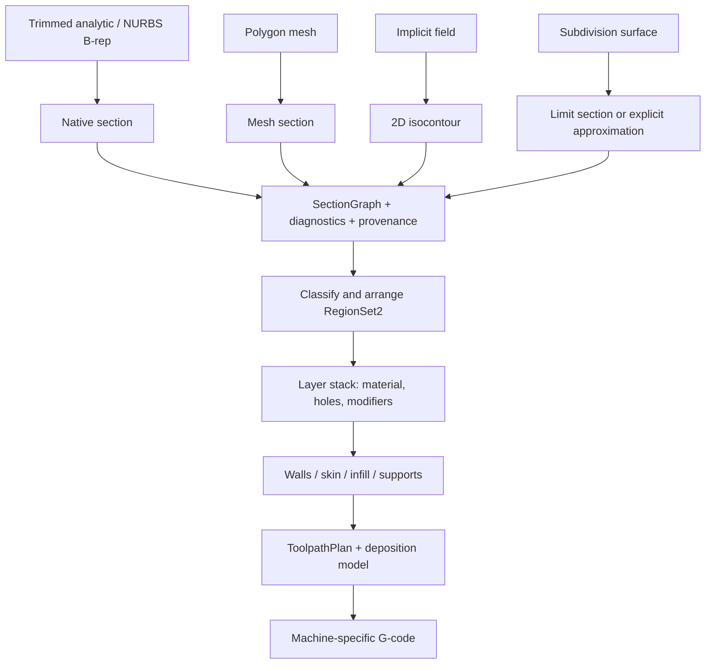

# Основания архитектуры нарезки: четыре представления, один печатный конвейер

**Решение:** сохранять исходное представление модели; в каждой геометрической библиотеке вычислять её собственное сечение. Общими делать геометрию и топологию плоскости, построение печатных областей, траекторий и вывод G-code. Для нарезки NURBS или поля не требуется промежуточная полигональная модель всего тела.

Схема пользователя задаёт правильное направление, но между «пересечение» и «контуры слоя» нужен явный этап разрешения геометрических событий и классификации материала. Сечение поверхности может дать открытые линии, точки касания и совпавшие участки; они ещё не являются заполненной областью. Последующие разделы — проектные предложения, а не описание уже реализованного слайсера.

## Проверенные первичные источники

Проверены 2026-09-08. Версии страниц ниже — наблюдаемые версии документации, а не версии зависимостей проекта. OCCT, CGAL, OpenSubdiv и CuraEngine используются здесь как источники алгоритмов и контрактов; подключение их C/C++-ядер не предлагается. Пересказы намеренно краткие; исходные статьи и документация целиком не копируются.

| ID | Источник | Что подтверждает и как влияет на решение |
| --- | --- | --- |
| S01 | [OCCT 8.0.1 — Boolean Operations](https://occt3d.com/dev/doc/overview/html/specification__boolean_operations.html) | Section, Splitter и Boolean используют общий этап пересечений и различаются сборкой результата. Section выдаёт рёбра и вершины. Пересечение граней включает кривые с допусками, отдельные точки и совпадения. Следствие для собственного ядра: переиспользовать события пересечения, параметрические соответствия и историю происхождения между сечениями и булевыми; не считать произвольный набор полученных кривых замкнутым телом. |
| S02 | [CGAL 6.2.1 — Polygon_mesh_slicer](https://doc.cgal.org/latest/PMP_Boolean_operations/classCGAL_1_1Polygon__mesh__slicer.html) | Пересекает треугольную поверхность с плоскостью и возвращает ориентированные полилинии. Замыкание обозначено совпадением концов. Внутреннее ребро двух лежащих в плоскости граней не попадает в результат: при совпадении плоскости с гранью куба остаётся её контур. Следствие: нужны общая индексация рёбер, детерминированная обработка копланарности и явное различие открытой/замкнутой цепи. |
| S03 | [CGAL 6.2.1 — 2D Arrangements](https://doc.cgal.org/latest/Arrangement_on_surface_2/index.html) | Разбиение плоскости хранит вершины, полурёбра и грани; грани имеют внешние компоненты границы и отверстия. Overlay объединяет разбиения с данными граней. Следствие: общий 2D-слой должен уметь разбивать пересекающиеся контуры и классифицировать полученные области; сортировки контуров только по площади недостаточно. |
| S04 | [Shewchuk — Adaptive Precision Floating-Point Arithmetic and Fast Robust Predicates](https://www.cs.cmu.edu/~quake/robust.html) | Ошибка знака почти нулевого определителя ломает геометрические решения; адаптивная точность позволяет надёжно вычислять orientation/incircle. Следствие: собственные Rust-предикаты с быстрым фильтром и точным резервным вычислением. Точный знак для представленных координат не устраняет ошибку самих приблизительно построенных точек пересечения. |
| S05 | [OpenSubdiv — Subdivision Surfaces](https://opensubdiv.org/docs/subdivision_surfaces.html) | Refinement создаёт более подробный управляющий каркас; его вершины в общем случае не лежат на предельной поверхности. Tessellation выбирает точки самой поверхности. Следствие: «N уровней Catmull–Clark» нельзя выдавать за сечение limit surface с известной погрешностью. Хранить, что именно нарезано: каркас, приближение или предельная поверхность. |
| S06 | [OpenSubdiv — BFR Overview](https://opensubdiv.org/docs/bfr_overview.html) | Поддерживает параметрическую оценку поверхности грани. Регулярные Catmull–Clark-области представляются bicubic B-spline patch; нерегулярные области требуют более сложного представления и/или иерархии. Следствие: регулярные патчи могут переиспользовать параметрическое пересечение; extraordinary vertices, crease и boundary rules остаются обязанностью subdivision-ядра. |
| S07 | [CGAL 6.2.1 — 3D Isosurfacing](https://doc.cgal.org/latest/Isosurfacing_3/index.html) | Дискретная выборка поля может пропустить настоящие компоненты и породить артефакты. Даже топологическая гарантия TMC относится к трилинейному интерполянту отсчётов. Следствие для 2D-изолиний: topology-correct для интерполянта не означает completeness относительно исходной функции; это отдельные поля отчёта. |
| S08 | [Hart, 1996 — Sphere tracing, авторская запись Illinois](https://experts.illinois.edu/en/publications/sphere-tracing-a-geometric-method-for-the-antialiased-ray-tracing/) | Аннотация работы связывает безопасные шаги с ограничением величины производной, включая недифференцируемые участки. Используется только как основание требования к bounds для implicit-алгоритмов, не как готовый алгоритм контуров слоя. Полный текст по этому адресу не проверялся. |
| S09 | [CuraEngine — Pipeline](https://ultimaker.github.io/CuraEngine/docs/pipeline.html) | Разделяет сечение, генерацию областей, генерацию путей, вставки команд и G-code; отдельные стадии допускают producer/consumer исполнение. Следствие: печатный план — самостоятельный промежуточный результат, а сериализатор G-code не должен заново решать геометрию. |
| S10 | [CuraEngine — Generating Areas](https://ultimaker.github.io/CuraEngine/docs/generating_areas.html) | Стены строятся внутренними смещениями; skin/infill/support — разные области. Поддержки определяются сравнением слоёв и выдерживанием XY/Z-зазоров, иногда на расстоянии нескольких слоёв. Следствие: планировщику необходим доступ к соседним слоям и передача требований поддержки вниз по стеку; чистой функции от одного слоя недостаточно. |
| S11 | [CuraEngine — Generating Paths](https://github.com/Ultimaker/CuraEngine/wiki/Generating-Paths) | Планирование включает порядок печати и заполнение областей линиями. Ширина дорожки влияет на размещение стен и заполнения, а перекрытие дорожек требует учёта подачи. Следствие: геометрическая граница детали, осевая линия движения и след нанесённого материала — разные объекты. |
| S12 | [Slic3r — Flow Math](https://manual.slic3r.org/advanced/flow-math) | Различает ширину дорожки и шаг соседних траекторий. Для поддержанного материала использует модель прямоугольника с полукруглыми концами; для мостов — отдельную модель сечения. Следствие: модель подачи должна зависеть от типа дорожки и профиля печати, а не только от длины пути. Это технологическое приближение, не физическая гарантия формы расплава. |
| S13 | [Marlin — G0/G1](https://marlinfw.org/docs/gcode/G000-G001.html) | G-code добавляет движения в очередь; скорость меняется по ускорениям. F задаётся в единицах длины в минуту, E зависит от режима относительной/абсолютной экструзии. Следствие: внутренняя скорость в мм/с требует явного преобразования, а оценка времени по length/speed не равна реальному времени прошивки. |
| S14 | [Marlin — M200](https://marlinfw.org/docs/gcode/M200.html) | В объёмном режиме E обозначает мм³; в обычном — длину поданного филамента. Следствие: режим подачи и диаметр филамента входят в обязательный MachineProfile, а экспорт должен устанавливать согласованный режим. |

## Контракты перед общими контурами

Предлагаемый путь данных:



**SectionGraph** — результат вычислительной геометрии. Содержит направленные дуги, общие узлы, параметрические интервалы на исходных объектах, точки касания, открытые ветви, совпавшие участки, ориентацию и отчёт. Тип дуги не ограничен полилинией: line, arc и parametric curve допустимы. Совпавшая с плоскостью область грани — событие с границей области, а не бесконечное число обычных кривых. Представление должно сохранять точные специальные случаи, не обещая, что всякая кривая пересечения двух NURBS точно представима NURBS конечной степени.

**RegionSet2** — результат разрешения пересечений, классификации и выбора политики материала. Отдельные компоненты имеют внешнюю границу и отверстия; внутренности областей после overlay не пересекаются. У границ сохраняются ссылки на исходные дуги, материал и источник. Касание в точке, контакт вдоль ребра и область положительной площади различаются. Вложенные кольца поддерживают остров внутри отверстия; принадлежность не выводится из одного знака площади.

**PrintableRegionSet** — успешный допуск к дальнейшему планированию. Для обычной объёмной печати запрещены неразрешённые открытые ветви и неоднозначная принадлежность материалу. «Печатать поверхность одной линией», «придать толщину» и «ремонтировать зазор» — отдельные явные политики. После ремонта сохраняются исходный дефект, метод, перемещение границы и новый revision; это не бесследная сварка концов.

Утверждение о наполненности относится к телу: отдельная NURBS-поверхность, открытая сетка или открытый subdivision-каркас не задают однозначно объём. Для NURBS нужны оболочки, ориентация, trim и классификация solid; для сетки — определённая политика замкнутости/самопересечений; для поля — соглашение о знаке и ограниченная область с известным внешним состоянием. Положительное расстояние до открытой сетки не является signed solid field.

## Что остаётся в каждом ядре

| Ядро | Собственная ответственность для сечения | Типовые события, которые нельзя спрятать |
| --- | --- | --- |
| NURBS / analytic + B-rep | Пересечение поверхности с плоскостью; отсечение trim; связь UV/3D; stitching по топологии; классификация оболочек. Аналитические специальные случаи допустимы и полезны. | Касательное сечение, полюс, периодический шов, копланарная грань, пересечение trim, несколько ветвей, неподтверждённая полнота численного поиска. |
| Polygon | Знаки положения вершин относительно плоскости, пересечения общих рёбер, сборка ориентированных цепей, ускорение по диапазонам высот или BVH. | Плоскость через вершину/ребро/грань, дубликаты, non-manifold-ветвление, самопересечения, очень короткий сегмент. |
| Implicit / SDF | Ограничение функции на плоскость, адаптивное разбиение 2D-домена, поиск нулей, интервальные/липшицевы оценки при наличии. | Узкий объект между отсчётами, saddle, несколько нулей на ребре, нулевое плато, выход контура через границу домена, неизвестная Lipschitz-константа. |
| Subdivision | Значения/производные limit surface, согласованные края патчей, правила crease/boundary, адаптивное приближение с отчётом. | Extraordinary vertex, разные уровни соседних патчей, seam/crack, отсутствие bound между каркасом и пределом. |

Ссылка NURBS ↔ B-rep не означает, что топологическая библиотека становится библиотекой NURBS. Pure topology хранит incidence/orientation/identity; геометрический адаптер связывает её с кривыми и поверхностями. Та же топология может использоваться для полигонального тела. 2D arrangement переиспользует подход полурёбер, но не должен зависеть от конкретных 3D-поверхностей.

## Численная политика и честные гарантии

Предлагаемые отдельные параметры: `section_distance_mm`, `endpoint_join_mm`, `curve_chord_mm`, `planar_quantization_mm`, `offset_error_mm`, `path_simplification_mm`, `gcode_rounding_mm`. Один глобальный epsilon не описывает разные источники погрешности. Согласование концов предпочтительно по общей топологической идентичности; близость координат является контролируемым резервным механизмом, потому что реальный зазор может быть меньше произвольного epsilon.

Оценки не сворачиваются в один `exact: bool`:

```text
GeometryGuarantee = SymbolicSpecialCase | CertifiedBound | SampledEstimate | Unknown
TopologyStatus   = Validated | Ambiguous | Invalid
Completeness     = CompleteUnderAssumptions | SamplingLimited | Unknown
Report = requested_budget + observed_or_proved_error + assumptions
       + consumed_budget + diagnostics + source_revision
```

Интерполяционный остаток в нескольких точках не доказывает максимальное отклонение между ними. Если нужен certified bound, алгоритм должен иметь оценку на всём интервале/ячейке и учитывать округление. Собственный допустимый тест отсечения для L-Lipschitz поля в ячейке радиуса r: при проверенном `abs(f(center)) > L*r + evaluation_error` нулей в ячейке нет. Если условие не выполнено, это лишь требование дальнейшего рассмотрения; ни существование, ни единственность нулей не доказаны. Для непрерывного поля смена знака даёт существование корня на ребре, но не запрещает дополнительные корни. Бюджет исчерпан — вернуть `SamplingLimited` или ошибку строгого режима.

Точное integer/expansion-решение 2D-предикатов относится к входным координатам алгоритма. Квантование границы перед этим остаётся аппроксимацией и способно удалить узкую щель. Нужны контролируемый масштаб, проверки диапазона арифметики и повторная топологическая проверка после snap/rounding. Успех булевой операции над квантованными контурами не означает доказанную точность исходной NURBS-геометрии.

Ошибка границы может складываться из ошибок сечения, линеаризации, квантования, offset, упрощения и G-code. Суммировать их как верхние границы можно только там, где каждый этап действительно имеет bound относительно предыдущего и сохранены требуемые предпосылки. Из малой Hausdorff-погрешности без feature-separation не следует сохранение топологии: отверстие может исчезнуть. Поэтому loss-of-feature — отдельная диагностика.

## Печатный план и экструзия

`LayerSpec` хранит `z_bottom`, `z_top`, `sample_z`, преобразование плоскости и правило выбора сечения. Толщина слоя и высота плоскости сечения — разные величины. Политика на критических высотах фиксируется для всех ядер: согласованное разрешение касаний/копланарности, а не независимое случайное смещение z. Для адаптивных слоёв алгоритмы сравнивают физические расстояния по z, а не просто номер соседнего слоя.

`PrintRegions` хранит role (outer wall, inner wall, top/bottom skin, sparse infill, bridge, support, support interface), material/tool, параметры ширины и связь с `RegionSet2`. Объединение деталей одного материала возможно по явной политике; конфликт разных материалов разрешается приоритетом либо ошибкой до toolpath. Необоснованное глобальное union стирает назначение extruder и интерфейсов.

`LayerStack` даёт планировщику запрос слоёв в физическом диапазоне высот, сохраняет material/modifier provenance и поддерживает анализ сверху вниз. Глобальный план поддержек и последовательная печать объектов могут требовать всей сцены. Потоковая обработка допустима после анализа зависимостей; нельзя обещать независимый streaming одного слоя для всех стратегий.

`ToolpathPlan` хранит геометрическую линию движения отдельно от модели нанесения: роль, width/height, объём на длину, скорость, retract/travel, tool, cooling и порядок. Траектория обязана учитывать конечную ширину дорожки: boundary детали не является её осевой линией. Избыточное упрощение может пересечь отверстие даже при визуально похожей полилинии.

Для принятой модели поддержанной дорожки ширины w и высоты h при w >= h площадь сечения `A = h*(w-h) + pi*h*h/4`. Тогда для постоянного сечения и длины L объём `V = A*L`; линейная подача филамента диаметра d равна `E = V/(pi*d*d/4)`, с отдельным откалиброванным коэффициентом подачи. Для переменного сечения требуется интегрирование по длине, для bridge — другой профиль. Ограничение расхода даёт `speed <= Qmax/A`; оно применяется вместе с ограничениями движения, охлаждения и материала. Эти формулы описывают выбранную инженерную модель, не сертифицируют реальную деталь.

G-code backend получает завершённый план и `MachineProfile`: единицы, координатные режимы, extrusion mode, tool/nozzle/filament, разрешённые команды, ограничения стола и подачи. Интерполяция дуг экспортируется только при явно поддерживаемом диалекте; иначе выполняется контролируемое уплощение траектории. Планировщик прошивки выполняет ускорения: симуляция времени слайсера помечается оценкой. Запуск печати — отдельное действие за пределами генерации файла.

## Проверка реализации по мере разработки

1. **Контракты 2D:** касающиеся окружности, ребро-на-ребре, self-crossing-контур, внешняя область + отверстие + остров, два материала, микрозазор до/после квантования. Проверять area, nesting, topology и provenance; не только картинку.
2. **Между ядрами:** аналитически известные сечения куба, сферы, цилиндра, тора и полого тела. Для mesh сравнивать с его собственной плоской геометрией; расхождение с гладким оригиналом учитывать как входную аппроксимацию.
3. **Критические высоты:** одинаковые входные тела на z точно по вершине/ребру/грани и по обе стороны критической высоты; фиксированная политика касаний, отсутствие двойных рёбер и внезапного заполнения отверстия.
4. **Поля и SubD:** тонкая компонента между узлами grid; несколько корней на ребре; saddle; extraordinary vertex; crease; отказ строгого режима, когда bound недоступен. Увеличение samples само по себе не является certified convergence.
5. **Печать:** навес над пустотой, поддержка с XY/Z-зазором, bridge, переменная высота слоя, конфликт материалов, узкая стенка меньше ширины дорожки, limiting volumetric flow. Проверять зависимость от соседних слоёв.
6. **G-code:** парсинг экспортированного файла обратно в движения и объём; согласованность единиц/E/F, соответствие MachineProfile и воспроизводимость порядка. Это проверяет файл; физическая печать и метрология остаются отдельным уровнем доказательства.

Для воспроизводимости сохранять версию исходной геометрии, tolerance policy, printer/material profile, версии алгоритмов, hash плана и диагностику. Сравнение с внешним слайсером допустимо как независимый ориентир, но не заменяет аналитические случаи и инварианты собственного ядра.
