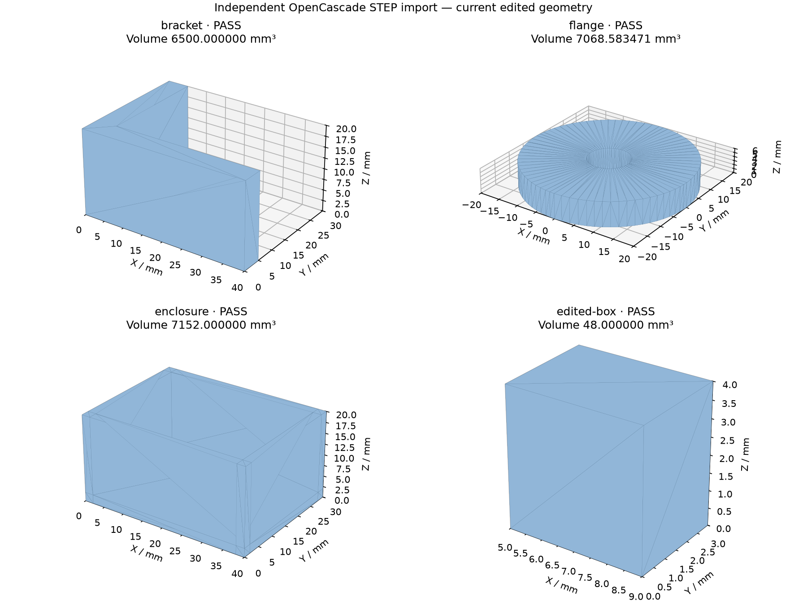

# Independent STEP acceptance

The STEP files were exported from current B-rep geometry by our kernel and read by OpenCascade through `cadquery-ocp==8.0.1.0.0`, Python 3.12.14. The preview uses OpenCascade tessellation; it does not use the application's display mesh.

All four fixtures passed solid validity, one-solid count, bounding dimensions (1e-6 mm) and volume (relative 1e-8, absolute floor 1e-6 mm³). The edited box includes nonuniform scaling and translation. A negative control increased the expected bracket volume by 100 mm³: the verifier exited 1, rejected that fixture, and accepted the other three.

From the repository root:

```sh
python3.12 -m venv /tmp/cad-roadmap-ocp
/tmp/cad-roadmap-ocp/bin/python -m pip install -r scripts/requirements-cad-step.txt
node --import tsx scripts/export-cad-roadmap-fixtures.mts
/tmp/cad-roadmap-ocp/bin/python scripts/verify-cad-step-occt.py
```

To check the retained evidence instead of generating fresh exports:

```sh
/tmp/cad-roadmap-ocp/bin/python scripts/verify-cad-step-occt.py docs/qualification/cad-roadmap-2026-09-28/step
```

`manifest.json` contains file hashes and independently specified dimensions and volumes. `occt-report.json` contains measured values. This qualifies these fixtures, not arbitrary STEP geometry, assembly structure, materials, or all fillets.


