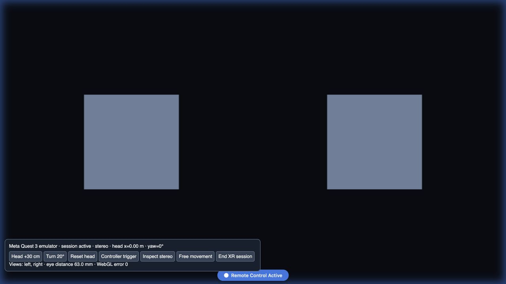
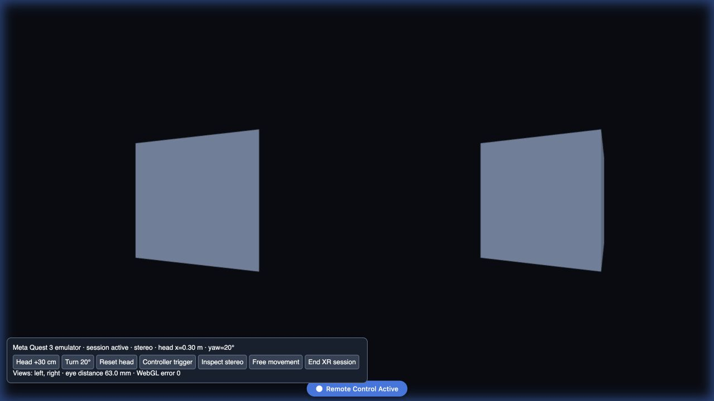
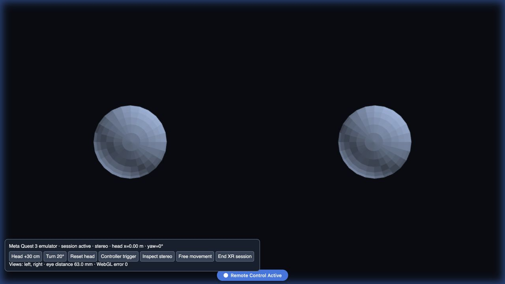
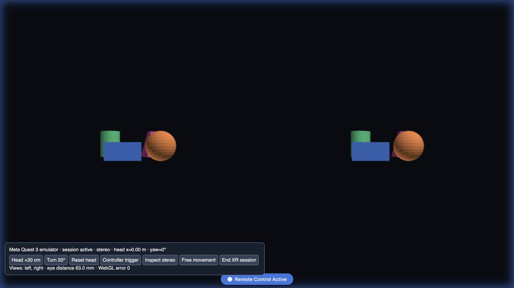
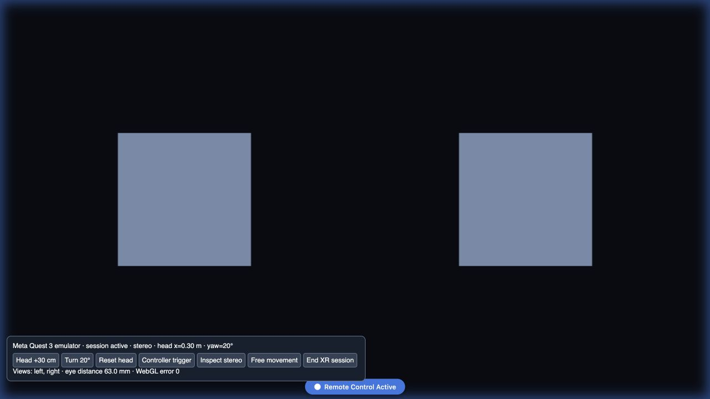

# VR emulator validation — 2026-09-30

Executed in the Codex in-app browser against the local Vite development server,
using Meta IWER and @iwer/devui 2.5.0, Quest 3 profile and 63 mm IPD.
The runtime starts only with `?xrEmulator=1` in development.

## Observed results

- Solid cube, Mesh UV sphere and the Source scene with four colored primitives
  each entered an immersive WebXR session through the application controls.
- Actual session poses contained left and right views, separated by 63.0 mm.
  The rendered images showed stereo parallax; WebGL reported error 0.
- Translating the head by 30 cm and rotating it by 20 degrees changed the view.
- The right controller trigger recentered the scene at the new head pose.
- Ending the session restored entry controls; entering again rendered correctly.
- Exiting through IWER's own session menu also restored application controls.

## Fixes found during this check

Vue cast the omitted optional Boolean `available` prop to false, preventing Source
from entering with valid meshes. Its default is now explicitly undefined, allowing
mesh-based availability. Component tests cover omitted, explicit and empty cases.
The Source VR control is now in the visible source editor toolbar.

IWER DevUI initializes IPD to zero; the development harness restores 63 mm after
installing DevUI so the check exercises distinct eye poses.

## Captures

These captures verify the emulated browser session. Physical headset display,
tracking, comfort and device permission behavior remain untested.

## Automated checks

- `vue-tsc --noEmit`: passed.
- VR scene, session and controls plus DirectModeler and main modeling UI suites:
  5 files, 219 tests passed.
- `vite build`: passed; emulator-specific markers absent from production assets.
- `git diff --check`: passed.
- `node scripts/verify-dist.mjs`: failed on the current shared checkout because
  `DirectModeler` is 376,206 bytes against its 375,000-byte artifact limit.
  The limit was left unchanged. This is an outstanding distribution check.

## Rust crate follow-up

Scene transforms, fitting and recenter anchor now execute in `crates/vr-core`.
After rebuilding its independent WASM module, the browser smoke test confirmed
Solid stereo (63 mm, WebGL error 0), head translation/rotation, controller
recentering and session exit. Native Rust tests: 3 passed. VR integration and
component tests against the generated WASM: 13 passed; typecheck passed.
Production compilation and the final distribution check passed on the shared
checkout: 115 artifacts, 7,149,458 asset bytes plus 11,231,717 raw WASM bytes.
An earlier attempt hit the DirectModeler size limit recorded above; the final
verification supersedes that result.

