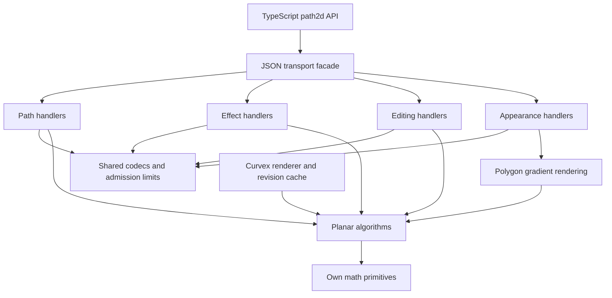

# 2D performance and architecture follow-up

Scope: the owned planar kernel, polygon gradient rendering and the path2d JSON
boundary used by WASM. The public native paths and TypeScript wire contracts
remain compatible. No external runtime dependency was added to the 2D kernel.

## Layer responsibilities



- `geometry-bridge/path2d.rs` is a small routing facade with the original tests.
  Paths, effects, editing and appearance handlers borrow the same request.
  Codecs own JSON conversion and backward-compatible wire defaults. The two
  stroke entry points share one option decoder. Algorithms stay in the kernel.
- `planar-geometry/limits.rs` owns resource policy. Path admission, flattening,
  arrangement and mesh output remain distinct budgets; common consumers use
  their named constants. Oversized JSON paths fail before a second segment
  buffer is allocated.
- `rings/winding.rs` owns prepared winding queries. A contour bounding hierarchy
  handles many short closed rings such as stroke strips/joins. The existing
  edge interval tree handles a few long contours and dense overlap (estimated
  from contour bounds). Both return signed winding
  counts; fill-rule and boolean decisions stay with arrangement construction.
- Stroke expansion keeps normalized boundaries as rings through tessellation.
  Editable Bezier paths are created only when the caller requests outlines.
  Compound render strokes share this pipeline; their joint union still prevents
  double blending at overlaps. Fill sweeping reuses its active-edge allocation.
- `measure::ArcLengthIndex` is an immutable geometry service with caller-owned
  lifetime. Along-path gradients reuse its nearest-segment search instead of
  scanning every segment for every sample. Equal-distance ties retain source
  segment order. Sampling failures return errors, with no partial colored mesh.
- Curvex cache ownership, revision invalidation and payload bounds remain at the
  renderer layer, outside pure geometry and transport. The native GPU cache
  optimization from the preceding qualification remains in the migration.

This applies SOLID through actual responsibilities and dependency direction,
not an interface for every function. DRY applies to wire options, resource
policy and the stroke pipeline. Separate indexing strategies remain explicit
because they have different workload costs and the same tested winding contract.

## Audit of the 2D surface

| Area | Decision and evidence |
| --- | --- |
| Paths, curves, offsets, corners | Preserve established binary64 algorithms and retained-curve semantics; centralize shared resource policy. |
| Ring boolean and fill tessellation | Add workload-specific winding index and reuse sweep storage; preserve both winding rules, holes and overlapping contours. |
| Stroke meshes | Remove rings → editable paths → flattened rings conversion from mesh construction and compound rendering. |
| Gradient rendering | Add reusable arc-length spatial index; propagate sampling errors through the appearance boundary. |
| Edit, snap, scissors and effects | Keep pure domain operations; isolate their transport handlers without changing operation contracts. |
| TypeScript/WASM | Keep the typed thin facade and existing function names; split Rust routing by domain and share decoding. |
| Curvex GUI/cache | Keep revision-based invalidation and bounded cache; rerun application/render qualification against the changed kernel. |

The compatibility `curve::BezPath` stream and the editable `path::BezierPath`
model retain distinct contracts (multiple subpaths versus one anchor-editable
path). Collapsing them would change public behavior; boundary conversion remains
explicit. Existing algorithms are retained where measurements and tests do not
justify a replacement. JSON transport remains synchronous, and first-time
geometry work can still exceed a frame budget.
Resource bounds and finite precision remain part of the documented contract.

## Measured results

| Workload | Before, ms | After, ms | Speedup |
| --- | ---: | ---: | ---: |
| crossing_80 | 0.913 | 0.838 | 1.09× |
| crossing_240_wide | 5.928 | 4.043 | 1.47× |
| wide_wave_400 | 35.029 | 13.323 | 2.63× |
| consumed_square | 0.134 | 0.123 | 1.09× |
| retraced_200 | 20.119 | 20.043 | 1.00× |
| dashed_wave | 8.185 | 5.359 | 1.53× |

The dense retracing regression in the first experiment was rejected; its paired
samples remain in `stroke-benchmark-diagnostic.json`. Choosing the interval
strategy for high overlap restores its original throughput. The final
[paired benchmark](stroke-benchmark.json) includes all timings and executable
hashes. Simple fill/stroke controls range from 6.3% faster to 2.1% slower
(about 1.65 µs at most slower), with no material regression established on these
fixtures; see [render-controls.json](render-controls.json).

For 4096 repeated nearest-length queries on 4095 segments, exhaustive search
takes **86.30 ms**, the prepared index **1.81 ms**
(**47.6×**). Index construction costs **0.613 ms**
separately. This is the search used by along-path gradient sampling, not a claim
that the entire gradient mesh or a whole document becomes 48× faster. The
[arc benchmark](arc-benchmark.json) verifies all answers and retains both timing
distributions. Other applications on the machine were uncontrolled.

## Reproduction

The preceding stress executable was retained before changes. Build this kernel
and the unchanged stress fixture, stop this task's compilers, then compare the
prebuilt executables using `../stress-qualification/compare.py` (A/B/B/A).
`before-sources.json` records the full pre-change source hashes.

The arc-length benchmark in this directory compares the previous exhaustive
projection with the new index on 4095 segments and 4096 queries. It checks every
answer before timing, reports index construction separately and alternates
execution order. Build and run with:

```sh
cargo run --offline --release --manifest-path integrations/curvex/architecture-qualification/Cargo.toml
cargo test --offline --manifest-path crates/Cargo.toml -p planar-geometry -p polygon-core
cargo test --offline --manifest-path crates/Cargo.toml -p geometry-bridge path2d
```

Original Curvex remains a clean reference. Application qualification uses a
fresh isolated migration prepared by `../prepare.py`; its generated patch and
build/test evidence are retained here. Synthetic corpus and benchmark results
are coverage evidence, not a proof for all possible 2D inputs or all GPUs.

## Remaining system constraints

- The kernel uses finite binary64 precision and bounded work. No finite corpus
  proves every possible input. Broad-phase/index selection is workload-dependent.
- JSON/WASM calls are synchronous. No worker scheduling or binary transport is
  introduced by this refactor, so callers must still budget cold geometry work.
- Curvex still invalidates its render cache on document revision changes. These
  changes improve geometry and repeated-query cost; they do not provide
  incremental per-shape rendering across every editing mutation.
- The geometry module has no UI, transport, cache or 3D dependency. The full
  application still has its existing GUI/SVG dependencies, including transitive
  Kurbo.

## Final verification

- 1494 Curvex tests passed; its existing ignored timing test also passed when
  explicitly run. Release, all-target and documentation checks passed.
- 228 native kernel/polygon tests, 8 JSON transport tests and 6 tests against the
  newly built workspace WASM passed. The native total includes one unrelated
  triangulation test already present in this shared checkout.
- 1024 independent round-stroke corpus cases passed 261987 point probes.
- All 36 software captures retain coverage IoU 1.0 and zero changed pixels above
  the 3/255 color threshold against the preceding qualified implementation.
  See [comparison](comparison.json) and [contact sheet](contact-sheet.png).
- The final native application initialized Apple M5/Metal and completed 330
  measured paint calls per attempt for 100/1000/5000 shapes. All three launches
  returned zero screenshot events and were stopped after their workload stages.
  **Final GPU visual equivalence and frame cadence are not qualified.** CPU paint
  samples alone do not establish presented GPU frames. Previous successful GPU
  captures remain in the preceding stress qualification, not evidence for this
  final source revision. Raw attempts are retained as `gpu-attempt-*.json`.
- Final source hashes match the tested snapshot; the original Curvex checkout
  is clean and the [migration patch](osv-migration.patch) passes `git apply --check`.

[Summary](summary.json), [application report](report.json), and `logs/` preserve
these checks. `after-sources.json` also covers the split transport modules and
polygon gradient implementation. `restore-before-planar.patch` reconstructs the
pre-refactor planar benchmark source in an isolated copy; it is not a full
application rollback and must not be applied to the shared working tree.
